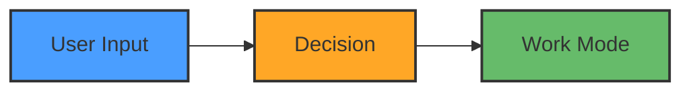

## SPARC Process

BitBot follows the **SPARC** methodology for structured development:

| Phase                   | Folder                   | Purpose                                      |
| ----------------------- | ------------------------ | -------------------------------------------- |
| **0. Research**         | `sparc/0-research/`      | Background research, standards, constraints  |
| **1. Specification**    | `sparc/1-specification/` | Requirements, use cases, acceptance criteria |
| **2. Pseudocode**       | `sparc/2-pseudocode/`    | Algorithm design, logic flows                |
| **3. Architecture**     | `sparc/3-architecture/`  | System design, diagrams, component structure |
| **4. Refinement**       | `sparc/4-refinement/`    | POCs, tests, iterations, optimizations       |
| **5. Completion**       | `sparc/5-completion/`    | Supporting tools, helpers (NOT core code)    |

**Usage Guidelines**:
- Research findings → `sparc/0-research/`
- Specifications → `sparc/1-specification/`
- Design docs → `sparc/3-architecture/`
- POC tests → `sparc/4-refinement/poc-tests/`
- Supporting tools/helpers → `sparc/5-completion/`
- Source code (e.g. launcher) → `sparc/5-completion/src/`
- Test suites → `sparc/5-completion/tests/`
- Core implementation → `/core` (BitBot shell scripts)
- BitBot templates → `templates/bitbot/` (base, config, dev, workspace)
- Custom templates → `templates/custom/` (user workload templates)
- DO NOT put core implementation code in sparc/ folders
- DO reference sparc/ docs when implementing features

## General Guidelines

- **Specs**: Use bulletpoints/pseudocode only, no extensive code
- **Clarity** Use concise text. Use lists, colors and symbols to structure.
- **Missing tools**: Install if you have rights, else guide user (apt/curl/wget)
- **Questions**: One at a time, use unicode symbols/colors for pros/cons in tables
- **Tables**: Align in monospace, keep narrow for terminals (unicode = 2 chars width)
- **Follow-up**: Ask for thoughts after answers, give hints
- **Line endings**: bash/sh=LF, ps1/bat/cmd=CRLF (use `.gitattributes` + tools below)
- **Syntax**: Check bash scripts after editing (use tools below)

**IMPORTANT**: **DO** use `devcontainer.cmd` on Windows or WSL! **DO** wrap it with `cmd.exe` if running from WSL.

**WARNING: DO NOT USE**: `devcontainer` on Windows or WSL - it corrupts WSL paths and breaks docker!

- **DO NOT** create copies of files when interation on the implementation. Only create copies  when explicitely requested.
- **DO NOT** overengineer or add unasked for features
- **DO NOT** add backward compatibility for previous implementation iteration steps
- **DO NOT** create copies of files when iterating. Only create copies when explicitly requested
- **DO** align columns in .md tables
- **DO** use mermaid for flow diagrams
- **DO** take small steps to avoid getting overwhelmed
- **DO NOT** attempt big refactorings or implementation steps in one go
- **DO NOT** use pwsh to run PowerShell scripts
- **DO NOT** add 🤖 Generated with [Claude Code] or Co-Authored-By to commits
- DO step by step, small steps, create TODO list for steps. test after steps. fix. commit if working.
- DON'T: large changes, multiple changes, large combined commits
- DO use worktrees when doing more complex git work like e.g. a release.
- **DO** ask the user for manual execution of any commands requiring `sudo`. `sudo`does not work in claude code TUI.
- **DO NOT** use bash echo to output instructions to the user, just directly use claude code text output.

## DevContainer Context

**IMPORTANT**: BitBot has two separate devcontainer contexts - do NOT confuse them!

| Context                | Location                | Purpose               | Notes                                      |
| ---------------------- | ----------------------- | --------------------- | ------------------------------------------ |
| **BitBot Development** | `/.devcontainer/`       | Develop BitBot itself | MinGW, BitBot dev tools                    |
| **Workspace**          | `/templates/workspace/` | User AI workspaces    | Claude Code, AI tools, shared home folders |

**Key Points**:

- `/.devcontainer/` = **For BitBot contributors** (developing BitBot)
- `templates/workspace/` = **For BitBot users** (AI-powered development)
- Do NOT modify root `/.devcontainer/` unless working on BitBot itself
- Workspace templates include shared home folders for AI tool configs
- See `templates/workspace/README.md` for workspace template docs

## Available Tools

**IMPORTANT**: ALWAYS use these tools instead of raw `dos2unix` or `sed` commands. These are auto-approved and don't require user confirmation.

**fix-line-endings**

- Converts CRLF→LF only (no syntax check)
- Use when: `/bin/bash: line 1: $'\r': command not found`
- Example: `.claude/tools/fix-line-endings script.sh another.sh`
- Auto-approved

**check-bash**

- Validates bash syntax without execution or modifications
- Use before committing bash scripts
- Example: `.claude/tools/check-bash script.sh`
- Auto-approved

**fix-line-endings-check-bash** ⭐ (recommended)

- Fixes CRLF→LF then checks bash syntax in one step
- Use after creating/editing bash scripts
- Example: `.claude/tools/fix-line-endings-check-bash script.sh another.sh`
- Auto-approved

**run-with-timeout**

- Runs a command with timeout to prevent hangs
- Use for potentially long-running test commands
- Example: `.claude/tools/run-with-timeout 30 ./test-script.sh`
- Auto-approved

**DO NOT USE**: `dos2unix file.sh` or `sed -i 's/\r$//' file.sh` directly - use tools above instead!

## PowerShell/CMD from WSL

**PowerShell commands**:

- Single command: `powershell.exe -Command "command"`
- Run script: `powershell.exe -File "script.ps1"`
- Faster (no profile): `powershell.exe -NoProfile -Command "..."`

**CMD files (.cmd/.bat)**:

- ALWAYS use cmd.exe: `cmd.exe /c "command.cmd args"`
- For devcontainer: `cmd.exe /c "cd /d C:\Path && devcontainer.cmd build --workspace-folder ."`
- **DO NOT** call .cmd files via PowerShell - use cmd.exe wrapper

**Paths**:

- WSL paths work: `/mnt/c/Projects/...`
- Windows paths: `C:\Projects\...` (escape backslashes in quotes)

## Testing Guidelines

**Process**: Step-by-step testing with todo list tracking

1. **Create Tests**:

   - Write test script in `tests/test-<feature>.sh`
   - Include bash syntax check, unit tests, integration tests
   - Use clear test names and section headers
   - Follow existing test structure (see `tests/test-container-bitbot.sh`)
1. **Run Tests in WSL**:

   - Fix line endings + check syntax: `.claude/tools/fix-line-endings-check-bash tests/test-<feature>.sh`
   - Run with timeout: `.claude/tools/run-with-timeout 60 ./tests/test-<feature>.sh`
   - Debug failures individually before moving on
1. **Fix Issues**:

   - Fix line endings: `.claude/tools/fix-line-endings file.sh` (or use fix-line-endings-check-bash)
   - Check syntax only: `.claude/tools/check-bash file.sh`
   - Fix logic errors one at a time
   - Rerun tests after each fix
   - Don't commit until all tests pass
1. **Commit After Success**:

   - Commit line ending fixes separately
   - Commit test suite with results in commit message
   - Add test to `tests/run-tests.sh` if appropriate
1. **Test Framework**:

   - Use `run_test()`, `test_passed()`, `test_failed()` helpers
   - Show colored output (GREEN=pass, RED=fail, BLUE=section)
   - Print summary with success rate
   - Exit 0 if all pass, exit 1 if any fail

**Example Workflow**:

```bash
# 1. Create test
vim tests/test-feature.sh
chmod +x tests/test-feature.sh

# 2. Fix line endings and check syntax (use tools!)
.claude/tools/fix-line-endings-check-bash tests/test-feature.sh
.claude/tools/fix-line-endings-check-bash feature/script.sh

# 3. Run tests with timeout to prevent hangs
.claude/tools/run-with-timeout 60 ./tests/test-feature.sh

# 4. Fix issues and rerun
# ... fix logic errors ...
.claude/tools/run-with-timeout 60 ./tests/test-feature.sh

# 5. Commit
git add feature/script.sh
git commit -m "Fix line endings"
git add tests/test-feature.sh
git commit -m "Add feature test suite (28/28 pass)"
```

## Mermaid Diagram Guidelines

**Color Scheme** (simplified from FLOW_INNER_BITBOT):

```
Entry/CLI:       #4a9eff  (blue)     - User input, CLI, entry points
Decisions:       #ffa726  (orange)   - Prompts, checks, config, warnings
Success/Work:    #66bb6a  (green)    - Work mode, done, safe operations
Errors:          #ef5350  (red)      - Errors only
```

**Text Color Rules**:

- Blue (#4a9eff): No color needed (dark enough)
- Orange (#ffa726): ALWAYS add `color:#333` (dark text on bright background)
- Green (#66bb6a): ALWAYS add `color:#333` (dark text on bright background)
- Red (#ef5350): ALWAYS add `color:#333` (dark text on bright background)
- Format: `fill:#COLOR,stroke:#333,stroke-width:2px,color:#333`

**Width**: Keep diagrams narrow (~60 chars per line) for terminal viewing

**Example**:

