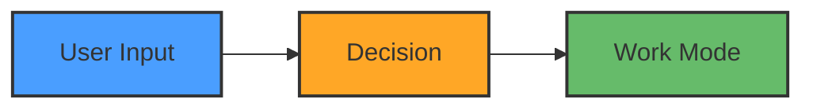

<!-- ============================================================================
     TEMPLATE-SPECIFIC CONTENT GOES HERE
     Each template (base, config, bitbotdev, workspace) can add custom sections
     ============================================================================ -->

<!-- ============================================================================
     BITBOT DEVELOPMENT SECTION (NOT synced to templates)
     Content below this line is for BitBot development only
     ============================================================================ -->

## Project Structure

BitBot follows a clean separation between core functionality, development artifacts, templates, and documentation.

**Note**: This section and below are for BitBot development, not end-user customization.

### Top-Level Organization

```
BitBot/
├── core/               # Host-side BitBot implementation
│   ├── bitbot         # Main launcher (bash)
│   ├── bitbot.cmd     # Windows CMD launcher
│   ├── bitbot.exe     # Windows compiled launcher
│   ├── shared/        # Shared resources (version tracking)
│   ├── global/        # Global commands (first-run setup)
│   ├── workspace/     # Workspace commands (work, config, init)
│   └── util/          # Utilities (detect, git, prerequisites)
├── container/          # Container-related files
│   ├── bitbot/        # Container-side BitBot runtime (commands, utilities)
│   ├── home/          # Global dotfiles (mounted to containers)
│   └── templates/     # DevContainer templates
│       ├── bitbot-base/   # Minimal BitBot container
│       ├── bitbot-config/ # BitBot with configuration tools
│       ├── bitbot-dev/    # BitBot development container
│       ├── bitbot-work/   # AI-powered workspace container
│       ├── custom/        # User custom templates
│       └── shared/        # Shared scripts and configs
├── dev/                # Development artifacts (scripts, src, tests)
├── sparc/              # SPARC methodology documentation
├── .claude/            # Claude Code configuration (CLAUDE.md, tools/)
├── .devcontainer/      # BitBot development container
└── .github/            # GitHub workflows
```

### Core Directories

| Directory                      | Purpose                              | Naming Convention   |
| ------------------------------ | ------------------------------------ | ------------------- |
| `/core/`                       | Host-side BitBot (shell)             | kebab-case.sh       |
| `/container/bitbot/`           | Container-side BitBot runtime        | kebab-case.sh       |
| `/container/templates/`        | DevContainer templates               | lowercase/          |
| `/container/templates/shared/` | Shared scripts and configs           | kebab-case          |
| `/dev/`                        | Development artifacts                | kebab-case          |
| `/sparc/`                      | SPARC documentation                  | (see SPARC section) |
| `/.claude/`                    | Claude Code config                   | kebab-case          |
| `/.devcontainer/`              | BitBot dev container                 | lowercase           |

**Workspace Directory Structure:**

For complete workspace directory structure, mount points, and permissions across different modes (work, config, dev), see:

📁 **`sparc/3-architecture/01-directory-structure.md`** (Single Source of Truth)

### Development Artifacts (/dev/)

Development-related files organized under `/dev/`:

| Directory       | Purpose                              | Examples                                  |
| --------------- | ------------------------------------ | ----------------------------------------- |
| `/dev/scripts/` | BitBot development scripts           | `bitbot-dev-create-release-branch.sh`     |
| `/dev/src/`     | Source code (e.g., Windows launcher) | `launcher_windows/launcher.c`             |
| `/dev/tests/`   | Test suites                          | `test-container-bitbot.sh`                |

### Naming Conventions

**Shell Scripts** (`.sh` files):
- Use **kebab-case**: `fix-line-endings.sh`, `test-prerequisites.sh`
- Always include `.sh` extension
- Mark executable with `chmod +x`

**Documentation** (`.md` files):
- Root docs: **kebab-case** (`README.md`, `README-EXTENDED.md`)
- SPARC research: **UPPERCASE_UNDERSCORE** (`AI_AGENT_RESEARCH.md`)
- SPARC specs: **Numbered UPPERCASE** (`01_CONTAINER_ORCHESTRATION.md`)
- Architecture: **numbered-kebab-case** (`01-system-overview.md`)

**Directories**:
- Use **lowercase** or **kebab-case**: `core/`, `container-bitbot/`, `sparc/`
- Template types: **bitbot-*** prefix (`bitbot-base/`, `bitbot-config/`, `bitbot-dev/`, `bitbot-work/`)
- Scripts follow template naming: **bitbot-dev-***, **bitbot-work-***, **bitbot-config-*** prefixes

**Configuration Files**:
- JSON: lowercase or dot-separated (`devcontainer.json`, `settings.local.json`)
- Dockerfile: `Dockerfile` (standard naming)
- YAML: kebab-case (`.github/workflows/release.yml`)

### Container Templates

Templates under `container/templates/`:

| Template          | Purpose                          | Features                               | .claude Content              |
| ----------------- | -------------------------------- | -------------------------------------- | ---------------------------- |
| `bitbot-base/`    | Minimal BitBot (base template)   | Core only, no extras                   | hooks, tools, settings.json  |
| `bitbot-config/`  | User workspace configuration     | + Config tools, JSON/YAML editing      | + bitbot-config-* skills     |
| `bitbot-dev/`     | BitBot development               | + Build tools, shared home             | + bitbot-dev-* skills        |
| `bitbot-work/`    | AI-powered user workspaces       | + Claude Code, AI tools, MCP           | + bitbot-work-* skills       |
| `custom/`         | User custom templates            | User-defined (uses bitbot-work/ base)  | Inherits from bitbot-work/   |
| `scripts/`        | Shared merge/build scripts       | Template merge and setup tools         | N/A                          |

Each template contains:
- `Dockerfile` - Container image definition
- `devcontainer.json` - VS Code DevContainer config (generated from base + details)
- `details.devcontainer.json` - Template-specific settings
- `README.md` - Template documentation
- `.claude/` - Template-specific Claude Code configuration

**Template Internals** (for BitBot development):
- **Base Template**: `bitbot-base/` is standalone (no merge needed)
- **Other Templates**: Built by merging `bitbot-base/devcontainer.json` + `details.devcontainer.json`
- **Merge Script**: `container/templates/scripts/merge-devcontainer.sh <template-dir>`
- **Mount Deduplication**: Details mounts with same target path override base mounts
- Container runtime scripts in `container/bitbot/` are mounted at `/usr/local/bitbot`
- During `bitbot init`, scripts are copied to `.devcontainer/bitbot/` in user workspace

**Merging Templates** (for BitBot development):

To regenerate a template's `devcontainer.json` after editing `details.devcontainer.json`:

```bash
# Merge single template
container/templates/scripts/merge-devcontainer.sh container/templates/bitbot-config

# Merge all templates
for t in bitbot-config bitbot-dev bitbot-work; do
  container/templates/scripts/merge-devcontainer.sh container/templates/$t
done
```

**Mount Override Example**:
- Base has `.devcontainer` mount as `readonly`
- Config template overrides with RW mount in `details.devcontainer.json`
- Merge script deduplicates: keeps 7 base mounts + 1 override = 8 total

**Customizing DevContainers** (for end users):

After `bitbot init`, users can customize their workspace `.devcontainer/`:

1. **Add Packages** (edit `Dockerfile`):
```dockerfile
RUN apt-get update && apt-get install -y \
    python3 python3-pip \
    && apt-get clean && rm -rf /var/lib/apt/lists/*
```

2. **Add VS Code Extensions** (edit `devcontainer.json`):
```json
{
  "customizations": {
    "vscode": {
      "extensions": ["ms-python.python", "dbaeumer.vscode-eslint"]
    }
  }
}
```

3. **Configure Settings** (edit `devcontainer.json`):
```json
{
  "customizations": {
    "vscode": {
      "settings": {
        "python.defaultInterpreterPath": "/usr/bin/python3"
      }
    }
  }
}
```

4. **Add DevContainer Features**:
```json
{
  "features": {
    "ghcr.io/devcontainers/features/docker-in-docker:2": {},
    "ghcr.io/devcontainers/features/node:1": {"version": "lts"}
  }
}
```

## SPARC Process

BitBot follows the **SPARC** methodology for structured development:

| Phase                   | Folder                   | Purpose                                      |
| ----------------------- | ------------------------ | -------------------------------------------- |
| **0. Research**         | `sparc/0-research/`      | Background research, standards, constraints  |
| **1. Specification**    | `sparc/1-specification/` | Requirements, use cases, acceptance criteria |
| **2. Pseudocode**       | `sparc/2-pseudocode/`    | Algorithm design, logic flows                |
| **3. Architecture**     | `sparc/3-architecture/`  | System design, diagrams, component structure |
| **4. Refinement**       | `sparc/4-refinement/`    | POCs, tests, iterations, optimizations       |
| **5. Completion**       | `sparc/5-completion/`    | Completion metadata, TODOs, progress tracking |

**Usage Guidelines**:
- Research findings → `sparc/0-research/`
- Specifications → `sparc/1-specification/`
- Design docs → `sparc/3-architecture/`
- POC tests → `sparc/4-refinement/poc-tests/`
- Completion metadata → `sparc/5-completion/` (TODO-TRACKER.md, SPEC-TODO.md, progress docs)
- Release scripts → `dev/scripts/`
- Source code (e.g. launcher) → `dev/src/`
- Test suites → `dev/tests/`
- Core implementation → `/core/` (host-side BitBot shell scripts)
- Container runtime → `/container/bitbot/` (container-side BitBot)
- Container templates → `container/templates/` (base, config, bitbotdev, workspace)
- Custom templates → `container/templates/custom/` (user workload templates)
- DO NOT put core implementation code in sparc/ folders
- DO reference sparc/ docs when implementing features

## General Guidelines

- **Specs**: Use bulletpoints/pseudocode only, no extensive code
- **Clarity** Use concise text. Use lists, colors and symbols to structure.
- **Missing tools**: Install if you have rights, else guide user (apt/curl/wget)
- **Questions**: One at a time, use unicode symbols/colors for pros/cons in tables
- **Tables**: Align in monospace, keep narrow for terminals (unicode = 2 chars width)
- **Follow-up**: Ask for thoughts after answers, give hints
- **Line endings**: bash/sh=LF, ps1/bat/cmd=CRLF (use `.gitattributes` + tools below)
- **Syntax**: Check bash scripts after editing (use tools below)

**IMPORTANT**: **DO** use `devcontainer.cmd` on Windows or WSL! **DO** wrap it with `cmd.exe` if running from WSL.

**WARNING: DO NOT USE**: `devcontainer` on Windows or WSL - it corrupts WSL paths and breaks docker!

- **DO NOT** create copies of files when interation on the implementation. Only create copies  when explicitely requested.
- **DO NOT** overengineer or add unasked for features
- **DO NOT** add backward compatibility for previous implementation iteration steps
- **DO NOT** create copies of files when iterating. Only create copies when explicitly requested
- **DO** align columns in .md tables
- **DO** use mermaid for flow diagrams
- **DO** take small steps to avoid getting overwhelmed
- **DO NOT** attempt big refactorings or implementation steps in one go
- **DO NOT** use pwsh to run PowerShell scripts
- **DO NOT** add 🤖 Generated with [Claude Code] or Co-Authored-By to commits
- DO step by step, small steps, track tasks using TodoWrite tool (session) AND `/sparc/TODOS.md` (persistent). test after steps. fix. commit if working.
- DON'T: large changes, multiple changes, large combined commits
- DO use worktrees when doing more complex git work like e.g. a release.
- **DO** ask the user for manual execution of any commands requiring `sudo`. `sudo`does not work in claude code TUI.
- **DO NOT** use bash echo to output instructions to the user, just directly use claude code text output.

## Stop Hook Automation

**DONOTSTOP Hook (Enabled by Default):**

BitBot includes a Stop hook that automatically continues work after Claude finishes responding. This enables automated workflows without manual prompting.

**How it works:**
- Hook reads `.bitbot/DO-NOT-STOP.txt` for continuation instructions
- When file exists, Claude continues with the specified reason
- When file is removed, Claude stops normally

**Default behavior:**
- Enabled: "Continue working. Check TODO list and implement the next pending task."
- Claude automatically continues to next task after completing current work
- Prevents need for repeated prompting

**Control:**
- `/claude-allow-stop` - Disable (allow normal stops)
- `/claude-do-not-stop [reason]` - Enable with custom reason
- Edit `.bitbot/DO-NOT-STOP.txt` - Change continuation message directly

**Use cases:**
- Multi-phase implementations (implement tasks from TODO-TRACKER.md)
- Test-fix-commit loops (run tests, fix failures, repeat)
- Documentation generation (create docs for all modules)

**Safety:**
- Prevents infinite loops with `stop_hook_active` check
- 5 second timeout on hook execution
- User can disable anytime with `/claude-allow-stop` command

## Context Management

**When to Recommend Context Compaction/Clearing:**

After completing a significant implementation phase, proactively remind the user:

> "This implementation phase is complete. Consider managing context:
> - **`/compact`** - Summarize recent work, free up tokens (recommended after each phase)
> - **`/clear`** - Start fresh, clear all history (use between major phases only)"

**Indicators that a phase is complete:**
- All tests passing for a feature
- Documentation updated and committed
- User says "done", "finished", "that's it", or similar
- Task list fully completed
- Natural break point in work

**Important:**
- **DO** proactively remind users about context management
- **DO** explain when to use `/compact` vs `/clear`
- **DO NOT** attempt to execute these commands programmatically
- User must manually type `/compact` or `/clear` commands

**Note:** Claude Code's TUI requires physical keyboard input to execute commands. Programmatic execution via tmux or other automation is not possible.

## Proactive Session Management

**IMPORTANT**: Claude should proactively manage its own session using restart skills when appropriate.

### Available Skills

**claude-restart-resume** - Quick restart to reload configuration
- Use when: Skills added/modified, settings changed, hooks updated, MCP services configured
- Action: Automatically invoke when files in `.claude/` are modified
- Preserves conversation history

**claude-restart-compact** - Compact context and continue working
- Use when: Token usage high (>150k), multi-phase tasks, long conversations
- Action: Proactively invoke when context is getting full but task not complete
- Summarizes and resumes with compact history

**claude-restart-clear** - Fresh start after task completion
- Use when: Task complete and committed, starting new unrelated work
- Action: Proactively invoke after major milestones when user says work is done
- Clears all conversation history

**claude-do-not-stop** - Enable continuous work mode
- Use when: User says "keep working", "don't stop", "finish", "complete all tasks"
- Action: Invoke immediately when user requests continuous work
- Continue until all tasks complete

**claude-allow-stop** - Disable automation, allow normal stops
- Use when: Work is finished, user wants interactive mode back
- Action: Invoke after completing all requested work
- Returns to normal stop behavior

### When to Use Proactively

**Restart-Resume** (Config Reloads):
- After creating/modifying skills in `.claude/skills/`
- After changing `.claude/settings.json`
- After modifying hooks in `.claude/hooks/`
- After configuring MCP services

**Restart-Compact** (Mid-Task):
- When token usage exceeds ~150,000 tokens
- During multi-phase implementations spanning 100+ messages
- When context feels "heavy" but work must continue
- User hasn't indicated work is done

**Restart-Clear** (After Completion):
- User says "done", "finished", "that's it", similar phrases
- All tasks in TODO list marked completed
- Work committed and pushed to git
- Starting completely new unrelated task

**Do-Not-Stop** (Continuous Work):
- User explicitly says "keep working", "don't stop", "finish everything"
- User provides a list of multiple tasks to complete
- User says "work until done", "complete all tasks"
- Beginning multi-phase implementation work

**Allow-Stop** (Return to Normal):
- After completing all tasks in do-not-stop mode
- Work is committed and tests pass
- Natural stopping point reached
- User asks for interactive mode back

### Proactive Usage Examples

```markdown
# After modifying .claude/skills/
"I've created the new skill. Let me restart to load it..."
[Invokes claude-restart-resume]

# During long implementation (150k+ tokens)
"Context is getting large. Let me compact and continue working..."
[Invokes claude-restart-compact]

# After user says "that's it, thanks"
"All work is complete and committed. Starting fresh for next task..."
[Invokes claude-restart-clear]

# User says "implement all TODOs, don't stop until done"
"Enabling continuous work mode to complete all tasks..."
[Invokes claude-do-not-stop]
"All tasks complete. Returning to normal mode..."
[Invokes claude-allow-stop]
```

### Context Size Awareness

**Note**: Claude cannot directly check token count programmatically (no API/hook access), but can see token budget in system reminders:
- Example: `<budget:token_budget>200000</budget:token_budget>`
- Current usage shown as: `Token usage: 93470/200000; 106530 remaining`

**Heuristics for when context is getting large:**
- Message count >100 messages
- Long conversations (>2 hours of work)
- Repeated context about same topics
- Token usage shown in reminders approaching 150k+

**Action**: When token usage exceeds ~150k (75% of 200k budget), proactively invoke `claude-restart-compact` to free up space and continue working.

## DevContainer Context

**IMPORTANT**: BitBot has multiple devcontainer contexts - do NOT confuse them!

| Context                | Location                            | Purpose                      | Notes                                      |
| ---------------------- | ----------------------------------- | ---------------------------- | ------------------------------------------ |
| **BitBot Development** | `/.devcontainer/`                   | Develop BitBot itself        | MinGW, BitBot dev tools                    |
| **BitBot Dev Template**| `/container/templates/bitbot-dev/`  | BitBot dev container         | Template for BitBot development            |
| **User Work Template** | `/container/templates/bitbot-work/` | User AI workspaces           | Claude Code, AI tools, shared home folders |
| **User Config Template**| `/container/templates/bitbot-config/` | User workspace config      | Config tools, JSON/YAML editing            |
| **Base Template**      | `/container/templates/bitbot-base/` | Minimal BitBot               | Core only, foundation for all templates    |

**Key Points**:

- `/.devcontainer/` = **For Claude Code dev** (developing BitBot with Claude Code)
- `container/templates/bitbot-dev/` = **BitBot dev template** (for developing BitBot itself)
- `container/templates/bitbot-work/` = **For users** (AI-powered development workspaces)
- `container/templates/bitbot-config/` = **For users** (workspace configuration, JSON/YAML editing)
- `container/templates/bitbot-base/` = **Foundation template** (minimal, base for all)
- Do NOT modify root `/.devcontainer/` unless working on BitBot itself
- User templates (work, config) include shared home folders for AI tool configs
- See individual template README.md files for template-specific documentation

## DevContainer Mount Structure

**Container User:** `root` (home directory = `/root/`)

**Mount Strategy:** Infrastructure files mounted readonly from `$BITBOT_HOME`, no copying.

### Global Mounts (from BitBot Installation)

| Source | Target | Purpose |
|--------|--------|---------|
| `$BITBOT_HOME/container/home/.tmux.conf` | `/root/.tmux.conf` | Tmux config (ro) |
| `$BITBOT_HOME/.bitbot/wrapper/` | `/opt/bitbot/wrapper/` | Wrapper scripts (ro) |

### Workspace Mounts (per-project)

| Source | Target | Purpose |
|--------|--------|---------|
| `${localWorkspaceFolder}/.devcontainer/bitbot/` | `/usr/local/bitbot/` | Container BitBot (ro) |
| `${localWorkspaceFolder}/.devcontainer/home/.claude/` | `/root/.claude/` | Claude config (rw) |
| `${localWorkspaceFolder}/.devcontainer/home/.claude-flow/` | `/root/.claude-flow/` | Claude Flow (rw) |
| `${localWorkspaceFolder}/.devcontainer/home/.opencode/` | `/root/.opencode/` | OpenCode (rw) |

**Key Points:**
- Container user is `root`, so home = `/root/` (NOT `/home/bitbot/`)
- Infrastructure mounted readonly (automatic updates when BitBot updated)
- Per-workspace dotfiles in `.devcontainer/home/` (workspace-specific Claude hooks/sessions)
- No files copied except user-modifiable configs
- See `sparc/1-specification/12_MOUNT_STRUCTURE.md` for details

## Available Skills

**IMPORTANT**: Use skills instead of raw `dos2unix` or `sed` commands.

**fix-line-endings** - Fix CRLF→LF line endings
**check-bash** - Validate bash syntax
**fix-line-endings-check-bash** ⭐ - Fix + check (recommended for bash scripts)
**run-with-timeout** - Execute commands with timeout protection
**claude-skill-creator** / **claude-template-skill** - Create custom skills (Anthropic)
**claude-do-not-stop** - Enable automation (default: "Resume work!") | `/claude-do-not-stop [reason]`
**claude-allow-stop** - Disable automation, allow normal stop | `/claude-allow-stop`
**claude-get-session-info** - Shared utility for session management (sourced by other skills)
**claude-restart** - Restart Claude to reload skills/manage context | Modes: resume (default), compact, clear | Self-pkill + exec restart

## Statusline (Optional)

**Recommended**: Use [ccstatusline](https://github.com/sirmalloc/ccstatusline) to display git branch, model, cost, and context info.

```bash
bunx ccstatusline@latest  # Interactive TUI setup
```

See `sparc/0-research/CCSTATUSLINE_SETUP.md` for full setup guide.

## PowerShell/CMD from WSL

**PowerShell commands**:

- Single command: `powershell.exe -Command "command"`
- Run script: `powershell.exe -File "script.ps1"`
- Faster (no profile): `powershell.exe -NoProfile -Command "..."`

**CMD files (.cmd/.bat)**:

- ALWAYS use cmd.exe: `cmd.exe /c "command.cmd args"`
- For devcontainer: `cmd.exe /c "cd /d C:\Path && devcontainer.cmd build --workspace-folder ."`
- **DO NOT** call .cmd files via PowerShell - use cmd.exe wrapper

**Paths**:

- WSL paths work: `/mnt/c/Projects/...`
- Windows paths: `C:\Projects\...` (escape backslashes in quotes)

## Testing Guidelines

**Process**: Step-by-step testing with todo list tracking

1. **Create Tests**:

   - Write test script in `dev/tests/test-<feature>.sh`
   - Include bash syntax check, unit tests, integration tests
   - Use clear test names and section headers
   - Follow existing test structure (see `dev/tests/test-container-bitbot.sh`)
1. **Run Tests in WSL**:

   - Fix line endings + check syntax: `.claude/skills/fix-line-endings-check-bash/scripts/fix-line-endings-check-bash.sh dev/tests/test-<feature>.sh`
   - Run with timeout: `.claude/skills/run-with-timeout/scripts/run-with-timeout.sh 60 dev/tests/test-<feature>.sh`
   - Debug failures individually before moving on
1. **Fix Issues**:

   - Fix line endings: `.claude/skills/fix-line-endings/scripts/fix-line-endings.sh file.sh` (or use fix-line-endings-check-bash)
   - Check syntax only: `.claude/skills/check-bash/scripts/check-bash.sh file.sh`
   - Fix logic errors one at a time
   - Rerun tests after each fix
   - Don't commit until all tests pass
1. **Commit After Success**:

   - Commit line ending fixes separately
   - Commit test suite with results in commit message
   - Add test to `dev/tests/run-tests.sh` if appropriate
1. **Test Framework**:

   - Use `run_test()`, `test_passed()`, `test_failed()` helpers
   - Show colored output (GREEN=pass, RED=fail, BLUE=section)
   - Print summary with success rate
   - Exit 0 if all pass, exit 1 if any fail

**Example Workflow**:

```bash
# 1. Create test
vim dev/tests/test-feature.sh
chmod +x dev/tests/test-feature.sh

# 2. Fix line endings and check syntax (use skills!)
.claude/skills/fix-line-endings-check-bash/scripts/fix-line-endings-check-bash.sh dev/tests/test-feature.sh
.claude/skills/fix-line-endings-check-bash/scripts/fix-line-endings-check-bash.sh feature/script.sh

# 3. Run tests with timeout to prevent hangs
.claude/skills/run-with-timeout/scripts/run-with-timeout.sh 60 dev/tests/test-feature.sh

# 4. Fix issues and rerun
# ... fix logic errors ...
.claude/skills/run-with-timeout/scripts/run-with-timeout.sh 60 dev/tests/test-feature.sh

# 5. Commit
git add feature/script.sh
git commit -m "Fix line endings"
git add dev/tests/test-feature.sh
git commit -m "Add feature test suite (28/28 pass)"
```

## Mermaid Diagram Guidelines

**Color Scheme** (simplified from FLOW_INNER_BITBOT):

```
Entry/CLI:       #4a9eff  (blue)     - User input, CLI, entry points
Decisions:       #ffa726  (orange)   - Prompts, checks, config, warnings
Success/Work:    #66bb6a  (green)    - Work mode, done, safe operations
Errors:          #ef5350  (red)      - Errors only
```

**Text Color Rules**:

- Blue (#4a9eff): No color needed (dark enough)
- Orange (#ffa726): ALWAYS add `color:#333` (dark text on bright background)
- Green (#66bb6a): ALWAYS add `color:#333` (dark text on bright background)
- Red (#ef5350): ALWAYS add `color:#333` (dark text on bright background)
- Format: `fill:#COLOR,stroke:#333,stroke-width:2px,color:#333`

**Width**: Keep diagrams narrow (~60 chars per line) for terminal viewing

**Example**:


- never abort research or work on an approach without explicit instruction
- test run all code and scripts before committing
- only commit when all tests are done and pass
- do not git reset without user confirmation
- use /sparc/TODOS.md to track Tasks

---

## INBOX

**Purpose**: Temporary holding area for memory commands and quick notes.

**Usage**:
- Use `# memory` commands to add quick notes here
- Content must be sorted into appropriate sections before syncing to templates
- Sync script will block if INBOX section exists

**Instructions**:
Before running sync script:
1. Review all items in INBOX
2. Move each item to its appropriate section (General Guidelines, Skills, etc.)
3. Delete the ## INBOX section
4. Run sync script: `dev/scripts/sync-claude-md-to-templates.sh`

**Template-Specific Content**:
Add to `container/templates/{template}/details.CLAUDE.md` (like `details.devcontainer.json`)

<!-- Items below this line -->

---
- order in mermaid defines tb columns and lr rows