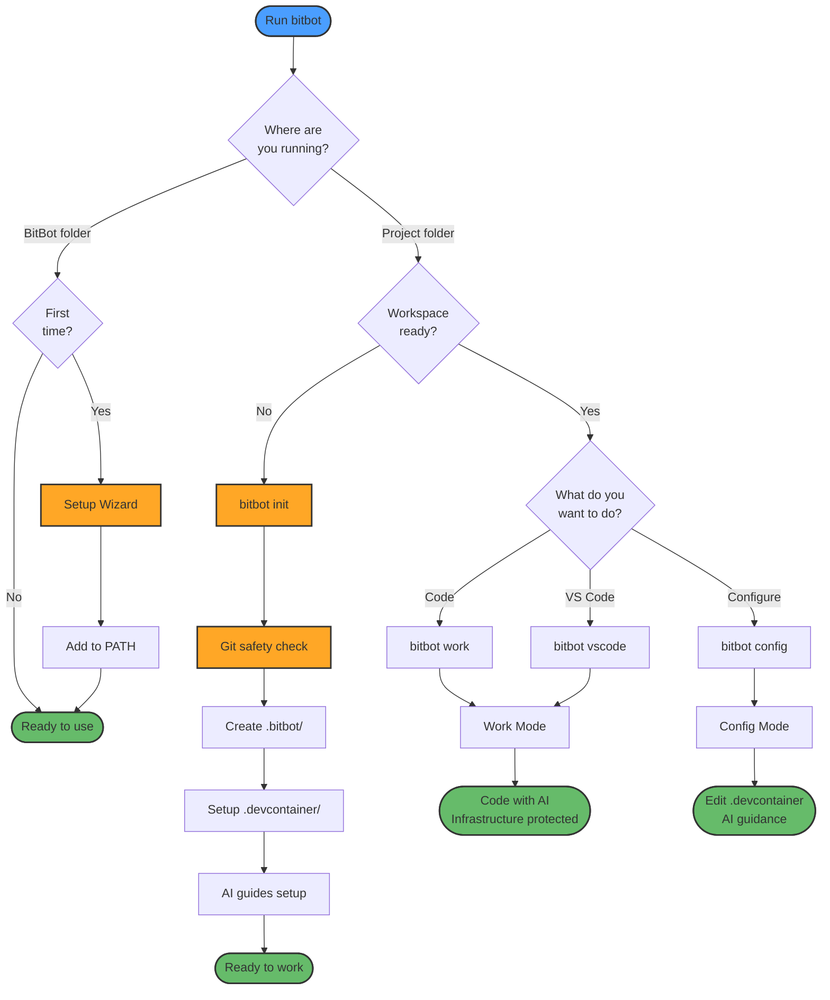

```
 ◆╮╭╲●═●╱╮ ╭⬡    BitBot v0.1.0-dev
○┳┻-▌-━━-▐┳┻■     Secure AI Development Environment
 ╰◇╰▄-━-▄╯╰○━□
```

# BitBot

**Secure Development Environments for AI-Assisted Coding**

BitBot is a cross-platform CLI tool that sandboxes AI coding assistants in isolated container environments, reducing risk when working with AI agents. It enables AI assistants to work freely on your code while protecting critical infrastructure files from accidental modification.

---

## Why BitBot?

### The Problem

When working with AI coding assistants like Claude Code, you want them to:

- ✅ Make changes to your application code freely
- ✅ Run tests and debug issues
- ✅ Refactor and improve your codebase
- ✅ Install dependencies and tools

But **not** accidentally:

- ❌ Modify critical files and folders
- ❌ Write or read files outside the project directory
- ❌ Install system-wide packages that affect other projects
- ❌ Wreck your machine

### Why DevContainers?

DevContainers are a great standardization that extends plain container definitions with development-specific features, making them perfect for AI-assisted development.

BitBot uses DevContainers to provide isolated, reproducible environments:

**Key Benefits:**

- ✅ **Isolation**: AI changes stay in container, host protected, no dependency conflicts
- ✅ **Reproducible**: Same environment across Windows/macOS/Linux for all developers
- ✅ **Safe**: Reset/rebuild without affecting host, try risky changes safely
- ✅ Docker containerization provides reasonable isolation
- 🚧 WIP: Full VM sandboxing for maximum security

### BitBot's Two-Mode Solution

### 💚 Work Mode (Default)

- AI can freely modify application code
- `.devcontainer/` and optionally other files or folders are **read-only** (protected)
- Git safety warnings for uncommitted changes
- Perfect for daily development

### 🔧 Config Mode

- **Read-write** access to `.devcontainer/` and whole workspace
- AI agent optimized for infrastructure tasks
- Use when you need to modify container configuration
- Human review advised. Git push is denied to agents.

---

## Features

🔒 **AI Agent Sandboxing**

- **Current**: Docker containerization isolates AI agents to reduce risk
- AI works in controlled environment with limited access
- Infrastructure files protected from accidental modification
- 🚧 **WIP**: Full VM sandboxing for maximum isolation

✨ **Two-Mode Security**

- Work mode protects infrastructure files
- Config mode for safe configuration editing
- Both modes work with VS Code and CLI

🚀 **Cross-Platform**

- **Windows**: Launcher → WSL bash or WSL bash directly
- **macOS**: Native bash
- **Linux**: Native bash

🎯 **VS Code Integration**

- Direct dev container opening (no popup!)
- Container reuse across terminal and VS Code

📦 **Preconfigured AI Agent Workspace**

- Ubuntu + AI tools (Claude Code, Claude Flow, Open Code)
- 🚧 WIP: Agent steering templates for different workloads

🌐 **Global AI Tool Configuration**

- Single sign-on: Credentials shared across all BitBot workspaces
- Global preferences: global CLAUDE.md and settings apply everywhere
- Workspace isolation: Session data (history, todos) stored per-workspace
- Per project config: `/workspace/.claude/` works like usually

🛡️ **Git Safety**

- Warnings for uncommitted changes
- Prompts to review commits before pushing
- Reminds to check for secrets in staged files
- Non-blocking (won't stop your workflow)
- Helps prevent AI from making risky changes to dirty repos

🤖 **Self-Improving System** 🚧 **WIP**

- BitBot self-configuration capabilities
- Agent-driven self-improvement mechanisms
- AI agents can help optimize their own environment

---

## ⚠️ Security Considerations

BitBot provides Docker containerization by default (reasonable isolation). For projects requiring Docker-in-Docker, rootless Docker is possible, but with limited isolation.

**📖 For security analysis, isolation levels, attack vectors:**

**See [Extended Documentation](README_EXTENDED.md#docker-in-docker-security-deep-dive)**

---

## Quick Start

### Prerequisites

**All Platforms:**

- Docker / Docker Desktop
- VS Code with Dev Containers extension
- Git

**Windows Only:**

- WSL2

### Installation

**💡 BitBot is Portable**: Install anywhere! No system-wide installation needed. Just clone/extract and run uonce to add it to PATH.

**Recommended: Clone Release Branch (Easy Updates)**

```bash
# Clone release branch for easy updates via git pull
# Replace [INSTALLFOLDER] with your preferred location (e.g., ~/tools/bitbot, /opt/bitbot, etc.)
git clone -b release https://github.com/ManuelKugelmann/BitBot.git [INSTALLFOLDER]/bitbot

# Update later with:
# cd [INSTALLFOLDER]/bitbot && git pull
```

**Alternative: Download Release Archive**

```bash
# Download specific version
wget https://github.com/ManuelKugelmann/BitBot/releases/latest/download/bitbot-v1.0.0.zip

# Extract to your chosen location
unzip bitbot-v1.0.0.zip -d [INSTALLFOLDER]/bitbot
```

**Example Locations**:

- `~/bitbot` - User home directory
- `~/tools/bitbot` - Personal tools folder
- `/opt/bitbot` - System-wide (requires permissions)
- `/mnt/c/tools/bitbot` - WSL accessing Windows drive

### First Use

1. **Initialize BitBot (one-time):**

   ```bash
   cd [INSTALLFOLDER]/bitbot
   core/bitbot
   ```

   This runs the first-time setup wizard to configure BitBot preferences and add `bitbot` to PATH.

2. **Initialize your workspace:**

   ```bash
   cd ~/Projects/MyApp
   bitbot init
   ```

   This reuses an existing `.devcontainer/` or creates one with the base bitbot devcontainer. Then it launches into configuration.

3. **Start working:***

    ```bash
    bitbot                # Defaults to Work mode (terminal or VS Code based on setup)
    ```

---

## Usage

### Basic Commands

```bash
# Launch work mode (AI can code, infrastructure protected)
bitbot
bitbot work

# Launch work mode in VS Code
bitbot vscode
bitbot work vscode

# Edit container configuration
bitbot config
bitbot config vscode
bitbot config terminal

# Initialize new workspace
bitbot init

# Help and version
bitbot help
bitbot version
```

### Example Workflow

**Day-to-day development:**

```bash
cd ~/Projects/MyApp
bitbot work            # Protected mode, code freely with AI
```

**Need to add a VS Code extension?**

```bash
bitbot config          # Opens config mode
# Edit .devcontainer/devcontainer.json
# Add extension to "extensions" array
# Rebuild dev container
# New extension available!
```

**Starting a new project:**

```bash
mkdir ~/Projects/NewProject
cd ~/Projects/NewProject
bitbot init            # Creates .devcontainer/ with template
bitbot work            # Start coding!
```

### Workflow Overview

BitBot simplifies AI-assisted development with two secure modes:



**Key Points:**

1. **First Time**: Run `bitbot` from install folder for setup wizard
2. **Initialize**: Run `bitbot init` in your project to create workspace
3. **Daily Work**: Run `bitbot` or `bitbot work` to code with AI protection
4. **Configuration**: Run `bitbot config` when you need to modify container setup
5. **VS Code**: Run `bitbot vscode` to open directly in VS Code

**Safety Features:**
- Git checks warn before making changes
- Work mode protects `.devcontainer/` from accidents
- Config mode provides AI guidance for infrastructure
- Both modes can run simultaneously

### GitHub Codespaces Support

BitBot workspaces work seamlessly in GitHub Codespaces!

**Workflow:**

```bash
# In your local project
cd ~/Projects/MyApp
bitbot init              # Creates .devcontainer/
git add .devcontainer/
git commit -m "Add BitBot workspace"
git push
```

Then open **your project** in Codespaces (via GitHub web UI):

- Your `.devcontainer` configuration loads automatically
- You're already inside the BitBot workspace container!
- Container bitbot scripts available at `/usr/local/bitbot`
- Start coding immediately - no `bitbot work` needed

**Benefits:**

- ✅ Develop from anywhere (browser or VS Code)
- ✅ No local Docker setup required
- ✅ Same environment across local and cloud
- ✅ Share workspace link with team members

> **For Contributors**: Want to develop BitBot itself? See [DEVELOPMENT.md](DEVELOPMENT.md) for development setup including Codespaces.

See `dev/tests/CODESPACES-TESTING.md` for details.

---

## Architecture

BitBot uses a **two-mode container system** with separate DevContainers for different security levels:

```
┌─────────────────────────────────────────────────────────────┐
│                         BitBot CLI                          │
│                    (Cross-Platform Router)                  │
└───────────────────┬────────────────┬────────────────────────┘
                    │                │
        ┌───────────▼─────────┐  ┌──▼──────────────────┐
        │    Work Mode        │  │   Config Mode       │
        │  (Infrastructure    │  │  (Infrastructure    │
        │   Protected)        │  │   Editable)         │
        ├─────────────────────┤  ├─────────────────────┤
        │ • Code: RW          │  │ • Code: RW          │
        │ • .devcontainer: RO │  │ • .devcontainer: RW │
        │ • Docker-in-Docker: │  │ • Docker inside: No │
        │   Optional (⚠️)     │  │ • Editing tools only│
        │ • AI: Code-focused  │  │ • AI: Infra-focused │
        └─────────────────────┘  └─────────────────────┘
```

### Mode Switching

Modes run in **separate containers** that can run simultaneously:

- Work mode uses `<workspace>/.devcontainer/`
- Config mode uses `<bitbot>/container/templates/config/`
- Each mode has its own AI agent configuration

### VS Code Integration

Open workspace in VS Code with container auto-launch:

```bash
bitbot vscode    # Opens VS Code in dev container (no popup)
```

**Benefits:** Direct container opening, container reuse, seamless workflow

---

## Project Structure

```
bitbot/
├── core/                      # Host-side BitBot implementation
│   ├── bitbot                 # Main CLI launcher (bash)
│   ├── bitbot.exe             # Windows launcher (38KB C executable)
│   ├── bitbot.cmd             # Windows CMD wrapper
│   ├── shared/                # Shared resources (version tracking)
│   ├── global/                # Global commands (first-run setup)
│   ├── workspace/             # Workspace commands (work, config, init)
│   └── util/                  # Utilities (detect, git, prerequisites)
├── container/                 # Container-related files
│   ├── bitbot/                # Container-side BitBot runtime
│   ├── home/                  # Global dotfiles (mounted to containers)
│   └── templates/             # DevContainer templates
│       ├── bitbot-base/       # Minimal BitBot container
│       ├── bitbot-config/     # Config mode (infrastructure)
│       ├── bitbot-dev/        # BitBot development
│       ├── bitbot-work/       # Work mode (AI tools)
│       ├── custom/            # User custom templates
│       └── shared/            # Shared scripts and configs
├── LICENSE                    # MIT License
└── README.md                  # This file
```

---

## Development Status

**Current Status:** 🚧 **Under Development** (Pre-Alpha - Not Yet Tested)

### Implemented Features (Untested)

⚙️ Work mode with read-only `.devcontainer/`

⚙️ Config mode for infrastructure editing

⚙️ VS Code direct container opening

⚙️ Windows launcher → WSL bash

⚙️ Cross-platform bash core (~2600 lines)

⚙️ Git safety warnings

⚙️ Workspace initialization with templates

⚙️ Prerequisite validation

**Note:** MVP implementation complete but requires manual testing before release.

### Roadmap

**Phase 2:**

- [ ] macOS testing and packaging
- [ ] Linux testing and packaging
- [ ] Rootless Docker template for Docker-in-Docker workflows
- [ ] Agent steering templates for different workloads (code, docs, testing)

**Phase 3:**

- [ ] Full VM sandboxing for maximum isolation
- [ ] BitBot self-configuration capabilities
- [ ] Agent-driven self-improvement mechanisms
- [ ] Multi-container orchestration (Docker Compose)
- [ ] MCP service architecture
- [ ] Session management (tmux)

**Future:**

- [ ] Cloud integration (GitHub Codespaces)
- [ ] Team workspace sharing
- [ ] Security scanning integration

---

## Platform-Specific Notes

### Windows

**Isolated WSL Environment:**

- BitBot uses isolated Alpine WSL distro (~8MB)
- Separate from your main WSL distribution
- Installation creates `BitBot-Alpine` automatically

**⚠️ IMPORTANT: Project Location**

Store projects in **WSL filesystem** (`~/projects`), not Windows (`/mnt/c/`):

- WSL: Native ext4 (fast ⭐⭐⭐⭐⭐)
- Windows mount: 9P protocol (10-40x slower ⚠️)

**Quick check:** `pwd` should show `/home/username/...`, not `/mnt/c/...`

**📖 See [Extended Documentation](README_EXTENDED.md#windowswsl-filesystem-performance-analysis) for:**

- Detailed performance analysis and benchmarks
- Windows access to WSL files (junction setup)
- Profiling tools and optimization tips

### macOS / Linux

Native bash execution, no virtualization layer needed.

---

## Contributing

Contributions welcome! This project is under active development.

For contribution guidelines, current priorities, and development setup, see [DEVELOPMENT.md](https://github.com/ManuelKugelmann/BitBot/blob/trunk/DEVELOPMENT.md).

---

## Documentation

**User Documentation:**

- [README_EXTENDED.md](README_EXTENDED.md) - Detailed security analysis, performance tuning, DevPod integration
- [container/templates/workspace/README.md](container/templates/workspace/README.md) - Workspace template (AI tools)
- [container/templates/config/README.md](container/templates/config/README.md) - Config mode details
- [templates/bitbot/base/README.md](templates/bitbot/base/README.md) - Base template documentation

**Developer Documentation:**

- [DEVELOPMENT.md](https://github.com/ManuelKugelmann/BitBot/blob/trunk/DEVELOPMENT.md) - Development setup and contribution guidelines (trunk branch)
- [sparc/1-specification/](sparc/1-specification/) - Complete system specifications (authoritative design docs)
- [sparc/1-specification/README.md](sparc/1-specification/README.md) - Specification overview and index

---

## License

MIT License - see [LICENSE](LICENSE) for details.

Copyright (c) 2025 Manuel Kugelmann, Bitcraft IT Consulting

---

## Author

**Manuel Kugelmann**

Bitcraft IT Consulting

Web: [bitcraft.org](https://bitcraft.org) | LinkedIn: [linkedin.com/in/mkugelmann](https://www.linkedin.com/in/mkugelmann/)

---

## Acknowledgments

Built with the assistance of AI coding tools: Claude, Gemini, GitHub Copilot, Perplexity.

---

## Support

- **Issues**: [GitHub Issues](https://github.com/ManuelKugelmann/BitBot/issues)
- **Discussions**: [GitHub Discussions](https://github.com/ManuelKugelmann/BitBot/discussions)

---

**Made with ❤️ for secure AI-assisted coding**