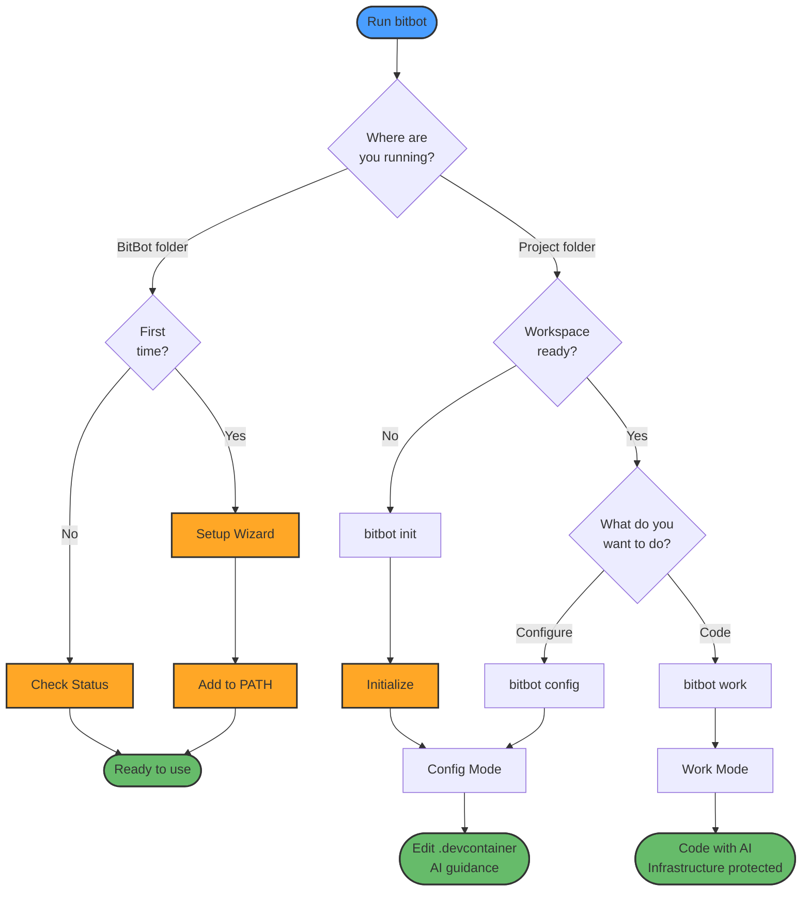

```
 ◆╮╭╲●═●╱╮ ╭⬡    BitBot v0.1.0-dev
○┳┻-▌-━━-▐┳┻■     Secure AI Development Environment
 ╰◇╰▄-━-▄╯╰○━□
```

# BitBot

**Secure Development Environments for AI-Assisted Coding**

BitBot is a cross-platform CLI tool that sandboxes AI coding assistants in isolated container environments, reducing risk when working with AI agents. It enables AI assistants to work freely on your code while protecting critical infrastructure files from accidental modification.

---

## Why BitBot?

### The Problem

When working with AI coding assistants like Claude Code, you want them to:

- ✅ Make changes to your application code freely
- ✅ Run tests and debug issues
- ✅ Use all tools freely
- ✅ Install dependencies and tools

But **not** accidentally:

- ❌ Modify critical files and folders
- ❌ Write or read files outside the project directory
- ❌ Install system-wide packages that affect other projects
- ❌ Wreck your machine

### The Solution: DevContainers

DevContainers are a great standardization that extends plain container definitions with development-specific features, making them perfect for AI-assisted development.

DevContainers provide isolated, reproducible environments with these key benefits:

- ✅ **Isolation**: AI changes stay in container, host protected, no dependency conflicts
- ✅ **Reproducible**: Same environment across Windows/macOS/Linux for all developers
- ✅ **Safe**: Reset/rebuild without affecting host, try risky changes safely

### BitBot's Two-Mode Solution

#### 🐿️ Work Mode (Default)

- AI can freely modify application code
- `.devcontainer/` and optionally other files or folders are **read-only** (protected)
- Git safety warnings for uncommitted changes
- Perfect for daily development

#### 🔧 Config Mode

- **Read-write** access to `.devcontainer/` and whole workspace
- AI agent optimized for infrastructure tasks
- Use when you need to modify container configuration
- Human review advised. Git push is denied to agents.


---

## Features

🔒 **AI Agent Sandboxing**

- Containerization isolates AI agents to reduce risk
- AI works in controlled environment with limited access
- Infrastructure files protected from accidental modification
- 🚧 WIP: Optional VM sandboxing for maximum isolation

✨ **Two-Mode Security**

- Work mode protects infrastructure files
- Config mode for safe configuration editing
- Both modes work with VS Code and CLI and can run in parallel

🚀 **Cross-Platform**

- **Windows**: Launcher → WSL bash or WSL bash directly
- **macOS**: Native bash
- **Linux**: Native bash

🎯 **VS Code Integration**

- Direct dev container opening (no popup!)
- Container reuse across terminal and VS Code

📦 **Preconfigured AI Agent Workspace**

- Ubuntu + AI tools (Claude Code, Claude Flow, Open Code) + config + MCPs + skills
- 🚧 WIP: Templates for different workloads
- 🚧 WIP: Skills and tools for self optimization

🌐 **Global AI Tool Configuration**

- Single sign-on: Credentials shared across all BitBot workspaces
- Global preferences: global steering documents and settings apply everywhere
- Workspace isolation and persistence: Session data (history, todos) stored per-workspace
- Per-project config works as usual

🛡️ **Git Safety**

- Warnings for uncommitted changes
- Prompts to review commits before pushing
- Reminders to check for secrets in staged files
- Non-blocking (won't stop your workflow)
- Helps prevent AI from making risky changes to dirty repos

🤖 **Self-Improving System**

- 🚧 WIP: BitBot self-configuration capabilities
- 🚧 WIP: Agent-driven self-improvement mechanisms
- 🚧 WIP: AI agents can help optimize their own environment


---

## ⚠️ Security Considerations

- ⚠️ Docker containerization provides reasonable isolation for most use cases. Not suitable for untrusted code.
- ⚠️ For projects requiring Docker-in-Docker, rootless Docker is possible, but with limited isolation.
- 🚧 WIP: Full VM sandboxing for maximum security
- 📖 For security analysis: See [Extended Documentation](README_EXTENDED.md#docker-in-docker-security-deep-dive)


---

## Quick Start

### Prerequisites

- Docker / Docker Desktop
- VS Code with Dev Containers extension
- Git
- WSL2 on Windows

### Installation

**💡 BitBot is Portable**: Install anywhere! No system-wide installation needed. Just clone/extract and run once to add it to PATH.

**Recommended: Clone Release Branch (Easy Updates)**

```bash
# Clone release branch for easy updates via git pull
# Replace [INSTALLFOLDER] with your preferred location (e.g., ~/tools/bitbot, /opt/bitbot, etc.)
git clone -b release https://github.com/ManuelKugelmann/BitBot.git [INSTALLFOLDER]/bitbot

# Update later with:
# cd [INSTALLFOLDER]/bitbot && git pull
```

**Alternative: Download Release Archive**

```bash
# Download specific version
wget https://github.com/ManuelKugelmann/BitBot/releases/latest/download/bitbot-v1.0.0.zip

# Extract to your chosen location
unzip bitbot-v1.0.0.zip -d [INSTALLFOLDER]/bitbot
```

**Example Locations**:

- `~/bitbot` - User home directory
- `~/tools/bitbot` - Personal tools folder
- `/opt/bitbot` - System-wide (requires permissions)
- `/mnt/c/tools/bitbot` - WSL accessing Windows drive

### First Use

1. **Initialize BitBot (one-time):**

   ```bash
   cd [INSTALLFOLDER]/bitbot
   core/bitbot
   ```

   This runs the first-time setup wizard to configure BitBot preferences and add `bitbot` to PATH.
1. **Initialize your workspace:**

   ```bash
   cd ~/Projects/MyApp
   bitbot init
   ```

   This reuses an existing `.devcontainer/` or creates one with the base bitbot devcontainer. Then it launches into configuration.
1. **Start working:**

   ```bash
   cd ~/Projects/MyApp
   bitbot                # Defaults to Work mode (terminal or VS Code based on setup)
   ```

---

## Usage

### Basic Commands

```bash
# Initialize new workspace
bitbot init

# Launch work mode
bitbot [work] [vscode|terminal]

# Launch config mode
bitbot config [vscode|terminal]

# Help and version
bitbot help
bitbot version
```

### Example Workflow

**Day-to-day development:**

```bash
cd ~/Projects/MyApp
bitbot work            # Protected mode, code freely with AI
```

**Need to modify the .devcontainer ?**

```bash
bitbot config          # Opens config mode
# Edit .devcontainer/devcontainer.json
# Add extension to "extensions" array
# Rebuild dev container
# New extension available!
```

**Starting a new project:**

```bash
mkdir ~/Projects/NewProject
cd ~/Projects/NewProject
bitbot init            # Creates .devcontainer/ with template
bitbot work            # Start coding!
```

### Workflow Overview

BitBot simplifies AI-assisted development with two secure modes:



### GitHub Codespaces Support

BitBot workspaces work seamlessly in GitHub Codespaces!

- ✅ Develop from anywhere (browser or VS Code)
- ✅ No local Docker setup required
- ✅ Same environment across local and cloud
- ✅ Share workspace link with team members

**Workflow:**

```bash
# In your local project
cd ~/Projects/MyApp
bitbot init              # Creates .devcontainer/
git add .devcontainer/
git commit -m "Add BitBot workspace"
git push
```

Then open **your project** in Codespaces (via GitHub web UI):

- Your `.devcontainer` configuration loads automatically
- You're already inside the BitBot workspace container!
- Container bitbot scripts available at `/usr/local/bitbot` and added to PATH
- Just run `bitbot` - the codespace is in work mode
- You can load the `.bitbot/internal/config/.devcontainer` to load the workspace in config mode


---


**📖 See [Extended README](README_EXTENDED.md#windowswsl-filesystem-performance-analysis) for:**

- Performance analysis and benchmarks
- Windows access to WSL files (junction setup)
- Profiling tools and optimization tips


---

## Development

Want to develop BitBot itself? See [DEVELOPMENT.md](DEVELOPMENT.md).

**Current Status:**

🚧 **Under Development**

### Implemented Features

⚙️ Work mode

⚙️ Config mode for infrastructure editing

⚙️ Workspace initialization with templates

⚙️ Persistent shared global config

⚙️ Persistent workspace config

⚙️ Devcontainer build

⚙️ VS Code direct container opening

⚙️ Windows launcher → WSL bash

⚙️ Cross-platform bash core (~2600 lines)

⚙️ Prerequisite validation

⚙️ Git safety warnings

⚙️ Codespaces

⚙️ Claude code self restart, clear and compation skills via wrapper

⚙️ Session management (tmux)

⚙️ Release mechanism (git, zip)

### Roadmap

- [ ] Windows testing and packaging
- [ ] Linux testing and packaging
- [ ] macOS testing and packaging
- [ ] Templates for different workloads
- [ ] Full VM sandboxing for maximum isolation
- [ ] BitBot self-configuration capabilities
- [ ] Agent-driven self-improvement mechanisms
- [ ] Team workspace sharing
- [ ] Security scanning integration


---

## License

MIT License - see [LICENSE](LICENSE) for details.

Copyright (c) 2025 Manuel Kugelmann, Bitcraft IT Consulting


---

## Author

**Manuel Kugelmann**

Bitcraft IT Consulting

Web: [bitcraft.org](https://bitcraft.org) | LinkedIn: [linkedin.com/in/mkugelmann](https://www.linkedin.com/in/mkugelmann/)


---

## Support

- **Issues**: [GitHub Issues](https://github.com/ManuelKugelmann/BitBot/issues)
- **Discussions**: [GitHub Discussions](https://github.com/ManuelKugelmann/BitBot/discussions)


---

**Made with ❤️ for secure AI-assisted coding**