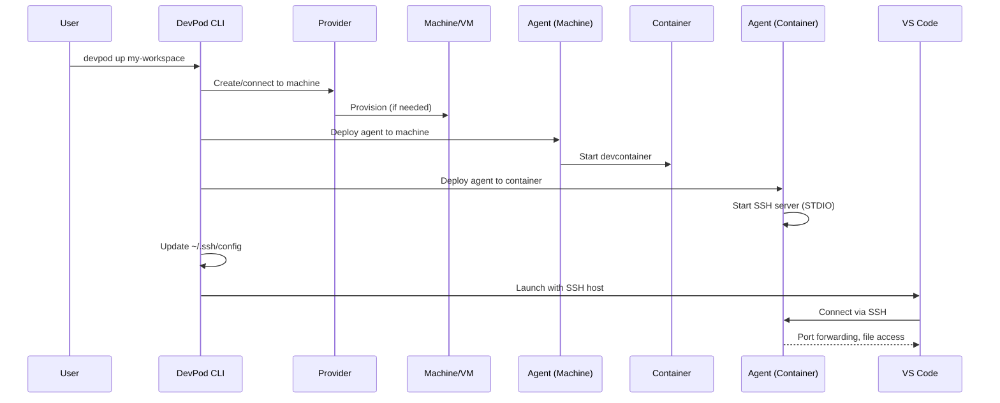
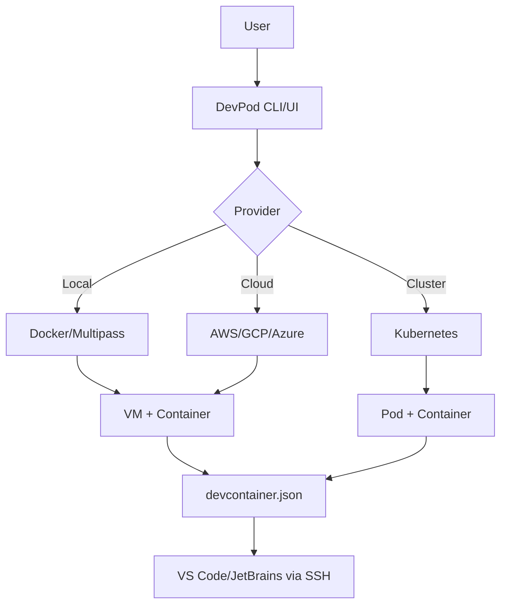
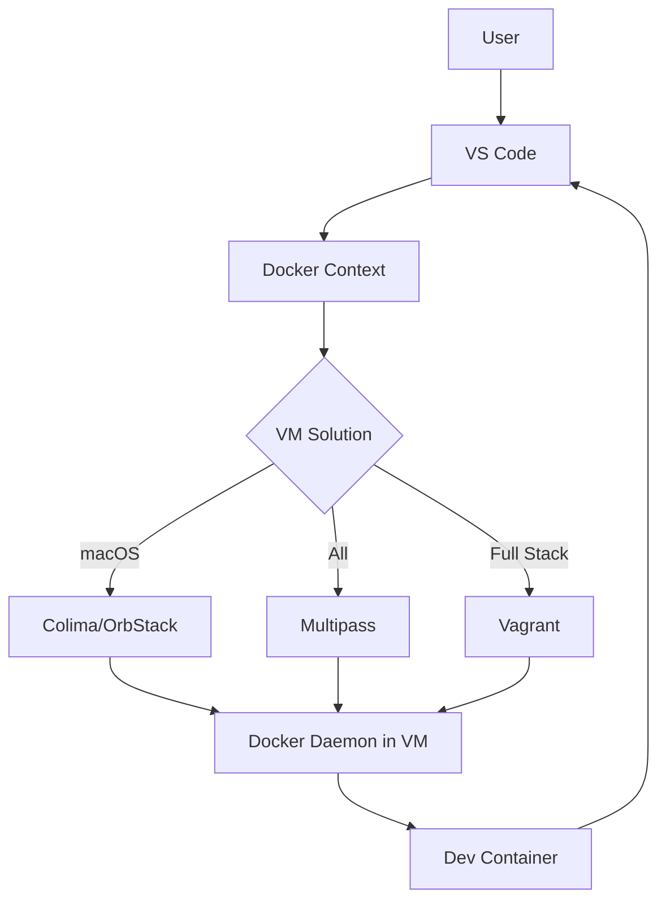
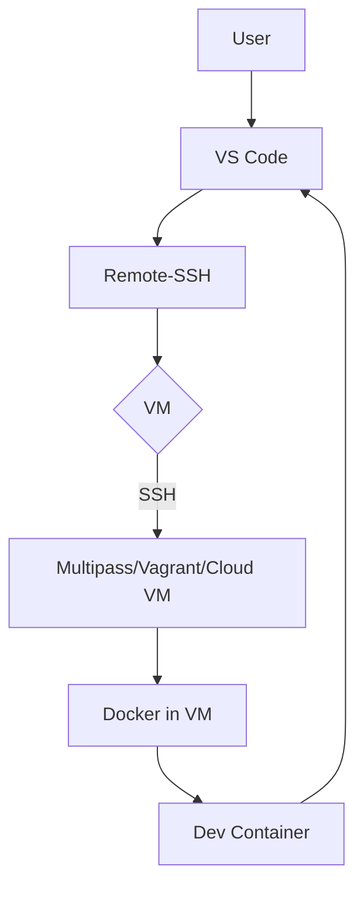

# VM Wrapper Solutions for VS Code Devcontainers

**Research Date**: 2025-10-21
**Context**: Research on how VMs (Multipass, Lima, etc.) can wrap or provide alternative isolation for VS Code devcontainers

---

## Executive Summary

Several solutions exist for running devcontainers in VM-based environments, ranging from direct integration tools like **DevPod** to lightweight VM wrappers like **Multipass**, **Lima/Colima**, and **OrbStack**. These solutions provide:

- ✅ Enhanced isolation beyond standard containers
- ✅ Cross-platform development (especially for macOS/Windows)
- ✅ Alternative to Docker Desktop
- ✅ VM-level security for container workloads

**Key Finding**: **DevPod** is the most mature open-source solution specifically designed to run devcontainers across multiple VM providers (Multipass, AWS, GCP, Azure, DigitalOcean, etc.)

**Local Development Focus**: For BitBot's use case, **local development on WSL, macOS, and Linux is the primary scenario**, with cloud deployment as a secondary option. DevPod's Docker provider offers the most practical solution for local VM-backed development.

---

## Local Development Scenarios (Primary Focus)

### Overview

DevPod excels at local development by supporting multiple local providers without requiring heavyweight server infrastructure. The **Docker provider** is the most common and practical choice for local development, but alternatives (Podman, Dockerless) are available.

### Platform-Specific Setup

#### 🪟 Windows + WSL2

**Recommended Setup**: DevPod + Docker in WSL2

**Installation**:
```bash
# Option 1: Install DevPod desktop app on Windows
# Download from https://devpod.sh

# Option 2: Install DevPod CLI in WSL
curl -L -o devpod "https://github.com/loft-sh/devpod/releases/latest/download/devpod-linux-amd64"
sudo install -c -m 0755 devpod /usr/local/bin
```

**Provider Setup**:
```bash
# In WSL: Add Docker provider
devpod provider add docker
devpod provider use docker
```

**Important Considerations**:
- ⚠️  **Path Handling**: DevPod may have issues with Windows paths (`/mnt/c/...`) when Docker is in WSL
  - **Best Practice**: Store projects in WSL filesystem (`/home/user/projects`), not Windows (`/mnt/c/`)
  - **Issue**: Setting `devpod-home=/mnt/c/Users/MyUser/` can cause incorrect volume binding
- ✅ **Docker Desktop**: If using Docker Desktop on Windows, ensure WSL2 integration is enabled
- ✅ **Performance**: WSL filesystem (~10x faster than `/mnt/c/` for file I/O)
- 🔧 **Recent Improvements**: As of April 2025, WSL integration has improved significantly

**Configuration Example**:
```bash
# Use WSL-native paths
cd ~/projects/my-repo
devpod up .
```

**Alternative**: Use DevPod desktop app on Windows, which handles path translation automatically.

#### 🍎 macOS

**Recommended Setup**: DevPod + Colima (lightweight, free alternative to Docker Desktop)

**Installation**:
```bash
# Install Homebrew dependencies
brew install docker colima devpod

# Start Colima (creates VM)
colima start --cpu 4 --memory 8 --disk 100

# Add Docker provider to DevPod
devpod provider add docker
devpod provider use docker
```

**Alternative Setups**:

1. **Docker Desktop** (commercial):
   ```bash
   # Install Docker Desktop from docker.com
   devpod provider add docker
   ```

2. **OrbStack** (fastest, commercial):
   ```bash
   # Install OrbStack from orbstack.dev
   # OrbStack automatically sets up Docker context
   devpod provider add docker
   ```

3. **Lima** (most flexible):
   ```bash
   brew install lima
   limactl start default
   devpod provider add docker
   ```

**Performance Comparison (macOS)**:

| Solution          | Startup Time | Performance       | Cost      | Best For                    |
|-------------------|--------------|-------------------|-----------|------------------------------|
| **OrbStack**      | ~5 sec       | ⭐⭐⭐⭐⭐ (Rosetta) | Paid/Free | M1/M2 Macs, best performance|
| **Colima**        | ~10 sec      | ⭐⭐⭐⭐          | Free      | Open-source preference      |
| **Docker Desktop**| ~15 sec      | ⭐⭐⭐           | Paid/Free | Enterprise, familiar        |
| **Lima**          | ~10 sec      | ⭐⭐⭐⭐          | Free      | Multi-distro, flexibility   |

**Apple Silicon (M1/M2) Considerations**:
```bash
# For x86 emulation with Colima + Rosetta
colima start --vz-rosetta --vm-type vz --arch x86_64

# OrbStack automatically uses Rosetta (fastest)
```

**File Sharing Performance**:
- OrbStack: Optimized VirtioFS with custom caching (fastest)
- Colima: Standard VirtioFS
- Docker Desktop: VirtioFS (slower than OrbStack)

#### 🐧 Linux (Native Docker)

**Recommended Setup**: DevPod + Docker (native)

**Installation**:
```bash
# Install Docker (example for Ubuntu/Debian)
sudo apt-get update
sudo apt-get install docker.io docker-compose

# Add user to docker group (no sudo required)
sudo usermod -aG docker $USER
newgrp docker

# Install DevPod CLI
curl -L -o devpod "https://github.com/loft-sh/devpod/releases/latest/download/devpod-linux-amd64"
sudo install -c -m 0755 devpod /usr/local/bin

# Add Docker provider
devpod provider add docker
devpod provider use docker
```

**Rootless Alternative (Podman)**:
```bash
# Install Podman
sudo apt-get install podman

# Install DevPod
curl -L -o devpod "https://github.com/loft-sh/devpod/releases/latest/download/devpod-linux-amd64"
sudo install -c -m 0755 devpod /usr/local/bin

# Configure DevPod to use Podman
devpod provider add docker
# In provider options, set DOCKER_PATH to podman socket
devpod provider set-options docker \
  --option DOCKER_PATH=/run/user/$(id -u)/podman/podman.sock
```

**Dockerless Provider (No Docker/Podman Required)**:

For situations where Docker/Podman aren't installed:

```bash
# Install Dockerless provider
devpod provider add dockerless
devpod provider use dockerless
```

**Features**:
- ✅ Uses RootlessKit for rootless containers
- ✅ Uses Crane for image management
- ✅ No Docker daemon required
- ✅ Linux only
- ⚠️  Less mature than Docker provider

**Performance**:
- **Native Linux**: Best performance (no VM overhead)
- **Docker**: Direct kernel access, fastest
- **Podman**: Similar to Docker, rootless benefit
- **Dockerless**: Lightweight, no daemon overhead

---

### DevPod: CLI vs Desktop App

#### Desktop App (GUI)

**Installation**:
- Windows: Download `.exe` installer
- macOS: Download `.dmg` (Apple Silicon and Intel)
- Linux: Download `.AppImage` or `.deb`

**Features**:
- ✅ Visual workspace management
- ✅ Provider configuration UI
- ✅ One-click workspace creation
- ✅ Integrated IDE launcher
- ✅ Abstracts complexity away
- ✅ Better for beginners

**Use Case**: Developers who prefer GUI, quick setup, visual workspace management

#### CLI (Command-Line)

**Installation**:
```bash
# Linux/macOS
curl -L -o devpod "https://github.com/loft-sh/devpod/releases/latest/download/devpod-linux-amd64"
sudo install -c -m 0755 devpod /usr/local/bin

# Or install via desktop app (includes CLI)
```

**Features**:
- ✅ Scriptable/automatable
- ✅ CI/CD integration
- ✅ Remote server usage (SSH)
- ✅ Advanced configuration control
- ✅ Faster for power users

**Use Case**: Automation, scripting, CI/CD, remote development, power users

**Common CLI Commands**:
```bash
# Create workspace from git repo
devpod up github.com/user/repo

# Create workspace from local directory
devpod up /path/to/project

# List workspaces
devpod list

# Delete workspace
devpod delete my-workspace

# SSH into workspace
devpod ssh my-workspace

# Open workspace in IDE
devpod ide vscode my-workspace
```

**Note**: Both CLI and Desktop App can coexist and share the same workspaces.

---

### VS Code Connection Architecture

#### How VS Code Connects to DevPod

DevPod uses a sophisticated SSH-based architecture to connect VS Code (and other IDEs) to development containers:



#### Connection Flow Details

1. **Provider-Specific Tunnel Creation**:
   - DevPod establishes connection using provider-specific API
   - AWS: Instance Connect
   - Kubernetes: kubectl (K8s control plane)
   - Docker (local): Direct container access
   - SSH: Standard SSH protocol
   - This vendor-specific channel is called the "tunnel"

2. **Machine Agent Deployment**:
   - DevPod copies its agent binary to the machine/VM
   - Agent runs as a background process
   - Handles machine-level operations (starting containers, port forwarding, etc.)

3. **Container Agent Deployment**:
   - Once devcontainer is running, DevPod deploys agent to the container
   - Agent includes embedded SSH server
   - SSH server uses STDIO (stdin/stdout) of the secure tunnel
   - This creates a "port-forward-free" connection (secure by default)

4. **SSH Configuration**:
   - DevPod automatically modifies `~/.ssh/config`
   - Adds entry for `WORKSPACE_NAME.devpod` hostname
   - Example entry:
   ```
   Host my-workspace.devpod
       HostName localhost
       User devpod
       Port 12345
       StrictHostKeyChecking no
       UserKnownHostsFile /dev/null
       LogLevel ERROR
       ProxyCommand /usr/local/bin/devpod ssh my-workspace --stdio
   ```
   - ProxyCommand uses DevPod's embedded SSH client

5. **IDE Launch**:
   - DevPod launches VS Code with SSH Remote extension
   - Command: `code --remote ssh-remote+my-workspace.devpod /workspace`
   - VS Code Remote-SSH extension connects to `my-workspace.devpod`
   - DevPod's ProxyCommand handles the actual connection via STDIO tunnel

6. **Connection Maintenance**:
   - Agent provides port forwarding (local ↔ container)
   - Agent forwards credentials (Git SSH keys, tokens)
   - Agent streams logs for debugging
   - gRPC server handles control plane operations

#### Prerequisites

**Required**:
- VS Code with **Remote-SSH** extension (`ms-vscode-remote.remote-ssh`)
- VS Code CLI (`code` command available in PATH)
- DevPod automatically checks for these during setup

**Installation**:
```bash
# Install Remote-SSH extension
code --install-extension ms-vscode-remote.remote-ssh

# Verify code CLI works
which code  # Should return path to VS Code CLI
```

#### SSH Config Management

**Automatic Entry** (created by DevPod):
```bash
# View DevPod SSH entries
grep -A 5 '\.devpod$' ~/.ssh/config

# Example output:
# Host my-workspace.devpod
#   ProxyCommand /usr/local/bin/devpod ssh my-workspace --stdio
#   User devpod
#   StrictHostKeyChecking no
```

**Manual Connection**:
```bash
# Connect via SSH directly
ssh my-workspace.devpod

# Execute command in workspace
ssh my-workspace.devpod "ls -la /workspace"

# Or use VS Code Remote-SSH UI to connect to "my-workspace.devpod"
```

#### DevPod CLI vs Dev Container CLI

**Critical Distinction**: DevPod is a **REPLACEMENT/ALTERNATIVE** to @devcontainers/cli, NOT a wrapper.

**Two Separate Implementations**:

| Aspect                    | @devcontainers/cli                  | DevPod                               |
|---------------------------|-------------------------------------|--------------------------------------|
| **Language**              | TypeScript/JavaScript (Node.js)     | Go                                   |
| **Parser**                | Reference implementation            | Own implementation (pkg/devcontainer)|
| **Distribution**          | npm package (`@devcontainers/cli`)  | Single Go binary                     |
| **Runtime Deps**          | Node.js, Python, C/C++              | None (static binary)                 |
| **VS Code Integration**   | Dev Containers extension            | Remote-SSH extension                 |
| **Connection Method**     | Docker exec/socket                  | SSH over STDIO tunnel                |
| **Provider Support**      | Docker, Docker Compose              | 10+ providers (Docker, VMs, cloud)   |
| **IDE Support**           | VS Code, Codespaces                 | VS Code, JetBrains, any SSH-capable  |
| **Multi-Provider**        | ❌ No                               | ✅ Yes                               |
| **Used By**               | VS Code, Codespaces, GitHub Actions | DevPod Desktop/CLI                   |

**DevPod Implementation Details**:
- Source: `github.com/loft-sh/devpod/pkg/devcontainer`
- Has methods: `getRawConfig`, `getSubstitutedConfig`, etc.
- Parses devcontainer.json directly in Go
- Does NOT invoke or depend on `@devcontainers/cli`
- Creates containers via provider APIs (Docker API, kubectl, AWS SDK, etc.)
- Uses Remote-SSH (not Dev Containers extension) for VS Code connection

**Why DevPod Built Its Own Parser**:
1. **Language/Ecosystem**: Go vs Node.js - avoids Node.js dependency
2. **Multi-Provider Architecture**: Needed provider abstraction @devcontainers/cli doesn't have
3. **SSH-Based Connection**: Different connection model than VS Code Dev Containers extension
4. **Single Binary Distribution**: No npm/Node.js runtime required

**The Common Standard**: `devcontainer.json`
- Both tools implement the **same spec** (from containers.dev)
- ✅ devcontainer.json files are **portable between tools**
- ✅ Both support features, lifecycle hooks, mounts, etc.
- ✅ A project with devcontainer.json works with both

**For BitBot**:

BitBot can use **either** or **both** approaches:

```bash
# Option 1: Use @devcontainers/cli (BitBot MVP approach)
npx @devcontainers/cli up --workspace-folder .
# VS Code connects via Dev Containers extension

# Option 2: Use DevPod
devpod up . --provider docker --ide vscode
# VS Code connects via Remote-SSH

# Option 3: Hybrid (same devcontainer.json, different backends)
bitbot work                    # Uses @devcontainers/cli for local Docker
bitbot work --provider devpod-multipass  # Uses DevPod for VM isolation
```

**Recommendation for BitBot**:
- **MVP**: Keep using `@devcontainers/cli` (already working)
- **Phase 3**: Add DevPod as optional provider for VM/cloud support
- **Benefit**: Same devcontainer.json works with both tools

#### JetBrains IDE Support

DevPod also supports JetBrains IDEs using the same SSH architecture:

**Supported IDEs**:
- IntelliJ IDEA
- PyCharm
- GoLand
- WebStorm
- PhpStorm
- Rider
- CLion
- RubyMine

**Connection Method**:
- JetBrains Gateway (Remote Development)
- SSH connection to `WORKSPACE_NAME.devpod`
- Same ProxyCommand mechanism as VS Code

**Setup**:
```bash
# Launch workspace with JetBrains IDE
devpod ide goland my-workspace
```

#### VSCodium Support

**Issue**: Microsoft's Dev Containers extension is proprietary (not compatible with VSCodium)

**Solution**: Community extension - `vscodium-devpodcontainers`
- GitHub: https://github.com/3timeslazy/vscodium-devpodcontainers
- Codeberg: https://codeberg.org/Zelaf/vscodium-devpodcontainers
- Provides devcontainer remote development for VSCodium using DevPod

#### Security Features

**STDIO Tunnel**:
- Uses stdin/stdout instead of exposed ports
- No listening ports on host machine
- Secure and private by default
- ProxyCommand mechanism isolates connection

**Credential Forwarding**:
- Git credentials automatically synced to container
- SSH keys available in container (securely)
- No manual key copying needed

**Authentication**:
- DevPod manages authentication to provider (AWS, GCP, K8s, etc.)
- No credentials stored in container
- Uses local machine's credentials

#### Connection Commands

```bash
# Create workspace and open in VS Code
devpod up github.com/user/repo
devpod ide vscode my-workspace

# Or combine in one step
devpod up github.com/user/repo --ide vscode

# SSH into workspace manually
devpod ssh my-workspace

# SSH with command execution
devpod ssh my-workspace --command "ls -la"

# Get SSH connection details
devpod ssh my-workspace --print-config

# Stop workspace (keeps state)
devpod stop my-workspace

# Delete workspace
devpod delete my-workspace
```

#### Troubleshooting

**Common Issues**:

1. **VS Code can't connect**:
   ```bash
   # Check SSH config
   cat ~/.ssh/config | grep -A 10 "my-workspace.devpod"

   # Test SSH manually
   ssh my-workspace.devpod

   # Check DevPod logs
   devpod logs my-workspace
   ```

2. **ProxyCommand not found**:
   ```bash
   # Ensure devpod is in PATH
   which devpod

   # If not, add to PATH or use full path in ~/.ssh/config
   ```

3. **Stale SSH entries**:
   ```bash
   # Clean up old entries
   devpod ssh-config --cleanup

   # Or manually edit ~/.ssh/config
   ```

#### BitBot Integration Considerations

**For BitBot's DevPod integration**:

1. **Workspace Naming**: BitBot should use predictable workspace names
   ```bash
   # Example: project name + mode
   devpod up /workspace --id bitbot-myproject-work
   # Creates SSH host: bitbot-myproject-work.devpod
   ```

2. **Multi-Container Support**: DevPod typically runs one devcontainer per workspace
   - BitBot's work + setup containers would be separate workspaces
   - Alternative: Use Docker Compose in devcontainer.json for multi-container

3. **VS Code Launch**: BitBot could launch VS Code directly
   ```bash
   # BitBot wrapper
   bitbot work --vscode
   # Internally: devpod up . --ide vscode --provider docker
   ```

4. **SSH Access for AI Agents**: AI agents can use SSH to access workspace
   ```bash
   # Agent connects via SSH
   ssh bitbot-myproject-work.devpod "git status"
   ```

5. **Provider Selection**: BitBot can expose DevPod providers
   ```bash
   bitbot init --provider devpod-docker
   bitbot init --provider devpod-multipass
   ```

---

### Docker Provider: Performance & Features

#### Image Caching

**How it works**:
1. First workspace creation: Builds devcontainer image
2. Subsequent startups: Reuses cached image
3. Image tagged as `devpod-<HASH>` based on devcontainer.json content

**Performance Impact**:
- First build: 2-10 minutes (depends on image size)
- Subsequent starts: 10-30 seconds (no rebuild)

**Example**:
```bash
# First run: Full build
devpod up github.com/myorg/myrepo  # 5 minutes

# Second run: Cached
devpod up github.com/myorg/myrepo  # 15 seconds

# Check cached images
docker images | grep devpod
```

#### Prebuilds

**Concept**: Pre-built devcontainer images stored in a registry (ghcr.io, Docker Hub, etc.)

**Setup**:
```json
// .devcontainer/devcontainer.json
{
  "image": "ghcr.io/myorg/myrepo:devpod-abc123",
  "features": { ... }
}
```

**DevPod Integration**:
- DevPod generates hash from devcontainer.json
- Checks registry for matching prebuild
- If found: Pulls image instead of building
- If not found: Builds locally

**Performance**:
- With prebuild: 30-60 seconds (pull only)
- Without prebuild: 2-10 minutes (build)

**Best Practice**: Use GitHub Actions or CI to prebuild and push images to registry.

#### Additional Features

**Git Credentials Sync**:
- DevPod automatically syncs Git credentials into containers
- No manual SSH key copying required

**Inactivity Shutdown**:
- Auto-stop workspaces after inactivity period
- Saves resources for cloud providers
- Configurable per provider

**Docker-in-Docker**:
- Supports nested Docker for CI/CD workflows
- Configure via devcontainer.json features

---

### Local Development: Performance Comparison

#### Startup Times (Average)

| Scenario                          | Initial Build | Subsequent Start | Notes                        |
|-----------------------------------|---------------|------------------|------------------------------|
| Native Docker (Linux)             | 2-5 min       | 10-20 sec        | Best performance             |
| Docker Desktop (macOS)            | 3-7 min       | 15-30 sec        | VM overhead                  |
| Colima (macOS)                    | 2-5 min       | 10-25 sec        | Lightweight VM               |
| OrbStack (macOS M1/M2)            | 2-4 min       | 5-15 sec         | Rosetta optimization         |
| WSL2 + Docker (Windows)           | 2-5 min       | 15-30 sec        | WSL filesystem critical      |
| DevPod w/ Multipass VM            | 5-10 min      | 30-60 sec        | VM startup + Docker          |
| DevPod w/ Prebuilds               | 1-2 min       | 10-20 sec        | Registry pull only           |

**Note**: Times assume small-to-medium devcontainer images (~2-5GB). Large images (>10GB) can take 2-3x longer.

#### Runtime Performance

**Native Linux**: ⭐⭐⭐⭐⭐
- Direct kernel access
- No virtualization overhead
- Filesystem: Native ext4/btrfs performance

**macOS (OrbStack)**: ⭐⭐⭐⭐⭐
- Rosetta for x86 emulation (near-native)
- Optimized VirtioFS with caching
- Best macOS option

**macOS (Colima/Lima)**: ⭐⭐⭐⭐
- Standard VM performance
- VirtioFS for file sharing
- Open-source, reliable

**macOS (Docker Desktop)**: ⭐⭐⭐
- Heavier VM overhead
- Slower filesystem performance
- Enterprise support

**WSL2 (WSL filesystem)**: ⭐⭐⭐⭐⭐
- Near-native Linux performance
- Fast ext4 filesystem
- **Critical**: Use `/home/user/`, not `/mnt/c/`

**WSL2 (Windows filesystem /mnt/c/)**: ⭐⭐
- 9P filesystem translation overhead
- ~10x slower than WSL native filesystem
- **Avoid for development**

---

### Local Development Best Practices

#### 1. Filesystem Location

**macOS/Linux**: Store projects in native filesystem
```bash
# Good
~/projects/my-repo

# Avoid
/Volumes/ExternalDrive/projects  # Slower
```

**Windows/WSL**: Store projects in WSL filesystem
```bash
# Good (WSL)
/home/username/projects/my-repo

# Bad (Windows filesystem via WSL)
/mnt/c/Users/username/projects/my-repo  # 10x slower
```

#### 2. devcontainer.json Configuration

**Optimize for local development**:
```json
{
  "name": "My Dev Environment",
  "image": "mcr.microsoft.com/devcontainers/base:ubuntu",

  // Use features for modular setup
  "features": {
    "ghcr.io/devcontainers/features/docker-in-docker:2": {},
    "ghcr.io/devcontainers/features/node:1": {}
  },

  // Mount Docker socket for Docker-in-Docker
  "mounts": [
    "source=/var/run/docker.sock,target=/var/run/docker.sock,type=bind"
  ],

  // Forward ports automatically
  "forwardPorts": [3000, 8080],

  // Post-create commands (cached between rebuilds)
  "postCreateCommand": "npm install",

  // Environment variables (public)
  "remoteEnv": {
    "NODE_ENV": "development"
  }
}
```

#### 3. Multiple Workspaces

**Use `--machine` flag to share compute**:
```bash
# First project (creates new machine)
devpod up /path/to/project1

# Second project (reuses same machine)
devpod up /path/to/project2 --machine project1
```

**Benefits**:
- Shared VM/Docker daemon
- Faster startup for subsequent workspaces
- Resource efficiency

#### 4. Git Configuration

**Container-local git config**:
```bash
# Inside devcontainer (don't use --global)
git config user.name "Your Name"
git config user.email "you@example.com"
```

**Reason**: `--global` changes don't persist across container recreations. DevPod syncs credentials automatically.

#### 5. Backup Before Rebuilds

**Important**: Deleting and recreating workspace loses local data

```bash
# Before rebuild
devpod ssh my-workspace
tar -czf /workspace-backup.tar.gz /workspaces/my-workspace

# After rebuild
devpod ssh my-workspace
tar -xzf /workspace-backup.tar.gz
```

**Better**: Use persistent volumes for data
```json
// devcontainer.json
{
  "mounts": [
    "source=my-data-volume,target=/data,type=volume"
  ]
}
```

#### 6. Resource Limits

**Docker provider options**:
```bash
# Set memory limit (8GB)
devpod provider set-options docker --option MEMORY=8Gi

# Set CPU limit (4 cores)
devpod provider set-options docker --option CPUS=4
```

**macOS (Colima)**:
```bash
# Set resources at Colima startup
colima start --cpu 4 --memory 8 --disk 100
```

---

### Local vs VM vs Cloud Comparison

| Aspect              | Docker (Local)  | DevPod + Docker | DevPod + Multipass | DevPod + Cloud |
|---------------------|-----------------|------------------|-------------------|----------------|
| **Setup Time**      | 5 min           | 10 min           | 15 min            | 20 min         |
| **Startup (cold)**  | 2-5 min         | 2-5 min          | 5-10 min          | 3-8 min        |
| **Startup (warm)**  | 10-20 sec       | 10-20 sec        | 30-60 sec         | 20-40 sec      |
| **Performance**     | ⭐⭐⭐⭐⭐        | ⭐⭐⭐⭐⭐         | ⭐⭐⭐⭐           | ⭐⭐⭐⭐        |
| **Isolation**       | Container       | Container        | VM + Container    | VM + Container |
| **Escape Risk**     | Medium          | Medium           | Low               | Low            |
| **Cost**            | Free            | Free             | Free              | $$$            |
| **Network Access**  | Host network    | Host network     | VM network        | Cloud network  |
| **Portability**     | Low             | High             | High              | High           |
| **Team Sharing**    | Manual          | devcontainer.json| devcontainer.json | devcontainer.json|
| **Best For**        | Solo dev        | Solo/small team  | Security-critical | Remote/teams   |

**Recommendation for BitBot**:
- **Primary**: DevPod + Docker (local) - best balance of performance and features
- **Enhanced Security**: DevPod + Multipass (local VM) - VM-level isolation
- **Remote/Team**: DevPod + Cloud (AWS/GCP) - secondary option

---

## 1. DevPod (Primary Solution)

**Project**: https://github.com/loft-sh/devpod
**Status**: ✅ Active, production-ready
**Description**: Open-source Codespaces alternative - client-only, unopinionated devcontainer runtime

### Architecture

```
┌─────────────┐
│  VS Code    │
│  JetBrains  │
└──────┬──────┘
       │ SSH
       ▼
┌─────────────────────────────────┐
│  DevPod Agent (VM/Machine)      │
│  ┌───────────────────────────┐  │
│  │  DevPod Agent (Container) │  │
│  │  ┌────────────────────┐   │  │
│  │  │  Dev Container     │   │  │
│  │  │  (devcontainer.json│   │  │
│  │  └────────────────────┘   │  │
│  └───────────────────────────┘  │
└─────────────────────────────────┘
```

### Key Features

- **Provider Architecture**: Separates infrastructure (where to run) from containers (what to run)
- **VM Providers**: AWS, GCP, Azure, DigitalOcean, SSH, Kubernetes, Docker, **Multipass**, and more
- **Client-Agent Model**: Deploys agent to VM and container for port forwarding, credential forwarding, log streaming
- **IDE Support**: VS Code, VS Code Browser, JetBrains IDEs (IntelliJ, GoLand, PyCharm, etc.)
- **devcontainer.json**: Standard devcontainer specification

### Multipass Provider

**Project**: https://github.com/minhio/devpod-provider-multipass
**Status**: ✅ Community-maintained Multipass provider

**Features**:
- `MULTIPASS_MOUNTS` option for mounting local paths to devcontainer via Multipass instance
- Launches Ubuntu VM via Multipass, then runs devcontainer inside
- Cross-platform (macOS, Windows, Linux)

### Connection Flow

1. **VM Creation**: DevPod uses provider CLI (e.g., `multipass`, `aws`, `kubectl`) to create VM
2. **Secure Tunnel**: Connects via provider-specific tunnel (SSH, instance connect, K8s control plane)
3. **SSH Server**: Agent starts SSH server over the tunnel's STDIO
4. **IDE Connection**: Local IDE connects to devcontainer via SSH
5. **Port Forwarding**: SSH tunnel handles port forwarding between local machine and container

### Drivers

- **Docker** (default): Runs devcontainer via Docker inside VM
- **Kubernetes**: Deploys workspace to K8s cluster instead of VM

### Use Cases

✅ Run devcontainers on cloud VMs (AWS, GCP, Azure)
✅ Run devcontainers in local VMs (Multipass, Docker)
✅ Run devcontainers in K8s clusters
✅ Share devcontainer infrastructure across team
✅ Client-only solution (no server infrastructure required)

---

## 2. Multipass (Canonical)

**Project**: https://multipass.run
**Status**: ✅ Official Canonical tool, actively maintained
**Description**: Lightweight VM manager for Ubuntu VMs (HyperKit on macOS, Hyper-V on Windows)

### Integration Approaches

#### A. DevPod + Multipass (Recommended)

- Uses Multipass as VM provider
- Full devcontainer.json support
- Automatic setup via `devpod provider add multipass`

#### B. Remote-SSH + Docker Blueprint

**Workflow**:
1. Launch Multipass VM with Docker blueprint:
   ```bash
   multipass launch --name dev-vm docker
   ```
2. Install Docker in VM automatically
3. Use VS Code Remote-SSH extension to connect to VM
4. Open devcontainer project in VS Code → prompts to reopen in container
5. Dev Containers extension runs inside Multipass VM

**Setup**:
```bash
# Get SSH config
multipass ssh-config dev-vm >> ~/.ssh/config

# Connect from VS Code Remote-SSH
# Then open folder with .devcontainer/devcontainer.json
# VS Code will prompt to reopen in container
```

#### C. Docker Context (Native Experience)

**Setup**:
```bash
# Create Docker context pointing to Multipass VM
docker context create multipass \
  --docker "host=ssh://ubuntu@multipass-vm-ip"
docker context use multipass

# VS Code devcontainers will use this context
# Clone repo with .devcontainer → automatic prompt
```

### Pros & Cons

| Pros                                      | Cons                                    |
|-------------------------------------------|-----------------------------------------|
| ✅ Official Canonical support             | ❌ Ubuntu-only                          |
| ✅ Cross-platform (Mac/Win/Linux)         | ❌ Requires manual Docker setup (B & C) |
| ✅ HyperKit/Hyper-V (lightweight)         | ❌ Extra SSH/context configuration      |
| ✅ Out-of-box Docker blueprint            | ❌ Less automated than DevPod           |
| ✅ VS Code extension available            |                                         |

---

## 3. Lima / Colima

**Lima**: https://github.com/lima-vm/lima
**Colima**: https://github.com/abiosoft/colima (built on Lima)
**Status**: ✅ Active, popular Docker Desktop alternative on macOS

### Architecture

- **Lima**: Launches Linux VMs with automatic file sharing, port forwarding, containerd
- **Colima**: Container runtime on macOS using Lima VMs

### Key Features

| Feature                    | Lima                              | Multipass              |
|----------------------------|-----------------------------------|------------------------|
| **OS Support**             | Alpine, Arch, Debian, Fedora,     | Ubuntu only            |
|                            | openSUSE, Rocky, Ubuntu           |                        |
| **Installation**           | No root required                  | Requires root          |
| **Architecture**           | x86 containers in ARM VM (fast)   | Standard emulation     |
| **Container Runtime**      | containerd (default)              | Docker                 |

### VS Code Devcontainer Integration

**Requirements**:
- Colima v0.2.2+ for proper VS Code container detection
- Automatically sets up `colima` Docker context

**Setup**:
```bash
# Start Colima
colima start

# VS Code Dev Containers extension works automatically
# (uses Docker context 'colima')
```

**Apple Silicon (M1/M2) x86 Emulation**:
```bash
# Start with Rosetta for x86 containers
colima start --vz-rosetta --vm-type vz --arch x86_64
```

### Pros & Cons

| Pros                                      | Cons                                    |
|-------------------------------------------|-----------------------------------------|
| ✅ Multi-distro support (Lima)            | ❌ macOS/Linux only (no Windows)        |
| ✅ No root required (Lima)                | ❌ Less enterprise features vs Multipass|
| ✅ Fast x86 on ARM (Rosetta)              | ❌ Community-driven (vs Canonical)      |
| ✅ containerd native                      |                                         |
| ✅ Lightweight, fast                      |                                         |

---

## 4. OrbStack

**Project**: https://orbstack.dev
**Status**: ✅ Commercial (free tier), actively developed
**Description**: Fast, light Docker & Linux VM solution for macOS

### Architecture

**VM Design**:
- Lightweight Linux VM with shared kernel (similar to WSL 2)
- Custom-built services in Swift, Go, Rust, C
- Purpose-built for macOS integration

**Key Optimizations**:
- **Rosetta Integration**: Uses Rosetta instead of QEMU for x86 emulation (much faster)
- **VirtioFS+**: Custom caching and optimizations on top of VirtioFS for bind mounts
- **Resource Efficiency**: Low CPU/memory overhead compared to Docker Desktop

### Devcontainer Support

✅ Full VS Code Dev Containers support via Docker compatibility
✅ Remote-SSH integration for Linux machines
✅ Seamless macOS integration (shared clipboard, files, networking)

### Pros & Cons

| Pros                                      | Cons                                    |
|-------------------------------------------|-----------------------------------------|
| ✅ Fastest on macOS (Rosetta)             | ❌ macOS only                           |
| ✅ Purpose-built for dev workflows        | ❌ Commercial (though free tier exists) |
| ✅ Better than Docker Desktop performance | ❌ Closed-source                        |
| ✅ Low resource usage                     |                                         |
| ✅ Excellent macOS integration            |                                         |

---

## 5. Vagrant

**Project**: https://www.vagrantup.com
**Status**: ✅ Mature, widely used (HashiCorp)
**Description**: VM provisioning and management tool

### Integration with VS Code

**Approach**: Remote-SSH to Vagrant VM

```bash
# Add Vagrant SSH config
vagrant ssh-config >> ~/.ssh/config

# Connect via VS Code Remote-SSH
# Use devcontainers inside Vagrant VM
```

### Recent Trends (2025)

**Developer Perspective**: Some developers are moving *back* to Vagrant from devcontainers for complex projects:

> "Debugging issues with the whole stack across a variety of computers, remotely, is leading me away from devcontainers and towards good old fashioned virtual machines. Vagrant can get me most of the way there for every platform... it seems like there is less to go wrong."
> — Developer blog post, February 2025

### Pros & Cons

| Pros                                      | Cons                                    |
|-------------------------------------------|-----------------------------------------|
| ✅ Mature, battle-tested                  | ❌ Heavier than containers              |
| ✅ Full VM isolation                      | ❌ Slower startup                       |
| ✅ Cross-platform                         | ❌ More complex than devcontainers      |
| ✅ Reproducible environments              | ❌ Requires Vagrant + VM provider       |
| ✅ Less complexity for full-stack apps   |                                         |

---

## 6. Other Solutions

### Rancher Desktop

**Project**: https://rancherdesktop.io
**Description**: Container management and Kubernetes on desktop
**Features**:
- ✅ Docker CLI via Moby (Dev Containers compatible)
- ✅ Cross-platform (macOS, Windows, Linux)
- ✅ K8s support built-in
- ✅ Open-source

### Podman

**Project**: https://podman.io
**Description**: Daemonless container engine
**Features**:
- ✅ Rootless containers
- ✅ Docker-compatible CLI
- ✅ VS Code Dev Containers support
- ✅ VM-based on macOS/Windows (podman machine)

### Kata Containers

**Project**: https://katacontainers.io
**Description**: Lightweight VMs that feel like containers
**Features**:
- ✅ VM-level isolation with container UX
- ✅ Security-focused (VM per container)
- ❌ No specific VS Code devcontainer integration found
- ⚠️  Would require custom runtime configuration

### Finch

**Project**: https://github.com/runfinch/finch
**Description**: AWS open-source Docker Desktop alternative
**Features**:
- ✅ Docker compatibility layer
- ✅ Can work with VS Code devcontainers
- ✅ Based on Lima (under the hood)

---

## Comparison Matrix

| Solution          | Platform          | VM Type       | Devcontainer | Complexity | Best For                  |
|-------------------|-------------------|---------------|--------------|------------|---------------------------|
| **DevPod**        | All               | Multi-provider| ✅ Native    | Low        | Multi-cloud, teams        |
| **Multipass**     | All               | Ubuntu VM     | ✅ Via setup | Medium     | Simple Ubuntu VMs         |
| **Colima**        | macOS/Linux       | Multi-distro  | ✅ Docker    | Low        | macOS Docker replacement  |
| **OrbStack**      | macOS             | Shared kernel | ✅ Docker    | Low        | macOS performance         |
| **Vagrant**       | All               | Full VMs      | ⚠️  SSH      | High       | Complex full-stack        |
| **Rancher**       | All               | VM (varies)   | ✅ Docker    | Low        | K8s + containers          |
| **Podman**        | All               | VM on Mac/Win | ✅ Docker    | Medium     | Rootless, security        |
| **Kata**          | Linux primarily   | Micro VMs     | ❌ Manual    | High       | High security isolation   |

---

## Architecture Patterns

### Pattern 1: DevPod Multi-Provider (Recommended for BitBot)



**Benefits**:
- Single tool for local and cloud
- Standard devcontainer.json
- Provider flexibility
- Team collaboration ready

### Pattern 2: Lightweight VM + Docker Context



**Benefits**:
- Native VS Code experience
- Lightweight
- Simple setup
- Good for single-user

### Pattern 3: Remote-SSH + VM



**Benefits**:
- Familiar SSH workflow
- Works with any VM
- Can use cloud VMs
- Flexible

---

## Recommendations for BitBot

### Option 1: DevPod + Multipass (Best Overall)

**Rationale**:
- ✅ Aligns with BitBot's multi-mode architecture (setup/work containers)
- ✅ Supports local (Multipass) and cloud (AWS/GCP) providers
- ✅ Standard devcontainer.json (no custom config)
- ✅ Cross-platform (Windows/macOS/Linux)
- ✅ Team-ready (multiple users can use same setup)

**Implementation**:
```bash
# User installs DevPod
devpod provider add multipass

# BitBot could wrap this
bitbot init --provider multipass
# Creates DevPod workspace with BitBot's devcontainer.json
```

### Option 2: Direct VM + Docker (Simpler)

**Rationale**:
- ✅ Simpler for single-user
- ✅ Can use Multipass directly (no extra dependency)
- ✅ More control over VM lifecycle
- ⚠️  Requires more custom setup logic

**Implementation**:
```bash
# BitBot manages Multipass directly
bitbot init
# - Creates Multipass VM
# - Installs Docker
# - Sets up Docker context
# - Launches devcontainer via @devcontainers/cli
```

### Option 3: Hybrid Approach

**Rationale**:
- ✅ Support both DevPod (for advanced users) and direct VM (for simple cases)
- ✅ BitBot detects which is available
- ✅ Falls back gracefully

**Implementation**:
```bash
bitbot init
# Detects: DevPod installed? Use it
# Otherwise: Create VM directly + Docker context
```

---

## Key Insights

### 1. DevPod is the Standard for VM-Backed Devcontainers

- Most mature open-source solution
- Active development and community
- Provider architecture is future-proof
- Supports standard devcontainer.json spec

### 2. Multipass is Ideal for Simple Ubuntu VMs

- Official Canonical support
- Cross-platform
- Docker blueprint for easy setup
- Good for BitBot's Ubuntu-focused approach

### 3. macOS Has Best Ecosystem

- OrbStack (performance champion)
- Colima (open-source, lightweight)
- Lima (flexible, multi-distro)
- All support devcontainers well

### 4. Windows: WSL2 vs VM Trade-offs

- WSL2 is faster than VM for simple cases
- VM provides better isolation
- Multipass works well on Windows (Hyper-V)
- DevPod abstracts this choice

### 5. Vagrant Still Relevant for Complex Stacks

- Some developers prefer VM stability
- Better for multi-service architectures
- More traditional, less "magic"
- Trade-off: heavier, slower startup

---

## Security Considerations

### Container Escape Mitigation

| Solution          | Isolation Level          | Kernel Sharing | Escape Risk |
|-------------------|--------------------------|----------------|-------------|
| **Standard Docker** | Namespace/cgroups      | ✅ Yes         | Medium      |
| **VM + Docker**   | VM + namespace           | ❌ No (VM)     | Low         |
| **Kata**          | Micro-VM per container   | ❌ No          | Very Low    |
| **Podman rootless** | User namespace         | ✅ Yes         | Low-Medium  |

**For BitBot**: VM wrapper (Multipass/DevPod) significantly reduces container escape risk by adding VM-level isolation.

---

## Performance Considerations

### Startup Time

```
Standard Docker:     ~2-5 seconds
VM + Docker:         ~15-30 seconds (VM startup)
Vagrant:             ~30-60 seconds
```

### Runtime Performance

- **OrbStack**: Fastest on macOS (Rosetta optimization)
- **Colima**: Fast, lightweight
- **Multipass**: Good performance, standard VM overhead
- **DevPod**: Depends on provider (local = fast, cloud = network latency)

---

## References

- DevPod: https://devpod.sh
- DevPod Multipass Provider: https://github.com/minhio/devpod-provider-multipass
- Multipass: https://multipass.run
- Lima: https://github.com/lima-vm/lima
- Colima: https://github.com/abiosoft/colima
- OrbStack: https://orbstack.dev
- Vagrant: https://www.vagrantup.com
- VS Code Dev Containers: https://code.visualstudio.com/docs/devcontainers

---

**Research conducted**: 2025-10-21
**For project**: BitBot (AI agent container orchestrator)
**Key takeaway**: DevPod + Multipass provides the best balance of features, cross-platform support, and future-proofing for VM-backed devcontainer workflows.
