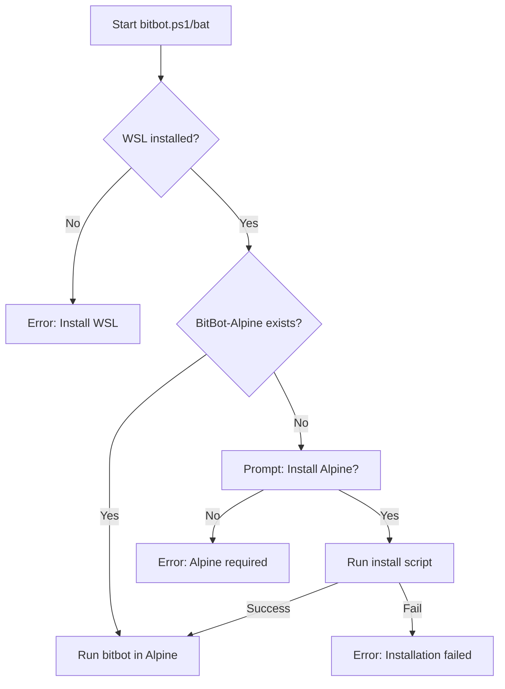

# BitBot Launcher Improvements

**Date**: 2025-10-20
**Status**: Complete

## Summary

Enhanced BitBot launcher scripts with better dependency checking, Alpine WSL auto-installation, and improved UX.

---

## ✅ **Completed Improvements**

### 1. Enhanced Dependency Checking

**File**: `tests/bitbot` (bash script)

**Changes**:
- ✅ Changed "Available tools" → "Check dependencies"
- ✅ Added color-coded output (green ✓, yellow ⚠, red ✗)
- ✅ Removed empty lines from version output
- ✅ Enhanced VS Code detection with extension check
- ✅ Detects VS Code builtin devcontainer CLI vs standalone
- ✅ Shows helpful install instructions for missing dependencies
- ✅ Checks if Docker is running (not just installed)

**Output Example**:
```
BitBot version 0.1.0-test
Platform: wsl
Check dependencies:
  ✓ VS Code installed
  ✓ DevContainer CLI (VS Code builtin)
  ✓ Docker running
```

**With Missing Dependencies**:
```
BitBot version 0.1.0-test
Platform: wsl
Check dependencies:
  ✓ VS Code installed
  ⚠ VS Code found but Dev Containers extension missing
    Install: code --install-extension ms-vscode-remote.remote-containers
  ✗ Docker not found
```

---

### 2. Alpine WSL Auto-Installation

**Files**: `tests/bitbot.ps1`, `tests/bitbot.bat`

**Changes**:
- ✅ Check for BitBot-Alpine WSL distribution on startup
- ✅ Offer to install if not found
- ✅ Call existing install script automatically
- ✅ Use `-d BitBot-Alpine` flag to ensure isolation
- ✅ Prevent accidentally using default WSL distro

**User Experience**:

```powershell
PS> .\bitbot.ps1 version

BitBot-Alpine WSL distribution not found.

BitBot requires a dedicated WSL distribution for isolation.

Install BitBot-Alpine now? (Y/n): y

Installing BitBot-Alpine...
==================================
 BitBot WSL Installer
==================================
...
```

**Future Path**:
When BitBot is installed in Alpine at `/opt/bitbot/bin/bitbot`, the entry points will use:
```powershell
wsl -d BitBot-Alpine /opt/bitbot/bin/bitbot $Command
```

---

### 3. Entry Point Platform Display

**Files**: `tests/bitbot.ps1`, `tests/bitbot.bat`

**Changes**:
- ✅ Show "Entry Point: Windows PowerShell" in .ps1
- ✅ Show "Entry Point: Windows cmd.exe" in .bat
- ✅ Displayed before version output for clarity

**Output**:
```powershell
PS> .\bitbot.ps1 version
Entry Point: Windows PowerShell

BitBot version 0.1.0-test
Platform: wsl
Check dependencies:
  ✓ VS Code installed
  ✓ DevContainer CLI (VS Code builtin)
  ✓ Docker running
```

---

### 4. Specification Updates

**File**: `Specification/10_INSTALLATION_DISTRIBUTION.md`

**Changes**:
- ✅ Added uninstall tasks to Phase 3 (Windows Support)
  - BitBot-Alpine WSL uninstall script
  - Full Windows uninstaller (removes Alpine + launchers)

---

## 📋 **Implementation Details**

### Dependency Check Logic

```bash
check_devcontainer_cli() {
    # Returns one of:
    # - "builtin"     : VS Code + Dev Containers extension
    # - "standalone"  : Standalone devcontainer CLI
    # - "vscode-only" : VS Code without extension
    # - "none"        : Nothing found
}
```

**Decision Matrix**:

| VS Code | Extension | Standalone | Result | Status |
|---------|-----------|------------|--------|--------|
| ✅ | ✅ | N/A | builtin | ✅ Best |
| ✅ | ❌ | ✅ | standalone | ✅ OK |
| ✅ | ❌ | ❌ | vscode-only | ⚠ Missing ext |
| ❌ | N/A | ✅ | standalone | ✅ OK |
| ❌ | N/A | ❌ | none | ✗ Install needed |

### Alpine WSL Check Flow



### Color Codes

```bash
GREEN='\033[0;32m'   # ✓ Success
YELLOW='\033[1;33m'  # ⚠ Warning
RED='\033[0;31m'     # ✗ Error
NC='\033[0m'         # Reset
```

---

## 🧪 **Testing**

### Test 1: Version with All Dependencies

```bash
$ ./bitbot version
```

**Expected**:
- All green checkmarks
- No empty lines
- Color-coded symbols

### Test 2: Version from PowerShell

```powershell
PS> .\bitbot.ps1 version
```

**Expected**:
- Shows "Entry Point: Windows PowerShell"
- Checks dependencies in Alpine WSL
- Same color output

### Test 3: Missing Alpine

```powershell
PS> .\bitbot.ps1 version
```

**If Alpine missing**:
- Prompts for installation
- Calls install-bitbot-wsl.ps1
- Continues after installation

### Test 4: Missing Dependencies

Uninstall VS Code or stop Docker, then:

```bash
$ ./bitbot version
```

**Expected**:
- ⚠ or ✗ symbols for missing items
- Helpful install instructions
- No crashes

---

## 📁 **Files Modified**

| File | Changes | Lines Changed |
|------|---------|---------------|
| `tests/bitbot` | Enhanced dependency checking | ~50 |
| `tests/bitbot.ps1` | Alpine check + entry point | ~30 |
| `tests/bitbot.bat` | Alpine check + entry point | ~25 |
| `Specification/10_INSTALLATION_DISTRIBUTION.md` | Added uninstall TODOs | +2 |

---

## 🔄 **Migration from Default WSL**

### Before (Risky):
```powershell
# Uses default WSL (Ubuntu/Debian)
# Docker Desktop can interfere
wsl bash bitbot version
```

### After (Isolated):
```powershell
# Uses dedicated BitBot-Alpine
# Docker Desktop won't corrupt it
wsl -d BitBot-Alpine /opt/bitbot/bin/bitbot version
```

---

## 🎯 **Benefits**

### For Users:
1. ✅ **Automatic setup**: Alpine installs on first run
2. ✅ **Clear feedback**: Know exactly what's missing
3. ✅ **Platform awareness**: See which entry point is used
4. ✅ **No confusion**: Color-coded, no empty lines

### For Developers:
1. ✅ **Isolation**: BitBot-Alpine won't conflict with other WSL distros
2. ✅ **Consistency**: Same environment every time
3. ✅ **Debugging**: Entry point clearly labeled
4. ✅ **Safety**: Can't accidentally use wrong distro

---

## 🚀 **Next Steps**

### Immediate:
- [ ] Test with BitBot-Alpine installed
- [ ] Test with BitBot-Alpine not installed (auto-install flow)
- [ ] Verify colors work in Windows Terminal and PowerShell

### Future:
- [ ] Create bitbot.exe C# launcher (production)
- [ ] Install BitBot in Alpine at `/opt/bitbot/`
- [ ] Update launchers to use installed path
- [ ] Create uninstall script for BitBot-Alpine
- [ ] Package for distribution

---

## 📖 **Related Documentation**

- **Installation**: `archive/manual-building/install-bitbot-wsl.ps1`
- **Testing**: `tests/TESTING.md`
- **README**: `tests/README.md`
- **Spec**: `Specification/10_INSTALLATION_DISTRIBUTION.md`

---

## 🐛 **Known Issues**

None currently identified.

---

**Implemented by**: Claude Code
**Reviewed**: Pending
**Status**: ✅ Ready for testing
