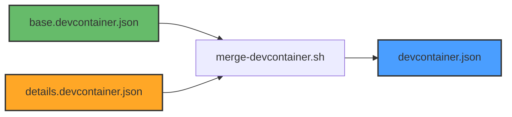

# Shared DevContainer Configuration

This directory contains shared configuration for all BitBot devcontainer templates.

## System Overview



**Formula**: `base.devcontainer.json` + `details.devcontainer.json` => `devcontainer.json`

## Files

| File                       | Purpose                                      |
|----------------------------|----------------------------------------------|
| `base.devcontainer.json`   | Common config shared by all templates       |
| `scripts/merge-devcontainer.sh` | JSON merge tool (uses jq)          |
| `scripts/setup-base.sh`    | Base setup for all templates                |
| `scripts/install-ai-tools.sh` | Fallback AI tool installation          |
| `scripts/install-dev-tools.sh` | Additional dev tools                  |

## Merge System

### How It Works

1. **base.devcontainer.json** - Common configuration:
   - Features: Node.js, Git
   - Base mounts
   - Common VS Code settings
   - postCreateCommand hook

2. **details.devcontainer.json** - Template-specific:
   - Located in each template dir (`templates/base/`, `templates/workspace/`, etc.)
   - Contains only template-specific overrides
   - Merged with base to produce final `devcontainer.json`

3. **Merge Strategy**:
   - Deep recursive merge (objects)
   - Arrays are **replaced** (not merged, to avoid duplicates)
   - Details override base values

### Usage

**Merge single template**:
```bash
./templates/shared/scripts/merge-devcontainer.sh templates/workspace
```

**Merge all templates**:
```bash
./templates/shared/scripts/merge-all.sh
```

### Example

**base.devcontainer.json**:
```json
{
  "features": {
    "ghcr.io/devcontainers/features/node:1": { "version": "lts" }
  },
  "mounts": [
    "source=${localWorkspaceFolder},target=/workspace,type=bind"
  ]
}
```

**workspace/details.devcontainer.json**:
```json
{
  "name": "BitBot Workspace",
  "features": {
    "ghcr.io/anthropics/devcontainer-features/claude-code:1": { "version": "latest" }
  },
  "mounts": [
    "source=${localWorkspaceFolder},target=/workspace,type=bind",
    "source=${localWorkspaceFolder}/.devcontainer/home/claude,target=/home/bitbot/.claude,type=bind"
  ]
}
```

**Generated workspace/devcontainer.json**:
```json
{
  "name": "BitBot Workspace",
  "features": {
    "ghcr.io/devcontainers/features/node:1": { "version": "lts" },
    "ghcr.io/anthropics/devcontainer-features/claude-code:1": { "version": "latest" }
  },
  "mounts": [
    "source=${localWorkspaceFolder},target=/workspace,type=bind",
    "source=${localWorkspaceFolder}/.devcontainer/home/claude,target=/home/bitbot/.claude,type=bind"
  ]
}
```

**Note**: Mounts array is **replaced** (not merged) because arrays don't deep-merge in jq. This is why workspace/details includes the base workspace mount again.

## Adding a New Template

1. Create template directory: `templates/my-template/`
2. Create `details.devcontainer.json` with template-specific config
3. Create `Dockerfile` (if using custom image)
4. Run merge: `./templates/shared/scripts/merge-devcontainer.sh templates/my-template`
5. Test generated `devcontainer.json`

## Modifying Shared Configuration

**When to modify base.devcontainer.json**:
- Adding features/tools needed by ALL templates
- Changing common mount patterns
- Updating base VS Code settings

**When to modify details.devcontainer.json**:
- Template-specific features
- Template-specific mounts
- Template-specific VS Code extensions

**After modifying base**:
```bash
# Regenerate all templates
./templates/shared/scripts/merge-all.sh
```

## Requirements

- **jq** - JSON processor for merging
  - Ubuntu/Debian: `apt-get install jq`
  - macOS: `brew install jq`
  - Alpine: `apk add jq`

## See Also

- [Workspace Template](../workspace/README.md) - AI-powered development
- [Config Template](../config/README.md) - Infrastructure management
- [Base Template](../base/README.md) - Minimal environment
