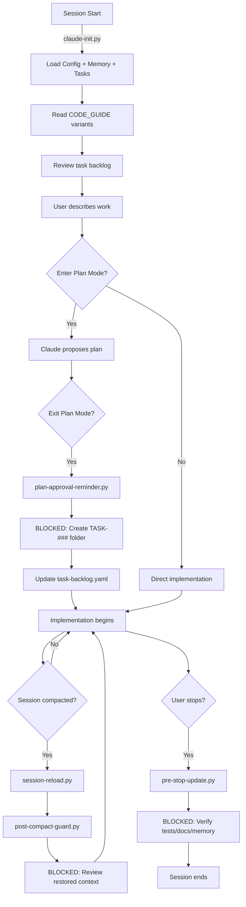

# Meridian Analysis: Task Scaffolding and Context Persistence

**Research Date:** 2025-11-14
**Repository:** https://github.com/markmdev/meridian
**Author:** Mark M (@markmdev)
**Purpose:** Analyze Meridian's task management and context persistence features for potential BitBot integration

---

## Executive Summary

Meridian is a zero-configuration Claude Code setup that implements persistent task management, structured memory, enforced coding standards, and context preservation after session compaction. Unlike Claude CodePro (which focuses on workflows) or BitBot (which focuses on container infrastructure), Meridian emphasizes **deterministic behavior through hooks** and **persistent project knowledge**.

**Key Finding:** Meridian's hook-based enforcement system and structured task/memory architecture provides a compelling model for managing complex multi-session development workflows. BitBot should consider adopting similar task scaffolding and memory persistence patterns.

---

## 1. Core Features Analysis

### 1.1 Feature Overview

| Feature                      | Description                                          | BitBot Applicability   |
| ---------------------------- | ---------------------------------------------------- | ---------------------- |
| **Context Persistence**      | Auto-reinject docs/tasks/memory after compaction    | ⭐⭐⭐ High            |
| **Deterministic Behavior**   | Hook-enforced workflows (not suggestions)            | ⭐⭐⭐ High            |
| **Task Scaffolding**         | Structured task folders (brief/plan/context)         | ⭐⭐⭐ High            |
| **Structured Memory**        | Append-only memory.jsonl for decisions/patterns      | ⭐⭐⭐ High            |
| **Code Standards**           | Pluggable CODE_GUIDE with project-type addons        | ⭐⭐ Medium            |
| **Zero Configuration**       | Copy folders, no API keys required                   | ⭐⭐ Medium            |
| **Plan Mode Integration**    | Enforces task creation on plan approval              | ⭐⭐ Medium            |
| **Pre-Stop Verification**    | Blocks exit until tests pass & docs updated          | ⭐⭐⭐ High            |

### 1.2 Architecture Overview

```
Project Root
├── .claude/                      # Claude Code configuration
│   ├── settings.json            # Basic settings
│   ├── hooks/                   # Lifecycle hooks (Python)
│   │   ├── claude-init.py       # Session startup
│   │   ├── session-reload.py    # Post-compaction restoration
│   │   ├── post-compact-guard.py # Block tools until context reviewed
│   │   ├── plan-approval-reminder.py # Enforce task creation
│   │   └── pre-stop-update.py   # Verify completion before exit
│   └── skills/                  # Agent capabilities
│       ├── task-manager/        # Task creation & tracking
│       │   ├── SKILL.md
│       │   └── scripts/create-task.py
│       └── memory-curator/      # Memory management
│           ├── SKILL.md
│           └── scripts/add_memory_entry.py
└── .meridian/                    # Project metadata
    ├── config.yaml              # Project type, TDD mode
    ├── CODE_GUIDE.md            # Base coding standards
    ├── CODE_GUIDE_ADDON_HACKATHON.md
    ├── CODE_GUIDE_ADDON_PRODUCTION.md
    ├── CODE_GUIDE_ADDON_TDD.md
    ├── task-backlog.yaml        # Central task index
    ├── memory.jsonl             # Append-only decision log
    ├── relevant-docs.md         # Documentation index
    └── tasks/                   # Structured task folders
        └── TASK-###/
            ├── TASK-###.yaml           # Brief (objectives, criteria)
            ├── TASK-###-plan.md        # Approved plan (frozen)
            └── TASK-###-context.md     # Progress notes (evolving)
```

---

## 2. Deep Dive: Core Systems

### 2.1 Hook System (Deterministic Enforcement)

Meridian's power comes from **blocking hooks** rather than prompt suggestions.

#### Hook Lifecycle



#### Hook Details

**1. claude-init.py (Session Startup)**

**Purpose:** Establish baseline context before any work begins

**Actions:**
- Read `.meridian/config.yaml` (project_type, tdd_mode)
- Build CODE_GUIDE file list based on config
- Inject system message with mandatory steps:
  1. Read CODE_GUIDE variants
  2. Read memory.jsonl (append-only decisions)
  3. Read task-backlog.yaml (all uncompleted tasks)
  4. Read relevant-docs.md and referenced files
  5. Review ALL files in uncompleted task folders
  6. Ask user what to work on

**Critical Override:** "Claude must always complete all steps listed in this system message before doing anything else"

**Implementation:**
```python
# Pseudocode structure
config = load_yaml('.meridian/config.yaml')
code_guides = ['CODE_GUIDE.md']

if config['project_type'] == 'hackathon':
    code_guides.append('CODE_GUIDE_ADDON_HACKATHON.md')
elif config['project_type'] == 'production':
    code_guides.append('CODE_GUIDE_ADDON_PRODUCTION.md')

if config['tdd_mode']:
    code_guides.append('CODE_GUIDE_ADDON_TDD.md')

prompt = load_template('agent-operating-manual.md')
prompt += inject_system_section(code_guides, mandatory_steps)
print(prompt)

# Create flag for post-compact-guard
touch('.meridian/.needs-context-review')
```

---

**2. session-reload.py (Post-Compaction Restoration)**

**Purpose:** Restore full context after compaction without loss

**Actions:**
- Read config (same as init)
- Build CODE_GUIDE list
- Load session-reload.md template
- Substitute variables ($CLAUDE_PROJECT_DIR)
- Inject CODE_GUIDE file list
- Wrap in `<reload_context_system_message>` XML tags
- Create `.needs-context-review` flag

**Key Insight:** Re-injects essential guidelines, memory, docs, and active task details

**Template Structure:**
```markdown
## Context Restored After Compaction

Read these files to restore context:
- {{CODE_GUIDE_FILES}} (dynamically generated list)
- .meridian/memory.jsonl (all entries)
- .meridian/task-backlog.yaml
- .meridian/relevant-docs.md (and referenced docs)
- Active task folder: .meridian/tasks/TASK-### (all files)

Before using any tools:
1. Sync task notes (TASK-###-context.md)
2. Update task status if changed
3. Acknowledge context restoration complete
```

---

**3. post-compact-guard.py (Block Tools Until Review)**

**Purpose:** Prevent premature tool usage after context restoration

**Mechanism:**
- Check for `.meridian/.needs-context-review` flag file
- If exists:
  - Remove flag (marks review cycle started)
  - Return `PreToolUse` denial event
  - Provide system message: "[Meridian] Hold on, Claude is reviewing the restored project context..."
- If not exists:
  - Exit silently (normal operations resume)

**Critical Behavior:** Claude CANNOT use tools until context review acknowledged

**Implementation:**
```python
flag_file = '.meridian/.needs-context-review'

if os.path.exists(flag_file):
    os.remove(flag_file)  # Mark review started

    response = {
        "hookEventName": "PreToolUse",
        "permissionDecision": "deny",
        "permissionDecisionReason": "Context review required",
        "systemMessage": "[Meridian] Hold on, Claude is reviewing..."
    }
    print(json.dumps(response))
else:
    sys.exit(0)  # Allow normal operations
```

---

**4. plan-approval-reminder.py (Enforce Task Creation)**

**Purpose:** Block plan mode exit until task scaffolding created

**Trigger:** `ExitPlanMode` tool call

**Actions:**
- Read stdin JSON (tool_name parameter)
- If `ExitPlanMode` detected:
  - Inject system reminder
  - Mandate three actions:
    1. Use `task-manager` skill to generate task structure
    2. Create TASK-### folder with brief/plan/context files
    3. Update task-backlog.yaml with new entry
  - Exception: Small changes/bug fixes can skip

**Critical Constraint:** "Before creating any new task brief or adding an entry to task-backlog.yaml, you MUST use the `task-manager` skill"

**Why Block?** Ensures consistent task structure and prevents ad-hoc backlog modifications

---

**5. pre-stop-update.py (Verify Completion Before Exit)**

**Purpose:** Block session termination until work is documented and verified

**Actions Before Exit:**
- Update task-backlog.yaml with current status
- Update task files (YAML, plan, context) with:
  - Implementation progress
  - Key decisions and issues
  - Complex problems solved
  - Session accomplishments
- Use memory-curator skill to update memory.jsonl (preserve insights "difficult to rediscover")
- Run tests, lint, build commands
- Fix failures and rerun until passing
- Review Definition of Done in agent-operating-manual.md

**Loop Prevention:** Uses `stop_hook_active` flag to allow one save cycle

**Exception:** If no changes, resend original stop message unchanged

---

### 2.2 Task Scaffolding System

#### Task Structure

Each task lives in `.meridian/tasks/TASK-###/` with three mandatory files:

**1. TASK-###.yaml (Brief)**

Structured specification:
```yaml
id: example-000
title: Add pagination to /api/users endpoint
objective: |
  Implement cursor-based pagination for the /api/users endpoint
  to handle large user lists efficiently.
scope: |
  - Modify backend endpoint
  - Add pagination parameters
  - Update API documentation
constraints: |
  - Maintain backward compatibility
  - Use cursor-based (not offset) pagination
  - Max 100 items per page
acceptance_criteria:
  - API accepts 'cursor' and 'limit' parameters
  - Returns 'nextCursor' in response
  - Tests cover edge cases (empty, last page, invalid cursor)
  - OpenAPI spec updated
deliverables:
  - Updated endpoint code
  - Test coverage
  - API documentation
risks:
  - Database query performance with large datasets
links:
  - docs/api-design.md
  - PRs: #123
```

**Benefits:**
- Forces clear thinking about scope and acceptance criteria
- Provides reference throughout implementation
- Documents decisions for future developers

---

**2. TASK-###-plan.md (Approved Plan)**

**Characteristics:**
- Contains the **exact plan approved by the user**
- **Frozen** after approval (changes require re-approval)
- Tracks amendments with timestamps

**Purpose:**
- Prevents scope creep
- Provides rollback reference if implementation diverges
- Accountability for plan changes

**Example Structure:**
```markdown
# Task 000: Add Pagination to /api/users

**Approved:** 2025-11-14 10:30 UTC

## Implementation Steps

1. **Database Layer**
   - Add indexed 'created_at' column for cursor
   - Write query with WHERE created_at > cursor

2. **API Layer**
   - Parse query params: cursor, limit (default 50, max 100)
   - Call database with cursor
   - Build response: { data: [], nextCursor: string | null }

3. **Testing**
   - Unit tests for pagination logic
   - Integration tests for endpoint
   - Edge cases: empty, last page, invalid cursor

4. **Documentation**
   - Update OpenAPI spec
   - Add pagination examples to API docs

## Amendments

### Amendment 1 (2025-11-14 14:00 UTC)
- Changed from offset to cursor pagination (performance reasons)
- User approved via Slack
```

---

**3. TASK-###-context.md (Progress Notes)**

**Characteristics:**
- **Evolving** document (frequent updates)
- Timestamped entries
- Captures implementation details, decisions, blockers

**Purpose:**
- Running log of work progress
- Documents "why" for future reference
- Identifies items worthy of memory.jsonl

**Example Structure:**
```markdown
# Task 000: Context & Progress Notes

## Background

Users reporting slow API responses when listing all users (10k+ records).
Current implementation loads all users into memory (no pagination).

## Key Files

- `backend/routes/users.ts` - Endpoint definition
- `backend/services/user-service.ts` - Business logic
- `backend/db/queries/users.sql` - Database queries

## Progress Log

### 2025-11-14 10:45 UTC
Started implementation. Reviewed existing code. Found:
- No indexing on created_at column
- SQL query does SELECT * (no limit)

Added database migration for index.

### 2025-11-14 11:30 UTC
Implemented cursor-based pagination logic.

**MEMORY:** Chose cursor over offset pagination because:
- Better performance with large datasets
- Handles deletions/insertions during pagination
- Recommended pattern for this codebase

### 2025-11-14 13:00 UTC
Tests passing. Found edge case: null cursor handling.
Fixed by treating null as "start from beginning".

### 2025-11-14 14:30 UTC
**BLOCKER:** OpenAPI spec generator doesn't support cursor pagination examples.
Workaround: Added manual examples to spec comments.

### 2025-11-14 15:00 UTC
Task complete. PR #123 created.
- Tests: 12 passing
- Lint: clean
- Build: successful

## Decisions

- Used cursor-based pagination (performance)
- Set max limit to 100 (prevent abuse)
- Return null nextCursor on last page (standard pattern)

## Links

- PR: #123
- Related task: TASK-015 (API performance optimization)
```

**Key Feature:** `MEMORY:` markers indicate entries that should be promoted to memory.jsonl

---

#### Task Backlog (Central Index)

**File:** `.meridian/task-backlog.yaml`

**Structure:**
```yaml
tasks:
  - id: example-000
    title: Add pagination to /api/users endpoint
    status: done
    priority: P1
    path: .meridian/tasks/TASK-000/

  - id: example-001
    title: Implement user authentication
    status: in_progress
    priority: P0
    path: .meridian/tasks/TASK-001/

  - id: example-002
    title: Add email notifications
    status: blocked
    priority: P2
    path: .meridian/tasks/TASK-002/

  - id: example-003
    title: Optimize database queries
    status: todo
    priority: P3
    path: .meridian/tasks/TASK-003/
```

**Status Flow:**
```
todo → in_progress → [blocked] → done
```

**Priority Levels:**
- P0: Critical (blocking other work)
- P1: High (important feature)
- P2: Medium (nice to have)
- P3: Low (future consideration)

**Benefits:**
- Single source of truth for all tasks
- Quick overview of project status
- Referenced by hooks for context loading

---

### 2.3 Structured Memory System

#### Memory Architecture

**File:** `.meridian/memory.jsonl` (JSON Lines format)

**Characteristics:**
- **Append-only** (never edit/delete existing lines)
- **Immutable** (corrections = new entries referencing old IDs)
- **Structured** (consistent markdown format)

#### Memory Entry Format

**JSON Structure:**
```json
{
  "id": "mem-0001",
  "timestamp": "2025-11-14T10:30:00Z",
  "summary": "<structured markdown content>",
  "tags": ["architecture", "api", "pattern"],
  "links": ["TASK-000", "backend/routes/users.ts"]
}
```

**Markdown Summary Template:**
```markdown
**Decision:** Use cursor-based pagination for all list endpoints

**Problem:** Offset pagination performs poorly with large datasets and handles deletions poorly

**Alternatives:**
- Offset pagination (rejected: slow, inconsistent with deletions)
- Keyset pagination (considered: good performance, but cursor is more flexible)

**Trade-offs:**
- Cursor requires clients to track cursor value (complexity)
- Cannot jump to arbitrary pages (acceptable for our use case)

**Impact/Scope:** Affects all list endpoints: /api/users, /api/posts, /api/comments

**Pattern:** For list endpoints with >1000 records, use cursor-based pagination:
- Cursor = last item's created_at timestamp
- Include nextCursor in response (null on last page)
- Support limit parameter (default 50, max 100)
```

#### Memory Triage Test

Document only if the insight:
1. **Affects how other features get built** (architectural impact)
2. **Represents reusable pattern** (cross-codebase applicability)
3. **Prevents future mistakes** (lessons learned)

**Examples of Memory-Worthy Items:**
- ✅ "Use Redis for session storage (not in-memory)"
- ✅ "Validate input schemas at API boundary with Zod"
- ✅ "Never store tokens in localStorage (security risk)"
- ❌ "Fixed typo in error message" (not reusable)
- ❌ "Updated button color to #3B82F6" (not architectural)

#### Memory Workflow

**Required:** Use helper script exclusively (prevents format errors)

```bash
python3 .claude/skills/memory-curator/scripts/add_memory_entry.py \
  --summary "$(cat <<'EOF'
**Decision:** Use cursor-based pagination for list endpoints

**Problem:** Offset pagination performs poorly with large datasets

**Alternatives:** Offset (slow), Keyset (less flexible)

**Trade-offs:** No arbitrary page jumps (acceptable)

**Impact/Scope:** All list endpoints: /api/users, /api/posts, /api/comments

**Pattern:** cursor = last item timestamp, nextCursor in response
EOF
)" \
  --tags architecture,api,pattern \
  --links "TASK-000 backend/routes/users.ts"
```

**Script Responsibilities:**
- Generate sequential IDs (mem-0001, mem-0002, ...)
- Add UTC timestamp
- Validate JSON structure
- Append to memory.jsonl (atomic operation)

#### Memory Usage in Sessions

**Session Startup (claude-init.py):**
- Claude reads entire memory.jsonl file
- Absorbs all architectural decisions and patterns
- Uses memory to inform implementation choices

**Session Reload (session-reload.py):**
- Re-reads memory.jsonl after compaction
- Restores decision context
- Prevents re-litigating settled decisions

**Session End (pre-stop-update.py):**
- Claude identifies memory-worthy insights from TASK-###-context.md (items marked with `MEMORY:`)
- Uses memory-curator skill to add entries
- Preserves knowledge for future sessions

---

### 2.4 Code Standards System

#### Pluggable CODE_GUIDE Architecture

**Base Guide:** `.meridian/CODE_GUIDE.md` (always loaded)

**Addons** (conditionally loaded):
- `CODE_GUIDE_ADDON_HACKATHON.md` (project_type: hackathon)
- `CODE_GUIDE_ADDON_PRODUCTION.md` (project_type: production)
- `CODE_GUIDE_ADDON_TDD.md` (tdd_mode: true)

#### Configuration-Driven Loading

**File:** `.meridian/config.yaml`
```yaml
project_type: production  # hackathon | standard | production
tdd_mode: true            # true | false
```

**Loading Logic:**
```python
guides = ['CODE_GUIDE.md']

if config['project_type'] == 'hackathon':
    guides.append('CODE_GUIDE_ADDON_HACKATHON.md')
elif config['project_type'] == 'production':
    guides.append('CODE_GUIDE_ADDON_PRODUCTION.md')

if config['tdd_mode']:
    guides.append('CODE_GUIDE_ADDON_TDD.md')  # Overrides testing sections
```

#### Base CODE_GUIDE Standards

**Frontend (Next.js/React):**
- TypeScript strict mode (noImplicitAny)
- Server Components by default (use client sparingly)
- Feature-based organization (not technical layers)
- TanStack Query/SWR for remote state
- Zod schemas for form validation
- ESLint + Prettier on commit
- Semantic HTML + accessibility
- Never store tokens in localStorage

**Backend (Node.js/TypeScript):**
- TypeScript strict mode
- Domain-based structure (users/, orders/)
- Validate all external inputs
- Store UTC, display with Intl.*
- Typed errors (no raw strings)
- Structured JSON logging (requestId)
- Rate limiting (429 responses)
- Queue-based background jobs with retry/DLQ

**Testing:**
- Fast unit tests
- Behavior-focused component tests
- E2E smoke tests only
- Typecheck + lint + test + audit on every PR

#### Project Type Addons

**Hackathon Mode** (loosened requirements):
- Skip E2E tests if unnecessary
- Manual testing acceptable for UI
- Simpler error handling (less validation)
- Focus on MVP features
- "Good enough" documentation

**Production Mode** (stricter requirements):
- Comprehensive test coverage
- Security audit required
- Performance monitoring
- Database migration rollback plans
- Incident runbooks
- Metrics dashboards
- "Production-ready" definition enforced

#### TDD Mode (Override All Testing Rules)

**Critical:** "TDD is mandatory. Tests MUST be written first (Red → Green → Refactor)"

**Workflow:**
1. **Red:** Write failing test for smallest behavior
2. **Green:** Implement minimal code to pass
3. **Refactor:** Improve design while keeping tests green

**Test Strategy:**
- Integration tests at system boundaries
- Unit tests for pure logic
- E2E tests for critical journeys only
- Use test-data builders (not large fixtures)
- Prefer fakes/testcontainers over mocks
- MSW for HTTP mocking

**Commit Discipline:**
- Optional: Separate `test:`, `feat:`, `refactor:` commits
- Can combine if clearer

**Exception:** Spike/exploratory code can skip TDD initially, but must add tests before merge

---

## 3. Comparison: Meridian vs BitBot vs Claude CodePro

### 3.1 Feature Comparison Matrix

| Feature                    | Meridian                     | BitBot                       | Claude CodePro               |
| -------------------------- | ---------------------------- | ---------------------------- | ---------------------------- |
| **Primary Focus**          | Task management + memory     | Container infrastructure     | Workflow orchestration       |
| **Task Management**        | ✅ Structured TASK-### folders | ⚠️ Manual /sparc/TODOS.md    | ⚠️ Manual todo tracking       |
| **Memory System**          | ✅ Append-only memory.jsonl   | ❌ No persistent memory       | ✅ MCP-based (.cipher/)       |
| **Context Persistence**    | ✅ Auto-reinject after compact | ⚠️ Manual /compact prompts    | ⚠️ Manual prompts             |
| **Hook Enforcement**       | ✅ Blocking hooks             | ⚠️ Guidance hooks             | ⚠️ Command-based              |
| **Code Standards**         | ✅ Pluggable CODE_GUIDE       | ✅ Template-based (CLAUDE.md) | ✅ Modular rules system       |
| **Container Support**      | ❌ No container management    | ✅ DevContainer templates     | ✅ Docker-in-Docker           |
| **TDD Enforcement**        | ✅ Optional strict TDD mode   | ❌ No TDD enforcement         | ✅ Deletes code without tests |
| **Plan Mode Integration**  | ✅ Task creation on approval  | ❌ No plan mode hooks         | ✅ /plan command              |
| **Pre-Stop Verification**  | ✅ Verify tests before exit   | ❌ No verification            | ❌ No verification            |
| **Zero Configuration**     | ✅ Copy folders only          | ⚠️ Requires bitbot init       | ⚠️ Requires setup             |
| **Semantic Search**        | ❌ No search                  | ❌ No search                  | ✅ MCP-based (Context7)       |

### 3.2 Philosophy Comparison

**Meridian:**
- **"Enforce, don't suggest"** - Blocking hooks ensure compliance
- **"Context is everything"** - Persistent memory + task scaffolding
- **"Zero behavior changes"** - Developers chat normally, system handles structure
- **"Append-only history"** - Immutable memory prevents loss

**BitBot:**
- **"Infrastructure first"** - Container templates + mount structure
- **"Template-based modularity"** - base, config, dev, work templates
- **"SPARC methodology"** - Structured development phases
- **"User control"** - Flexible, user-driven workflows

**Claude CodePro:**
- **"Specification-driven"** - Plan before implement
- **"TDD or delete"** - Strict enforcement (deletes code without tests)
- **"Token optimization"** - Context management via compaction
- **"Professional-grade"** - Production reliability focus

---

## 4. BitBot Integration Analysis

### 4.1 Features Highly Applicable to BitBot

#### Priority 1: Task Scaffolding System ⭐⭐⭐

**Why Adopt:**
- BitBot already uses `/sparc/TODOS.md` but it's unstructured
- Meridian's TASK-###/ folders provide:
  - Clear objectives (YAML brief)
  - Approved plans (frozen reference)
  - Progress tracking (timestamped context)
- Integrates naturally with SPARC phases

**Implementation Approach:**
```
.bitbot/
└── tasks/
    └── TASK-###/
        ├── TASK-###.yaml         # Brief (objectives, acceptance criteria)
        ├── TASK-###-plan.md      # Approved plan (SPARC phase 1-3)
        └── TASK-###-context.md   # Progress notes (SPARC phase 4-5)
```

**SPARC Alignment:**
- YAML brief = SPARC 1 (Specification)
- Plan document = SPARC 2-3 (Pseudocode + Architecture)
- Context notes = SPARC 4-5 (Refinement + Completion)

**Benefits for BitBot:**
- Structured task tracking (replaces loose /sparc/TODOS.md)
- Clear acceptance criteria (aligns with SPARC specification)
- Progress visibility (tracks refinement iterations)
- Template-specific tasks (bitbot-dev vs bitbot-work tasks)

**Estimated Effort:** 3-4 days
- Create task-manager skill (Python script)
- Adapt TASK-### structure for SPARC
- Update session-start hook to load tasks
- Add task-backlog.yaml support

---

#### Priority 2: Context Persistence System ⭐⭐⭐

**Why Adopt:**
- BitBot has restart-compact skill but loses context
- Meridian's session-reload.py auto-restores:
  - Active task details
  - Memory entries
  - Coding standards
  - Relevant documentation

**Implementation Approach:**

**1. Create session-reload hook:**
```python
# .claude/hooks/session-reload.py
# Triggered after compaction/restart

# Load BitBot config
config = load_yaml('.bitbot/config.yaml')

# Determine template type (base, config, dev, work)
template = config['template']

# Build context injection list
context_files = [
    'CLAUDE.md',
    f'.bitbot/templates/{template}/README.md',
    '.bitbot/memory.jsonl',
    '.bitbot/task-backlog.yaml',
    'sparc/5-completion/TODOS.md'
]

# Find active tasks
active_tasks = find_tasks_with_status('in_progress')

# Inject restoration prompt
prompt = f"""
## BitBot Context Restored After Compaction

You are working in a **{template}** environment.

### Essential Files (read before continuing)
{'\n'.join(f'- {f}' for f in context_files)}

### Active Tasks
{'\n'.join(f'- {t["id"]}: {t["title"]} (.bitbot/tasks/{t["id"]}/)' for t in active_tasks)}

### Instructions
1. Review all files above
2. Read complete contents of active task folders
3. Sync task context notes with current state
4. Acknowledge restoration complete before using tools
"""

print(f"<reload_context_system_message>\n{prompt}\n</reload_context_system_message>")

# Set flag for post-compact-guard
touch('.bitbot/.needs-context-review')
```

**2. Add post-compact-guard hook:**
```python
# .claude/hooks/post-compact-guard.py
# Blocks tool usage until context reviewed

flag = '.bitbot/.needs-context-review'

if os.path.exists(flag):
    os.remove(flag)

    response = {
        "hookEventName": "PreToolUse",
        "permissionDecision": "deny",
        "permissionDecisionReason": "Context review required after compaction",
        "systemMessage": "[BitBot] Restoring project context..."
    }
    print(json.dumps(response))
else:
    sys.exit(0)
```

**Benefits for BitBot:**
- No manual /compact prompts needed
- Active task automatically restored
- Template-specific context loaded
- Seamless continuation after compaction

**Estimated Effort:** 2-3 days
- Create session-reload.py hook
- Create post-compact-guard.py hook
- Test with different templates
- Document user guidance

---

#### Priority 3: Structured Memory System ⭐⭐⭐

**Why Adopt:**
- BitBot has no cross-session memory
- Decisions get re-litigated each session
- Patterns discovered then forgotten

**Implementation Approach:**

**1. Create memory structure:**
```
.bitbot/
└── memory.jsonl
```

**2. Add memory-curator skill:**
```bash
# .claude/skills/bitbot-memory/scripts/add-memory.py

#!/usr/bin/env python3
import sys, json, argparse
from datetime import datetime
from pathlib import Path

parser = argparse.ArgumentParser()
parser.add_argument('--summary', required=True)
parser.add_argument('--tags', required=True)  # comma-separated
parser.add_argument('--links', default='')    # space-separated
args = parser.parse_args()

memory_file = Path('.bitbot/memory.jsonl')

# Get next ID
if memory_file.exists():
    with open(memory_file, 'r') as f:
        lines = f.readlines()
        last_id = json.loads(lines[-1])['id'] if lines else 'mem-0000'
        next_num = int(last_id.split('-')[1]) + 1
else:
    next_num = 1

entry = {
    "id": f"mem-{next_num:04d}",
    "timestamp": datetime.utcnow().isoformat() + 'Z',
    "summary": args.summary,
    "tags": args.tags.split(','),
    "links": args.links.split() if args.links else []
}

# Append to file
with open(memory_file, 'a') as f:
    f.write(json.dumps(entry) + '\n')

print(f"Added {entry['id']}")
```

**3. Update session hooks to load memory:**
```python
# In claude-init.py and session-reload.py
context_files.append('.bitbot/memory.jsonl')
```

**4. Update pre-stop hook to save memory:**
```python
# .claude/hooks/pre-stop-update.py

# Before allowing stop:
# - Check TASK-###-context.md for MEMORY: markers
# - Prompt Claude to use bitbot-memory skill for each
# - Verify memory.jsonl updated
```

**Benefits for BitBot:**
- Cross-session learning persistence
- Architectural decisions documented
- Patterns reused across templates
- Lessons learned preserved

**Estimated Effort:** 2-3 days
- Create memory structure
- Add memory-curator skill (Python script)
- Update hooks to load/save memory
- Document memory triage criteria

---

#### Priority 4: Pre-Stop Verification Hook ⭐⭐⭐

**Why Adopt:**
- BitBot sessions often end without verification
- Tests may be failing
- Documentation incomplete
- Task status not updated

**Implementation Approach:**
```python
# .claude/hooks/pre-stop-update.py

import sys, json, os

# Read stdin for stop_hook_active flag
data = json.loads(sys.stdin.read())
if data.get('stop_hook_active'):
    sys.exit(0)  # Allow stop (already ran once)

# Check project state
prompt = """
## BitBot Session Ending - Verification Required

Before stopping, complete the following:

### 1. Task Updates
- Update .bitbot/task-backlog.yaml with current status
- Update active TASK-###-context.md files with:
  - Implementation progress
  - Key decisions made
  - Issues encountered
  - Next steps (if incomplete)

### 2. Memory Updates
- Review TASK-###-context.md for MEMORY: markers
- Use bitbot-memory skill to preserve insights:
  - Architectural decisions
  - Patterns discovered
  - Lessons learned

### 3. Quality Verification
Run project checks:
- Tests: `npm test` or equivalent
- Lint: `npm run lint` or equivalent
- Build: `npm run build` or equivalent

If failures, fix and rerun until passing.

### 4. Exception
If you made NO changes this session, reply with your original stop message unchanged.

**After completing all steps above, resend your stop message with stop_hook_active=true**
"""

print(prompt)
sys.exit(0)
```

**Benefits for BitBot:**
- Ensures clean session endings
- Tasks always up-to-date
- Memory captured before forgotten
- Tests verified passing

**Estimated Effort:** 1-2 days
- Create pre-stop-update.py hook
- Define template-specific verification steps
- Test with different workflows
- Document exceptions

---

### 4.2 Features Moderately Applicable to BitBot

#### Priority 5: Pluggable Code Standards ⭐⭐

**Current BitBot Approach:**
- Template-specific CLAUDE.md files
- Merged from templates/shared/CLAUDE.base.md

**Meridian Approach:**
- Base CODE_GUIDE.md
- Project-type addons (hackathon, production)
- TDD mode addon

**Integration Opportunity:**

**Option A: Extend Current System**
```
container/templates/
├── shared/
│   ├── CLAUDE.base.md          # Base for all templates
│   ├── CLAUDE.addon.dev.md     # BitBot dev-specific
│   ├── CLAUDE.addon.work.md    # AI workspace-specific
│   ├── CLAUDE.addon.config.md  # Config template-specific
│   └── CLAUDE.addon.tdd.md     # Optional TDD mode
└── bitbot-work/
    └── CLAUDE.md               # Generated: base + work + tdd?
```

**Merge Logic:**
```bash
# During bitbot init or template merge
cat shared/CLAUDE.base.md > CLAUDE.md

if [ "$TEMPLATE" = "bitbot-dev" ]; then
    cat shared/CLAUDE.addon.dev.md >> CLAUDE.md
elif [ "$TEMPLATE" = "bitbot-work" ]; then
    cat shared/CLAUDE.addon.work.md >> CLAUDE.md
fi

if [ "$TDD_MODE" = "true" ]; then
    cat shared/CLAUDE.addon.tdd.md >> CLAUDE.md
fi
```

**Option B: Dynamic Loading (Like Meridian)**
```yaml
# .bitbot/config.yaml
template: bitbot-work
tdd_mode: true
```

```python
# .claude/hooks/claude-init.py
config = load_yaml('.bitbot/config.yaml')

guides = ['CLAUDE.md']  # Base (already has template-specific content)

if config.get('tdd_mode'):
    guides.append('.bitbot/standards/CLAUDE.addon.tdd.md')

# Inject into prompt: "Read these files: ..."
```

**Recommendation:** Option A (extend current) simpler, Option B (dynamic) more flexible

**Benefits:**
- Consistent across templates
- Optional TDD enforcement
- Easier to maintain shared standards

**Estimated Effort:** 2 days

---

#### Priority 6: Plan Mode Integration ⭐⭐

**Meridian Approach:**
- plan-approval-reminder.py hook
- Blocks ExitPlanMode until task created

**BitBot Context:**
- BitBot doesn't heavily use Plan Mode
- Prefers direct implementation with SPARC docs

**Integration Opportunity:**

Could add optional enforcement:
```python
# .claude/hooks/plan-approval-reminder.py

import sys, json

data = json.loads(sys.stdin.read())

if data.get('tool_name') == 'ExitPlanMode':
    prompt = """
## BitBot Plan Approval

You've exited Plan Mode. For substantial features:

1. Use `bitbot-task-manager` skill to create TASK-###
2. Update .bitbot/task-backlog.yaml

For small fixes, proceed directly.
"""
    print(prompt)

sys.exit(0)
```

**Alternative:** Keep current workflow (SPARC docs in /sparc/)

**Recommendation:** Optional feature, not core to BitBot workflow

**Estimated Effort:** 1 day (if implemented)

---

### 4.3 Features Not Applicable to BitBot

#### Docker-in-Docker / Container Management ❌

**Reason:** Meridian has no container management features. BitBot's strength is container infrastructure, which Meridian lacks.

**BitBot Advantage:** Template-based DevContainers, mount management, multi-environment support

---

#### MCP Server Integration ❌

**Reason:** Meridian doesn't use MCP servers (unlike Claude CodePro with Cipher/Context7).

**BitBot Current State:** No MCP integration. Could consider separately (see Claude CodePro analysis).

---

#### Subagent Orchestration ❌

**Reason:** Meridian explicitly avoids subagents ("lack shared live context, waste tokens").

**BitBot Current State:** Uses Task tool for complex searches. Could re-evaluate after adding memory system (shared context via memory.jsonl).

---

## 5. Implementation Roadmap

### Phase 1: Core Task Management (Week 1-2)

**Goals:**
- ✅ Task scaffolding structure
- ✅ Task creation skill
- ✅ Task backlog tracking

**Tasks:**
1. Create `.bitbot/tasks/` structure
2. Define TASK-###.yaml schema (align with SPARC)
3. Create `bitbot-task-manager` skill (Python script)
   - `create-task.py` - Generate TASK-###/ folder
   - Task templates (YAML, plan.md, context.md)
4. Create `.bitbot/task-backlog.yaml` structure
5. Update session-start hook to load task backlog
6. Document task workflow

**Deliverables:**
- `.bitbot/tasks/TASK-000-template/` (reference)
- `.claude/skills/bitbot-task-manager/` (skill)
- Updated `.claude/hooks/session-start.py` (load tasks)
- Documentation: `sparc/0-research/TASK_SYSTEM.md`

**Success Criteria:**
- Can create tasks via skill
- Tasks tracked in backlog
- Session startup loads tasks

---

### Phase 2: Memory System (Week 3)

**Goals:**
- ✅ Persistent memory structure
- ✅ Memory curator skill
- ✅ Hook integration

**Tasks:**
1. Create `.bitbot/memory.jsonl` structure
2. Define memory entry schema (JSON)
3. Create `bitbot-memory` skill (Python script)
   - `add-memory.py` - Append memory entry
   - Validate JSON structure
   - Generate sequential IDs
4. Update session hooks to load memory
5. Document memory triage criteria

**Deliverables:**
- `.bitbot/memory.jsonl` (empty starter)
- `.claude/skills/bitbot-memory/` (skill)
- Updated hooks (claude-init.py, session-reload.py)
- Documentation: `sparc/0-research/MEMORY_SYSTEM.md`

**Success Criteria:**
- Can add memory entries via skill
- Session startup loads memory
- Memory persists across sessions

---

### Phase 3: Context Persistence (Week 4)

**Goals:**
- ✅ Auto-restore context after compaction
- ✅ Block tools until review

**Tasks:**
1. Create `session-reload.py` hook
   - Load active tasks
   - Load memory
   - Load template-specific context
   - Inject restoration prompt
2. Create `post-compact-guard.py` hook
   - Check `.bitbot/.needs-context-review` flag
   - Block tools until acknowledged
3. Test with restart-compact skill
4. Document workflow

**Deliverables:**
- `.claude/hooks/session-reload.py`
- `.claude/hooks/post-compact-guard.py`
- Updated `claude-restart-compact` skill (trigger reload)
- Documentation: `sparc/0-research/CONTEXT_PERSISTENCE.md`

**Success Criteria:**
- Compaction auto-restores context
- Tools blocked until review
- No manual /compact prompts needed

---

### Phase 4: Session Verification (Week 5)

**Goals:**
- ✅ Verify work before exit
- ✅ Ensure documentation updated

**Tasks:**
1. Create `pre-stop-update.py` hook
   - Verify task updates
   - Verify memory updates
   - Run tests/lint/build
   - Block stop until complete
2. Define template-specific verification steps
3. Test with different workflows
4. Document exceptions

**Deliverables:**
- `.claude/hooks/pre-stop-update.py`
- Template-specific verification configs
- Documentation: `sparc/0-research/SESSION_VERIFICATION.md`

**Success Criteria:**
- Sessions end with verified state
- Tasks always up-to-date
- Tests passing before exit

---

### Phase 5: Polish & Documentation (Week 6)

**Goals:**
- ✅ Integration testing
- ✅ User documentation
- ✅ Migration guide

**Tasks:**
1. End-to-end testing across all templates
2. Create user guide: "Using BitBot Task Management"
3. Create migration guide: "From /sparc/TODOS.md to Task System"
4. Update template READMEs
5. Add examples to each template

**Deliverables:**
- Complete test coverage
- User guide: `docs/TASK_MANAGEMENT.md`
- Migration guide: `docs/TASK_MIGRATION.md`
- Updated template READMEs

**Success Criteria:**
- All templates work with new system
- Clear user documentation
- Easy migration path

---

## 6. Comparison: Meridian's Approach vs BitBot's Current Approach

### 6.1 Task Management

| Aspect              | Meridian                     | BitBot Current               | Proposed Integration         |
| ------------------- | ---------------------------- | ---------------------------- | ---------------------------- |
| **Structure**       | TASK-###/ folders            | /sparc/TODOS.md (flat)       | .bitbot/tasks/TASK-###/      |
| **Brief**           | TASK-###.yaml (structured)   | Markdown bullets             | TASK-###.yaml (SPARC-aligned)|
| **Plan**            | TASK-###-plan.md (frozen)    | /sparc/2-pseudocode/         | TASK-###-plan.md (link SPARC)|
| **Progress**        | TASK-###-context.md (notes)  | /sparc/5-completion/         | TASK-###-context.md (log)    |
| **Backlog**         | task-backlog.yaml (central)  | TODOS.md (manual)            | task-backlog.yaml (indexed)  |
| **Status Tracking** | todo/in_progress/blocked/done| Manual checkboxes            | Automated via skill          |
| **Creation**        | task-manager skill (enforced)| Manual editing               | bitbot-task-manager skill    |

**Key Insight:** Meridian's structure more formal but better for multi-session projects. BitBot's SPARC already has phases - just need to link them.

---

### 6.2 Memory & Context

| Aspect              | Meridian                     | BitBot Current               | Proposed Integration         |
| ------------------- | ---------------------------- | ---------------------------- | ---------------------------- |
| **Memory**          | memory.jsonl (append-only)   | None (lost between sessions) | .bitbot/memory.jsonl         |
| **Format**          | JSON Lines (structured)      | N/A                          | JSON Lines (same as Meridian)|
| **Creation**        | memory-curator skill         | N/A                          | bitbot-memory skill          |
| **Triage**          | Decision/Pattern/Lesson test | N/A                          | Same triage criteria         |
| **Loading**         | Auto (hooks)                 | N/A                          | Auto (session-start/reload)  |
| **Context Restore** | session-reload.py (auto)     | Manual /compact prompts      | session-reload.py (BitBot)   |
| **Tool Blocking**   | post-compact-guard.py        | None                         | post-compact-guard.py        |

**Key Insight:** BitBot has zero memory persistence. Meridian's append-only memory.jsonl is perfect fit.

---

### 6.3 Hooks & Enforcement

| Hook                | Meridian                     | BitBot Current               | Proposed Integration         |
| ------------------- | ---------------------------- | ---------------------------- | ---------------------------- |
| **Session Start**   | claude-init.py (load all)    | session-start.py (guidance)  | Enhance to load tasks/memory |
| **Session Reload**  | session-reload.py (restore)  | None                         | Add session-reload.py        |
| **Post-Compact**    | post-compact-guard.py (block)| None                         | Add post-compact-guard.py    |
| **Plan Approval**   | plan-approval-reminder.py    | None                         | Optional (not core workflow) |
| **Pre-Stop**        | pre-stop-update.py (verify)  | None                         | Add pre-stop-update.py       |

**Key Insight:** BitBot has guidance hooks. Meridian has enforcement hooks (blocking). Enforcement better for consistency.

---

### 6.4 Philosophy Alignment

**Meridian:**
- "Enforce, don't suggest"
- "Context is everything"
- "Zero behavior changes for developers"

**BitBot:**
- "Infrastructure first"
- "Template-based modularity"
- "User control and flexibility"

**Integration Strategy:**
- Adopt Meridian's enforcement where it enhances BitBot (task creation, memory persistence)
- Maintain BitBot's flexibility (template choice, optional features)
- Combine strengths: BitBot's infrastructure + Meridian's task management

---

## 7. Recommendations Summary

### 7.1 High Priority (Implement Now)

1. **Task Scaffolding** (Week 1-2)
   - Adopt TASK-###/ structure
   - Create bitbot-task-manager skill
   - Integrate with SPARC methodology

2. **Structured Memory** (Week 3)
   - Adopt memory.jsonl (append-only)
   - Create bitbot-memory skill
   - Load in session hooks

3. **Context Persistence** (Week 4)
   - Create session-reload.py hook
   - Create post-compact-guard.py hook
   - Auto-restore after compaction

4. **Pre-Stop Verification** (Week 5)
   - Create pre-stop-update.py hook
   - Verify tasks/memory/tests before exit

**Total Estimated Effort:** 5-6 weeks

---

### 7.2 Medium Priority (Consider Later)

5. **Pluggable Code Standards**
   - Extend template merge system
   - Add optional TDD addon
   - Dynamic loading (config.yaml)

6. **Plan Mode Integration**
   - Optional plan-approval-reminder.py
   - Not core to BitBot workflow

---

### 7.3 Low Priority (Future Consideration)

7. **Subagent Orchestration**
   - Re-evaluate after memory system (shared context)
   - Meridian avoids, but BitBot uses Task tool

8. **MCP Integration**
   - Separate consideration (see Claude CodePro analysis)
   - Not in Meridian

---

## 8. Risk Analysis

### 8.1 Implementation Risks

| Risk                       | Impact | Probability | Mitigation                             |
| -------------------------- | ------ | ----------- | -------------------------------------- |
| **User adoption friction** | High   | Medium      | Clear migration guide, optional rollout|
| **Hook complexity**        | Medium | Low         | Start simple, add features iteratively |
| **Template compatibility** | High   | Low         | Test all templates thoroughly          |
| **Performance overhead**   | Low    | Low         | Memory/task loading is fast            |
| **Breaking existing setups**| High  | Medium      | Backward compatible, opt-in initially  |

### 8.2 User Experience Risks

| Risk                       | Impact | Probability | Mitigation                             |
| -------------------------- | ------ | ----------- | -------------------------------------- |
| **Too prescriptive**       | Medium | Medium      | Keep optional, allow overrides         |
| **Learning curve**         | Medium | High        | Comprehensive docs, examples           |
| **Workflow disruption**    | High   | Medium      | Gradual rollout, preserve old workflow |
| **Hook failures**          | High   | Low         | Graceful degradation, error handling   |

---

## 9. Conclusion

### 9.1 Key Takeaways

**Meridian's Strengths:**
1. **Deterministic enforcement** via blocking hooks (not suggestions)
2. **Structured task management** with TASK-###/ folders (brief/plan/context)
3. **Persistent memory** with append-only memory.jsonl (decisions/patterns/lessons)
4. **Context preservation** via auto-restoration after compaction
5. **Zero configuration** (copy folders, works immediately)

**BitBot's Current Gaps:**
1. No structured task management (loose /sparc/TODOS.md)
2. No persistent memory (decisions lost between sessions)
3. No automatic context restoration (manual /compact prompts)
4. No pre-stop verification (sessions end without checks)

**Integration Value:**
- **High synergy** between BitBot's infrastructure and Meridian's task management
- **Natural alignment** with SPARC methodology (phases map to task structure)
- **Complementary strengths** (BitBot = containers, Meridian = workflows)

### 9.2 Strategic Recommendation

**Adopt Meridian's core systems with BitBot customization:**

1. **Task Scaffolding** - Structured TASK-###/ folders aligned with SPARC phases
2. **Memory System** - Append-only memory.jsonl for cross-session knowledge
3. **Context Persistence** - Auto-restore hooks for seamless continuation
4. **Pre-Stop Verification** - Ensure clean session endings

**Maintain BitBot's Identity:**
- Keep template-based architecture
- Preserve user flexibility
- Enhance (don't replace) SPARC methodology
- Optional adoption (backward compatible)

**Expected Impact:**
- Better multi-session project continuity
- Reduced context loss during compaction
- Improved task tracking and accountability
- Enhanced developer experience

### 9.3 Next Steps

1. **Review this analysis** with BitBot stakeholders
2. **Prototype Phase 1** (task scaffolding) in bitbot-dev template
3. **Gather user feedback** on proposed changes
4. **Iterate design** based on feedback
5. **Implement roadmap** (6 weeks total)

---

## 10. References

### Repositories
- Meridian: https://github.com/markmdev/meridian
- BitBot: (current repository)
- Claude CodePro: https://github.com/maxritter/claude-codepro

### Documentation
- Meridian README: Task workflows and installation
- BitBot SPARC: `/sparc/` methodology documentation
- Claude Code: Hook system and skills documentation

### Related Research
- Claude CodePro Analysis: `/sparc/0-research/CLAUDE_CODEPRO_ANALYSIS.md`
- BitBot Directory Structure: `/sparc/3-architecture/01-directory-structure.md`
- BitBot TODOS: `/sparc/5-completion/TODOS.md`

---

**Document Version:** 1.0
**Last Updated:** 2025-11-14
**Author:** Claude (BitBot Development)
**Review Status:** Draft (pending stakeholder review)
