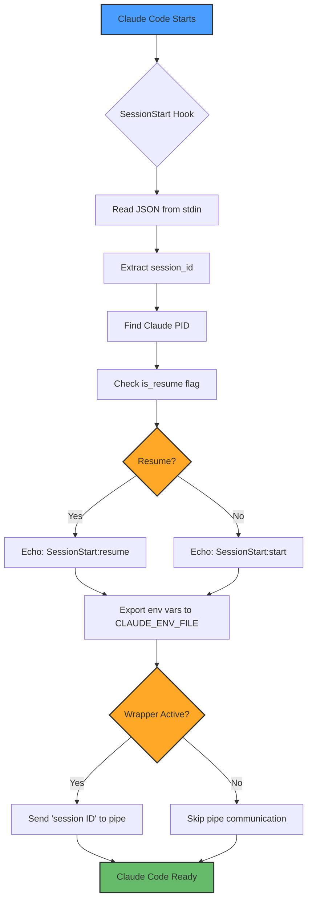
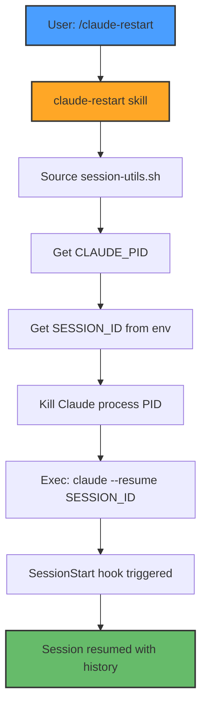
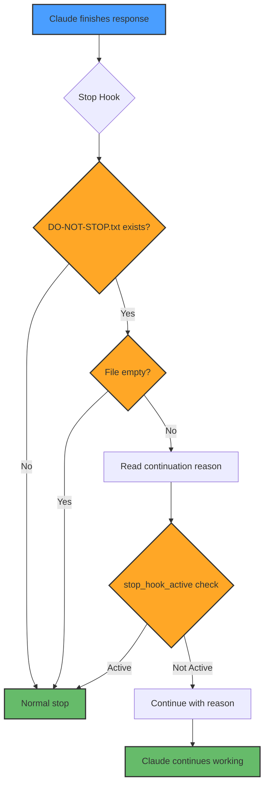

# Session Management Specification

**Feature ID**: SPEC-04
**Priority**: P1 (Important)
**Status**: Implemented
**Depends On**: None (Claude Code native feature)
**Created**: 2025-10-20
**Last Updated**: 2025-10-28

---

## Executive Summary

Claude Code session tracking via hooks with session ID and PID management. Enables session-aware skills (restart, compact, resume) without additional infrastructure.

**Key Decision**: Leverage Claude Code's built-in session management instead of implementing custom tmux-based sessions.

---

## 1. Implementation Overview

### 1.1 Design Principles

**Session Tracking**:
- Use Claude Code's native session IDs (UUID format)
- Track Claude process PID for session control
- Communicate session info via pipe-based IPC (no state files)
- No custom session persistence needed (Claude Code handles this)

**Hook-Based Architecture**:
- SessionStart: Capture session ID and send to wrapper via pipe
- SessionEnd: No cleanup needed (stateless communication)
- UserPromptSubmit: Optional hook for user interaction tracking
- Stop: Control continuous workflow behavior (do-not-stop feature)

### 1.2 Session Communication

**Pipe-Based IPC**:
- Session hook sends: `session <SESSION_ID>` → `$WRAPPER_PIPE`
- Wrapper receives session ID and starts watchdog
- No state files created (stateless communication)

**Directory Structure**:
```
.bitbot/
├── tmp/                        # Runtime files (ephemeral)
│   └── pipes/                  # Named pipes for wrapper IPC
│       ├── claude-{PID}.pipe   # Control pipe
│       └── claude-{PID}.ready  # Ready marker
└── DO-NOT-STOP.txt             # Stop hook control file
```

**Environment Variables** (set by SessionStart hook):
- `CLAUDE_SESSION_ID` - Current session UUID
- `CLAUDE_PID` - Current Claude process ID
- `CLAUDE_PROJECT_DIR` - Project root directory

---

## 2. Hook Implementation

### 2.1 SessionStart Hook

**File**: `.bitbot/hooks/session-start.sh`

**Purpose**: Capture session ID and PID at Claude Code startup

**Inputs**:
- JSON via stdin with `session_id` and `is_resume` fields
- `CLAUDE_ENV_FILE` environment variable (provided by Claude Code)

**Outputs**:
- Exports `CLAUDE_SESSION_ID`, `CLAUDE_PID`, `CLAUDE_PROJECT_DIR` to env file
- Echoes session info: `SessionStart:{start|resume} - Session: {ID}, PID: {PID}`
- Sends `session <SESSION_ID>` to wrapper via `$WRAPPER_PIPE` (if running under wrapper)

**Key Features**:
- Detects resume vs new session
- Finds Claude PID via process tree inspection
- Communicates with wrapper via pipe (no files)
- Validates it's being run by Claude Code (not standalone)

### 2.2 SessionEnd Hook

**File**: `.bitbot/hooks/session-end.sh`

**Purpose**: Session cleanup when Claude exits (currently minimal)

**Behavior**:
- No cleanup needed (pipe-based communication is stateless)
- Hook exists for future session teardown logic

### 2.3 Stop Hook (Do-Not-Stop)

**File**: `.bitbot/hooks/do-not-stop.sh`

**Purpose**: Enable continuous workflow automation

**Behavior**:
- Reads `.bitbot/DO-NOT-STOP.txt` for continuation instructions
- If file exists and not empty: continues with specified reason
- If file doesn't exist or empty: allows normal stop
- Prevents infinite loops with `stop_hook_active` check

**Control Files**:
- `.bitbot/DO-NOT-STOP.txt` - Global control (deprecated)
- `.bitbot/DONOTSTOP-{reason}.txt` - Session-specific control

### 2.4 Session Utilities

**File**: `.bitbot/hooks/session-utils.sh`

**Shared Functions**:
- `find_claude_pid()` - Locate Claude process PID
- `find_project_root()` - Locate BitBot project root
- `get_session_id()` - Read session ID from environment (`$CLAUDE_SESSION_ID`)

---

## 3. Skills Integration

### 3.1 claude-restart Skill

**Purpose**: Restart Claude Code session while maintaining context

**Modes**:
- `resume` (default) - Restart and resume session
- `compact` - Compact context before resuming (future)
- `clear` - Clear context and start fresh (future)

**Implementation**:
```bash
# Find current Claude PID
source .bitbot/hooks/session-utils.sh
CLAUDE_PID=$(find_claude_pid)

# Kill Claude process
kill $CLAUDE_PID

# Exec restart to launch new Claude
exec claude --resume $CLAUDE_SESSION_ID
```

### 3.2 claude-get-session-info Skill

**Purpose**: Shared utility for getting session ID and PID

**Usage**: Sourced by other skills needing session info

**Exports**:
- `CLAUDE_PID` - Current Claude process ID
- `SESSION_ID` - Current session UUID

### 3.3 Session-Aware Skills

Skills that use session info:
- `claude-restart` - Restart current session
- `claude-do-not-stop` - Enable automation for session
- `claude-allow-stop` - Disable automation for session

---

## 4. Configuration

### 4.1 Hook Registration

**File**: `.claude/settings.json`

```json
{
  "hooks": {
    "SessionStart": [{
      "hooks": [{
        "type": "command",
        "command": ".bitbot/hooks/session-start.sh",
        "timeout": 5000
      }]
    }],
    "SessionEnd": [{
      "hooks": [{
        "type": "command",
        "command": ".bitbot/hooks/session-end.sh",
        "timeout": 5000
      }]
    }],
    "UserPromptSubmit": [{
      "hooks": [{
        "type": "command",
        "command": ".bitbot/hooks/user-prompt-submit.sh",
        "timeout": 10000
      }]
    }],
    "Stop": [{
      "hooks": [{
        "type": "command",
        "command": ".bitbot/hooks/do-not-stop.sh",
        "timeout": 5000
      }]
    }]
  },
  "permissions": {
    "allow": []
  }
}
```

### 4.2 Git Ignore

**File**: `.bitbot/.gitignore`

```
# Runtime files (ephemeral)
tmp/

# Session control files (per-user preference)
DO-NOT-STOP.txt
DONOTSTOP-*.txt
```

---

## 5. Process Flow

### 5.1 Session Startup Flow



### 5.2 Session Restart Flow



### 5.3 Stop Hook (Do-Not-Stop) Flow



---

## 6. Future Enhancements

**Context Management**:
- Compact context before resume (reduce token usage)
- Clear context option (fresh start with session history)
- Auto-compact on low token budget

**Session Metadata**:
- Track session duration
- Log session activity (commands run, files modified)
- Session tagging/naming

**Multi-Session Support**:
- Parallel Claude sessions (different workspaces)
- Session switching
- Session list/management commands

---

## 7. Success Criteria

**Functional Requirements**:
- [x] Session ID captured at startup
- [x] Claude PID tracked via process tree
- [x] Session ID communicated via pipe to wrapper
- [x] SessionEnd hook exists for future use
- [x] claude-restart skill works reliably
- [x] Do-not-stop hook enables automation

**Usability Requirements**:
- [x] Hooks work silently in background
- [x] Session info displayed at startup
- [x] Skills can access session info via utilities
- [x] No user configuration required

**Reliability Requirements**:
- [x] Hooks validate they're run by Claude Code
- [x] Pipe-based IPC is stateless (no conflicts)
- [x] Failed hook doesn't break Claude startup
- [x] No cleanup needed (pipes are ephemeral)

---

## 8. References

**Related Specifications**:
- SPEC-00: Architectural Decisions
- SPEC-07: AI Agent Integration (Claude Code skills)

**External References**:
- Claude Code Hooks: https://docs.claude.com/en/docs/claude-code/hooks
- Claude Code Skills: https://docs.claude.com/en/docs/claude-code/skills

---

**Status**: **Implemented**
**Next Steps**: Add context management features (compact/clear)
