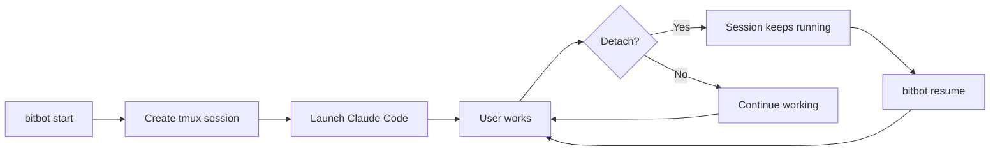

# Container BitBot Specification

**Feature ID**: SPEC-11
**Priority**: P1 (Important)
**Status**: Implemented
**Depends On**: SPEC-02 (Security Modes), SPEC-04 (Session Management)
**Created**: 2025-10-28
**Last Updated**: 2025-10-28

---

## Executive Summary

Container BitBot is the container-side companion to host-side BitBot, providing tmux-based session management, Claude Code launching, workspace analysis, and devcontainer configuration assistance. It runs inside both work and config mode containers at `/usr/local/bitbot/`.

**Key Features**:
- Smart session launcher (detect existing sessions, offer resume/new)
- tmux-based session management for terminal multiplexing
- Mode-aware Claude Code launching (work vs config tools)

---

## 1. Architecture

### 1.1 Installation Location

**Container Path**: `/usr/local/bitbot/`

**Structure**:
```
/usr/local/bitbot/
├── bitbot                      # Main entry point
├── core/
│   ├── commands/               # Command implementations
│   │   ├── default.sh         # Smart launcher (default)
│   │   ├── start.sh           # Create fresh Claude session
│   │   └── resume.sh          # Resume existing session
│   └── util/
│       ├── helpers.sh         # Common utilities
│       └── tmux-utils.sh      # tmux operations
└── README.md
```

### 1.2 Mount Configuration

Container BitBot is mounted from host installation:

**Dockerfile**:
```dockerfile
# Copy container BitBot from host installation
COPY container/bitbot/ /usr/local/bitbot/
RUN chmod +x /usr/local/bitbot/bitbot
RUN chmod +x /usr/local/bitbot/core/commands/*.sh
```

**PATH Setup**:
```dockerfile
ENV PATH="/usr/local/bitbot:${PATH}"
```

---

## 2. Commands

### 2.1 Default (Smart Launcher)

**Usage**: `bitbot` (no arguments)

**Behavior**:
- **0 tmux sessions**: Offer launch mode [1] Fresh [2] Resume [3] Custom
- **1 tmux session**: Auto-resume that session (no menu)
- **2+ tmux sessions**: Show list, offer [1] Resume [2] New

**Example Output (1 session - auto-resume)**:
```
BitBot - Claude Code Launcher

Found one session: claude-20251028-1430

Auto-resuming...

Attaching to session 'claude-20251028-1430'...
```

**Example Output (multiple sessions)**:
```
BitBot - Claude Code Launcher

Found existing tmux sessions:
  • claude-20251028-1430 (3h ago) - 2 windows, attached
  • claude-20251028-0900 (10h ago) - 1 window, detached

Would you like to:
  1) Resume existing session
  2) Create new session

Choice (1-2) [1]:
```

### 2.2 Start (Fresh Session)

**Usage**: `bitbot start`

**Behavior**:
1. Check if wrapper is available (pipe-based IPC)
2. If wrapper available: Launch Claude via wrapper (no tmux needed)
3. If no wrapper: Use tmux fallback
   - Generate session name: `claude-{YYYYMMDD-HHMM}`
   - Create new tmux session
   - Launch Claude Code in session
   - Attach to session

**Wrapper Flow (Preferred)**:
```bash
# Check for wrapper
if [[ -f /opt/bitbot/wrapper/claude-wrapper.sh ]]; then
    # Launch via pipe-based IPC (no tmux required)
    exec /opt/bitbot/wrapper/claude-wrapper.sh claude
fi
```

**tmux Fallback Flow**:
```bash
# Create detached session
tmux new-session -d -s "claude-20251028-1430"

# Send Claude command
tmux send-keys -t "claude-20251028-1430" "claude" C-m

# Wait for startup
sleep 1

# Attach to session
tmux attach-session -t "claude-20251028-1430"
```

**Session Management Options**:
- **Wrapper (Preferred)**: Pipe-based IPC + watchdog, no tmux dependency
- **tmux (Fallback)**: Terminal multiplexing, requires tmux installed

**Session Naming (tmux fallback)**:
- Format: `claude-{YYYYMMDD-HHMM}`
- Example: `claude-20251028-1430`
- Sorted chronologically when listing

### 2.3 Resume (Intelligent Session Resume)

**Usage**:
- `bitbot resume` - Intelligent resume
- `bitbot resume <session-name>` - Direct resume

**Behavior**:
- **0 tmux sessions**: Create new tmux + run `claude --resume` (Claude shows its sessions)
- **1 tmux session**: Auto-attach (no menu) + check if Claude running
- **2+ tmux sessions**: Show tmux session menu
- **After attach**: Check if Claude is still running, warn if exited

**Example Output (no tmux sessions)**:
```
BitBot - Resume Session

No tmux sessions found

Creating new tmux session with Claude --resume...
Claude will show its available sessions for you to select

Workspace: /workspace
Mode: work
Session: claude-20251028-1545

Session created successfully

Attaching to session 'claude-20251028-1545'...

[Claude's session picker appears]
```

**Example Output (1 session - auto-attach)**:
```
BitBot - Resume Session

Found one session: claude-20251028-1430

Attaching to session 'claude-20251028-1430'...

[tmux attaches]
```

**Example Output (Claude exited)**:
```
BitBot - Resume Session

Found one session: claude-20251028-1430

Attaching to session 'claude-20251028-1430'...

Note: Claude Code appears to have exited in this session

  To resume your Claude session:
    claude --resume

[tmux attaches to shell]
```

**Example Output (multiple sessions)**:
```
BitBot - Resume Session

Select tmux session to resume:

  1) claude-20251028-1430 (3h ago) - 2 windows
  2) claude-20251028-0900 (10h ago) - 1 window

  0) Cancel

Choice:
```


---

## 3. Session Management Architecture

Container BitBot supports two session management strategies:

### 3.1 Wrapper-Based (Pipe IPC) - Preferred

**Architecture**:
- Named pipes for IPC (`/tmp/claude-wrapper-*.pipe`)
- Watchdog process for stall detection
- No tmux dependency required
- Direct process management

**Benefits**:
- **Lightweight**: No terminal multiplexer overhead
- **Reliable**: Direct IPC via named pipes
- **Monitoring**: Built-in watchdog for stall detection
- **Simplicity**: No tmux learning curve

**Availability**:
- Mounted from `$BITBOT_HOME/sparc/5-completion/` directory
- Path: `/opt/bitbot/wrapper/claude-wrapper.sh`
- Requires devcontainer.json mount configuration

**Limitations**:
- Single Claude instance per wrapper
- No built-in multiplexing (use multiple containers)

### 3.2 tmux-Based - Fallback

**Architecture**:
- tmux terminal multiplexer
- Session-based management
- Full terminal emulation

**Benefits**:
- **Persistence**: Sessions survive terminal disconnection
- **Multiplexing**: Multiple panes/windows in one session
- **Detachment**: Close terminal, resume later
- **Scriptability**: Automate session creation
- **Universal**: Works in all terminal environments

**Use Cases**:
- Long-running Claude sessions (hours/days)
- Multiple workspaces in parallel
- Terminal disconnect/reconnect
- Session sharing (future: pair programming)
- Wrapper not available/not mounted

**Requirements**:
- tmux package installed in container
- Terminal access (not required for wrapper)

### 3.3 Session Lifecycle (tmux)

**Session Lifecycle**:


**Session Naming Convention**:
- Format: `claude-{YYYYMMDD-HHMM}`
- Chronologically sortable
- Human-readable timestamp
- No special characters (tmux compatible)

**Session Detection**:
```bash
# List all tmux sessions
tmux list-sessions

# Check if specific session exists
tmux has-session -t "session-name"

# Get session details
tmux list-sessions -F "#{session_name} #{session_created} #{session_attached}"
```

### 3.4 tmux Configuration

**BitBot tmux Config** (future):
```bash
# ~/.tmux.conf (user's home in container)

# Enable mouse support
set -g mouse on

# Increase history
set -g history-limit 10000

# Better colors
set -g default-terminal "screen-256color"

# Status bar
set -g status-bg colour235
set -g status-fg colour250
set -g status-left "[#{session_name}] "
set -g status-right "%H:%M %d-%b-%y"

# Easy pane navigation
bind h select-pane -L
bind j select-pane -D
bind k select-pane -U
bind l select-pane -R
```

---

## 4. Mode-Specific Behavior

### 4.1 Work Mode

**Environment**:
- `BITBOT_MODE=work`
- Workspace mounted RW at `/workspace`
- `.devcontainer/` mounted RO (read-only)

**Available Commands**:
- `bitbot` (default) - Smart launcher
- `bitbot start` - Fresh session
- `bitbot resume` - Resume session

**Claude Code Configuration**:
- Work-focused tools enabled
- Git safety hooks active
- Infrastructure files read-only
- MCP services: code-focused

### 4.2 Config Mode

**Environment**:
- `BITBOT_MODE=config`
- Full workspace RW access
- No Docker inside (default)

**Available Commands**:
- Same as work mode (start, resume)

**Claude Code Configuration**:
- Infrastructure tools enabled
- Git safety hooks active
- Full filesystem access
- MCP services: config-focused

---

## 5. Integration with Host BitBot

### 5.1 Two-Layer Architecture

**Host-Side BitBot** (`/path/to/bitbot/`):
- Workspace initialization
- DevContainer launching
- VS Code integration
- Cross-platform routing

**Container-Side BitBot** (`/usr/local/bitbot/`):
- Session management
- Claude Code launching
- Workspace analysis
- Mode-specific utilities

### 5.2 Flow

```
User runs: bitbot work
  ↓
Host BitBot launches work container
  ↓
User in container terminal runs: bitbot
  ↓
Container BitBot launches Claude Code in tmux
  ↓
User works with Claude
  ↓
User detaches tmux (Ctrl+B D)
  ↓
Container keeps running
  ↓
User reconnects later: bitbot resume
  ↓
Resume same Claude session
```

---

## 6. Future Enhancements

### 6.1 Enhanced Session Selection (Inspiration)

**Reference**: https://github.com/TerminalGravity/cld-tmux/blob/main/cld

**Goal**: Improve session selection UX beyond Claude's built-in chooser

**Current Approach**:
- BitBot manages tmux sessions (Level 1)
- Claude manages conversation history (Level 2)
- `claude --resume` shows its own session picker

**Potential Enhancement**:
- fzf-based unified session picker
- Show both tmux sessions AND Claude sessions in one view
- Preview pane showing session metadata
- Fuzzy search across session names/dates
- Integration with existing tools like cld-tmux

**Decision**: Keep it simple for now, revisit when user feedback indicates need

### 6.2 Multi-Workspace Support

**Goal**: Work on multiple projects simultaneously

**Features**:
- Multiple containers (one per workspace)
- Session namespace by workspace
- Container-aware session switching
- Resource limits per workspace

### 6.3 Session Persistence

**Goal**: Survive container restarts

**Features**:
- Save session state to volume
- Restore sessions after container restart
- Workspace history tracking
- Session backup/restore

### 6.4 Collaborative Sessions

**Goal**: Pair programming with AI assistant

**Features**:
- tmux session sharing
- Multi-user attach
- Session recording/playback
- Audit trail

### 6.5 Resource Monitoring

**Goal**: Track and limit resource usage

**Features**:
- CPU/memory monitoring per session
- Token usage tracking (Claude API)
- Storage quota enforcement
- Alert on resource limits

---

## 7. Implementation Details

### 7.1 Utilities

**helpers.sh**:
```bash
# Color output
info()    { echo -e "${BLUE}$*${RESET}"; }
success() { echo -e "${GREEN}$*${RESET}"; }
warning() { echo -e "${YELLOW}$*${RESET}"; }
error()   { echo -e "${RED}$*${RESET}"; }

# Environment detection
get_bitbot_mode()  { echo "${BITBOT_MODE:-unknown}"; }
get_workspace()    { echo "${WORKSPACE:-/workspace}"; }
is_config_mode()   { [[ "${BITBOT_MODE}" == "config" ]]; }
```

**tmux-utils.sh**:
```bash
# tmux operations
tmux_available()          { command -v tmux >/dev/null 2>&1; }
list_claude_sessions()    { tmux list-sessions 2>/dev/null | grep "^claude-"; }
session_exists()          { tmux has-session -t "$1" 2>/dev/null; }
generate_session_name()   { echo "claude-$(date +%Y%m%d-%H%M)"; }
create_claude_session()   { tmux new-session -d -s "$1"; }
attach_session()          { tmux attach-session -t "$1"; }
```

### 7.2 Error Handling

**Prerequisites Check**:
```bash
# Check tmux availability
if ! tmux_available; then
    error "tmux is not available"
    echo ""
    echo "Please install tmux:"
    echo "  sudo apt-get install tmux"
    exit 1
fi

# Check Claude Code availability
if ! command -v claude >/dev/null 2>&1; then
    error "Claude Code is not installed"
    echo ""
    echo "Please install Claude Code:"
    echo "  npm install -g @anthropic-ai/claude-code"
    exit 1
fi
```

**Session Conflicts**:
```bash
# Avoid duplicate session names
session_name="$(generate_session_name)"
counter=1
while session_exists "$session_name"; do
    session_name="claude-$(date +%Y%m%d-%H%M)-${counter}"
    ((counter++))
done
```

---

## 8. Testing

### 8.1 Manual Test Cases

**Session Creation**:
- [ ] `bitbot start` creates new session
- [ ] Session name follows naming convention
- [ ] Claude Code launches successfully
- [ ] User can interact with Claude

**Session Resume**:
- [ ] `bitbot resume` lists existing sessions
- [ ] User can select and resume session
- [ ] Session state persists after resume
- [ ] Multiple sessions can coexist

**Default Launcher**:
- [ ] `bitbot` with no sessions creates new
- [ ] `bitbot` with sessions offers resume/new choice
- [ ] User can navigate menu correctly

**Mode-Specific**:
- [ ] `bitbot configure` works in config mode
- [ ] `bitbot configure` blocked in work mode
- [ ] Mode detection correct in both modes

### 8.2 Automated Tests

**Future** (`dev/tests/test-container-bitbot.sh`):
```bash
# Test session creation
test_session_creation() {
    local session=$(bitbot start --test-mode)
    assert_session_exists "$session"
    assert_claude_running_in_session "$session"
}

# Test session listing
test_session_listing() {
    create_test_sessions 3
    local output=$(bitbot resume --list)
    assert_session_count 3 "$output"
}

# Test mode detection
test_mode_detection() {
    export BITBOT_MODE=work
    assert_command_available "bitbot analyze"
    assert_command_blocked "bitbot configure"
}
```

---

## 9. Success Criteria

**Functional Requirements**:
- [x] Container BitBot accessible at `/usr/local/bitbot/`
- [x] Smart launcher detects and offers resume
- [x] tmux session creation and management
- [x] Claude Code launches in tmux
- [x] Mode-specific behavior (work vs config)
- [x] Workspace analysis functional

**Usability Requirements**:
- [x] Simple command syntax (`bitbot`, `bitbot start`, etc.)
- [x] Clear menu prompts and options
- [x] Human-readable session names
- [x] Helpful error messages
- [x] No complex configuration required

**Reliability Requirements**:
- [x] Sessions persist across terminal disconnect
- [x] Multiple sessions can run simultaneously
- [x] No session name conflicts
- [x] Graceful handling of missing prerequisites
- [x] Works in both work and config modes

---

## 10. References

**Related Specifications**:
- SPEC-02: Security Mode System (work vs config)
- SPEC-04: Session Management (hooks, not tmux)
- SPEC-07: AI Agent Integration (Claude Code)

**External References**:
- tmux manual: https://man.openbsd.org/tmux
- Claude Code CLI: https://docs.claude.com/en/docs/claude-code/cli

---

**Status**: **Implemented**
**Next Steps**: Add session persistence across container restarts
