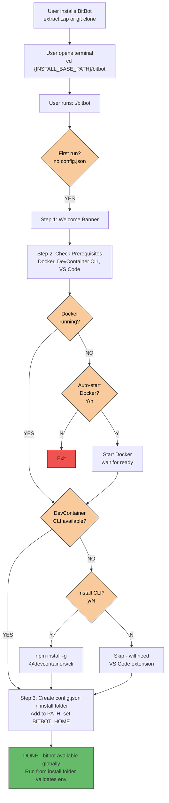

# BitBot Global First-Run Flow

**Scenario**: User has just installed BitBot and runs it for the first time from the install folder.

**Purpose**: Set up global BitBot environment - add to PATH, set env variables, create config.json

**Note**: BitBot is **portable** and **self-contained**:

- All files stay in the installation folder
- No ~/.bitbot/ directory created
- Can be moved to any location and will auto-detect the move

---

## Prerequisites

- User has downloaded/extracted BitBot to any folder (installation is portable)
- Docker Desktop is installed
- Running on Linux, macOS, or WSL2

**Note**: `{INSTALL_BASE_PATH}/bitbot` represents the BitBot installation directory. Examples:

- `~/bitbot` - User's home directory
- `~/tools/bitbot` - User's tools folder
- `/opt/bitbot` - System-wide installation (requires sudo)
- `/mnt/c/Users/user/bitbot` - WSL installation

---

## Flow Diagram



---

## Step-by-Step Screen Flow

### Step 1: User runs BitBot for first time

**Terminal:**

```bash
user@laptop:{INSTALL_BASE_PATH}/bitbot$ ./bitbot
```

**Output:**

```
==============================================
  Welcome to BitBot!
==============================================

BitBot is a secure development environment
manager for AI-assisted coding.

This is your first run. Let's set up BitBot...

==============================================
```

---

### Step 2: Prerequisites Check

**Output:**

```
[1/4] Checking prerequisites...

Checking Docker...
  ✓ Docker installed (Docker version 24.0.7, build afdd53b)
  ✓ Docker is running

Checking Docker Compose...
  ✓ Docker Compose v2 (Docker Compose version v2.23.0)

Checking DevContainer CLI...
  ✓ DevContainer CLI (VS Code builtin)

Checking VS Code...
  ✓ VS Code installed
  ✓ Dev Containers extension installed

Checking Git...
  ✓ Git installed (git version 2.42.0)

[+] All prerequisites OK
```

**Alternative: Docker not running**

```
Checking Docker...
  ✓ Docker installed (Docker version 24.0.7, build afdd53b)
  ✗ Docker is not running

Start Docker now? (Y/n): █
```

**User input:** `Y` (or just Enter)

```
[>] Starting Docker...
  Waiting for Docker to start...
  .......... 10s... 20s
  ✓ Docker ready (took 24s)
```

**Alternative: DevContainer CLI missing**

```
Checking DevContainer CLI...
  ✗ DevContainer CLI not found

Install options:

Option 1: VS Code + Dev Containers extension (recommended)
  https://code.visualstudio.com/
  Extension: ms-vscode-remote.remote-containers

Option 2: Standalone CLI (requires Node.js)
  npm install -g @devcontainers/cli

Install standalone CLI now? (y/N): █
```

**User input:** `y`

```
[>] Installing @devcontainers/cli...

added 142 packages in 8s
  ✓ @devcontainers/cli installed
```

---

### Step 3: Create Configuration

**Output (VS Code installed):**

```
[2/3] Creating configuration...

Choose default launch mode for BitBot workspaces:
  • Terminal: Faster, lightweight, tmux-based (good for servers, CLI workflows)
  • VS Code: Full IDE experience with GUI (good for local development)

Select default launch mode:

  1. Terminal
  2. VS Code (default)

Choice [2]: █
```

**User input:** `2` (or just Enter for VS Code) or `1` for Terminal

```

  ✓ Created config.json
  ✓ Default mode: VS Code
```

**Alternative (VS Code not installed):**

```
[2/3] Creating configuration...

[i] VS Code not detected on this system
    Default launch mode will be set to: Terminal

    To use VS Code integration later:
      1. Install VS Code: https://code.visualstudio.com/
      2. Edit /home/user/bitbot/config.json
      3. Set "launch_mode": "vscode"

  ✓ Created config.json
  ✓ Default mode: Terminal
```

---

### Step 4: Add to PATH

**Output (example shows WSL, similar for Linux/macOS):**

```
[3/3] Adding BitBot to PATH...

BitBot install location: /home/user/bitbot

Detected shell: bash
Detected platform: WSL
Shell config: ~/.bashrc (or ~/.zshrc)

Add BitBot to your PATH? (Y/n): █
```

**User input:** `Y` (or just Enter)

```
  ✓ Added to ~/.bashrc (or ~/.zshrc)

[>] Updating Windows environment variables...
  ✓ Set BITBOT_HOME in Windows: C:\Users\user\bitbot
  ✓ Updated Windows PATH

[i] Restart your shell or run: source ~/.bashrc (or ~/.zshrc)
```

**Note:** Windows environment update only shown on WSL. Linux/macOS skip this step.

**Alternative (WSL without PowerShell access):**

```
  ✓ Added to ~/.bashrc (or ~/.zshrc)

[>] Updating Windows environment variables...
[!] Cannot access PowerShell from WSL

Manual Windows setup required (run in PowerShell as Admin):
  [Environment]::SetEnvironmentVariable('BITBOT_HOME', 'C:\Users\user\bitbot', 'User')
  $path = [Environment]::GetEnvironmentVariable('Path', 'User')
  [Environment]::SetEnvironmentVariable('Path', 'C:\Users\user\bitbot;' + $path, 'User')

[i] Restart your shell or run: source ~/.bashrc (or ~/.zshrc)
```

---

### Completion

**Output:**

```
[+] Global BitBot setup complete!

Reload your shell to use 'bitbot' from anywhere:
  $ source ~/.bashrc  (or ~/.zshrc)

Then initialize a workspace:
  $ cd ~/my-project
  $ bitbot init
```

---

## Alternative Flows

### User Cancels Docker Auto-Start

```
Start Docker now? (Y/n): n

Setup cancelled.

Please start Docker Desktop manually and run:
  ./bitbot

```

### User Cancels PATH Addition

```
Add BitBot to your PATH? (Y/n): n

Skipped PATH addition.

To use BitBot, run from the install directory:
  {INSTALL_BASE_PATH}/bitbot/bitbot

Or add to PATH manually:
  export PATH="$PATH:{INSTALL_BASE_PATH}/bitbot"

[+] Setup complete
```

---

## After First Run

### Subsequent Runs from Install Folder

**User runs from install folder (after init):**

```bash
user@laptop:~$ cd {INSTALL_BASE_PATH}/bitbot
user@laptop:{INSTALL_BASE_PATH}/bitbot$ bitbot
```

**Output (if environment OK):**

```
BitBot is installed at: {INSTALL_BASE_PATH}/bitbot
Environment is configured correctly

To use BitBot, navigate to a project and initialize:
  $ cd ~/my-project
  $ bitbot init
```

**Output (if installation was moved, example shows WSL):**

```
[!] BitBot installation moved:
    Was: /home/user/bitbot
    Now: /home/user/tools/bitbot

  ✗ BitBot not in PATH (or wrong installation)
  ✗ BITBOT_HOME points to: /home/user/bitbot
    Current location: /home/user/tools/bitbot

Update shell configuration now? (Y/n): Y

BitBot install location: /home/user/tools/bitbot

Detected shell: bash
Detected platform: WSL
Shell config: ~/.bashrc (or ~/.zshrc)

  ✓ Removed old PATH entries
  ✓ Added to ~/.bashrc (or ~/.zshrc)

[>] Updating Windows environment variables...
  ✓ Set BITBOT_HOME in Windows: C:\Users\user\tools\bitbot
  ✓ Updated Windows PATH

[i] Please reload your shell: source ~/.bashrc (or ~/.zshrc)

BitBot is installed at: {INSTALL_BASE_PATH}/bitbot
Environment is configured correctly

To use BitBot, navigate to a project and initialize:
  $ cd ~/my-project
  $ bitbot init
```

**Note:** Windows environment update only shown on WSL. Linux/macOS show similar output without Windows environment steps.

---

## Files Modified/Created

After global init:

```
{INSTALL_BASE_PATH}/bitbot/
├── bitbot                        # Main executable (already exists)
├── lib/                          # Library scripts (already exist)
├── config-devcontainer/          # Config mode devcontainer (already exists)
│   ├── devcontainer.json
│   └── Dockerfile
├── devcontainer-template/        # Base template for workspace .devcontainer (already exists)
│   ├── devcontainer.json         # Minimal template with BitBot defaults
│   └── Dockerfile                # Base Alpine/Ubuntu image
├── config.json                   # CREATED - Global settings (init marker)
└── ... other files ...

~/.bashrc (or ~/.zshrc)
# Added lines:
export PATH="{INSTALL_BASE_PATH}/bitbot:$PATH"
export BITBOT_HOME="{INSTALL_BASE_PATH}/bitbot"

# If WSL, also sets Windows environment:
BITBOT_HOME = C:\Users\user\bitbot  (Windows User environment variable)
Path = C:\Users\user\bitbot;...     (Windows User PATH)
```

**Key point**: No ~/.bitbot/ directory is created. Everything stays in the installation folder.

---

## User Experience Notes

### Timing

- Prerequisites check: **5-10 seconds**
- Docker auto-start: **20-60 seconds** (if needed)
- Global setup: **2-3 seconds**
- PATH addition: **< 1 second**
- **Total**: 30-75 seconds (depending on Docker)

### User Interactions

- **Minimal**: Only 2 confirmations (Docker start, PATH addition)
- **Defaults**: Sensible defaults (Y for both)
- **Cancellable**: User can cancel at any time
- **Resumable**: Can re-run if cancelled

### Error Handling

- **Docker not installed**: Clear error with install link
- **npm not found**: Prompt to install Node.js first
- **Permission errors**: Suggest using sudo or checking permissions
- **Network errors**: Retry or skip with manual instructions

---

## Platform-Specific Variations

### Linux

- Uses `~/.bashrc` or `~/.zshrc`
- May need `sudo` for Docker commands
- Systemd for Docker auto-start

### macOS

- Uses `~/.zshrc` (default shell is zsh)
- `open -a Docker` for Docker Desktop
- May need admin password

### WSL2 (Windows)

- Uses `~/.bashrc` (or `~/.zshrc`) in WSL
- Windows paths (e.g., `/mnt/c/bitbot`)
- May prompt for WSL Docker integration setup
- PowerShell commands for Docker Desktop (Windows side)
- **Additional step**: Updates Windows environment variables (BITBOT_HOME and PATH) via PowerShell

---

## Success State

**User knows setup succeeded when:**

1. See "✓ Setup complete" message
2. See next steps with clear instructions
3. Can reload shell and run `bitbot --version` from any directory

**What user can do next:**

1. Reload shell (`source ~/.bashrc` or `~/.zshrc`)
2. Navigate to project folder
3. Run `bitbot init` to initialize workspace
4. Run `bitbot work` to start development

---

## Common Issues

### Issue: "Docker not running" keeps appearing

**Cause**: Docker Desktop not starting or WSL integration disabled

**Solution**:

1. Check Docker Desktop is running
2. On WSL, enable BitBot-Alpine in Docker settings
3. Wait 30-60 seconds for Docker to initialize

### Issue: "command not found: bitbot" after setup

**Cause**: Shell not reloaded

**Solution**: Run `source ~/.bashrc` (or `~/.zshrc`) or close/reopen terminal

### Issue: npm install fails

**Cause**: Node.js not installed or network issue

**Solution**:

1. Install Node.js from https://nodejs.org/
2. Or skip CLI install and use VS Code extension instead

### Issue: Windows PATH not updated after move (WSL)

**Cause**: PowerShell not accessible from WSL or permission issue

**Solution**:

1. Run in PowerShell (as regular user):

   ```powershell
   [Environment]::SetEnvironmentVariable('BITBOT_HOME', 'C:\Users\user\tools\bitbot', 'User')
   $path = [Environment]::GetEnvironmentVariable('Path', 'User')
   # Remove old BitBot entries first
   $path = $path -replace 'C:\\Users\\user\\bitbot;', ''
   [Environment]::SetEnvironmentVariable('Path', 'C:\Users\user\tools\bitbot;' + $path, 'User')
   ```
1. Close and reopen all terminals

---

## Summary

**Global first-run initializes:**

- ✅ config.json in BitBot install folder (serves as init marker)
- ✅ PATH environment variable
- ✅ BITBOT_HOME environment variable
- ✅ Windows environment (if WSL)

**Subsequent global commands:**

- ✅ Validate PATH and BITBOT_HOME on **every** invocation from install folder
- ✅ Running `./bitbot` (no args) triggers move check
- ✅ Offer to update shell config if environment is incorrect or installation moved
- ✅ Check config.json exists in install folder (not ~/.bitbot/)

**User is ready to:**

- ✅ Run `bitbot` from any directory
- ✅ Initialize workspaces with `bitbot init`
- ✅ Launch work/config modes
- ✅ Use VS Code integration

**Next step:** See `FLOW_WORKSPACE_INIT.md` for workspace initialization flow.