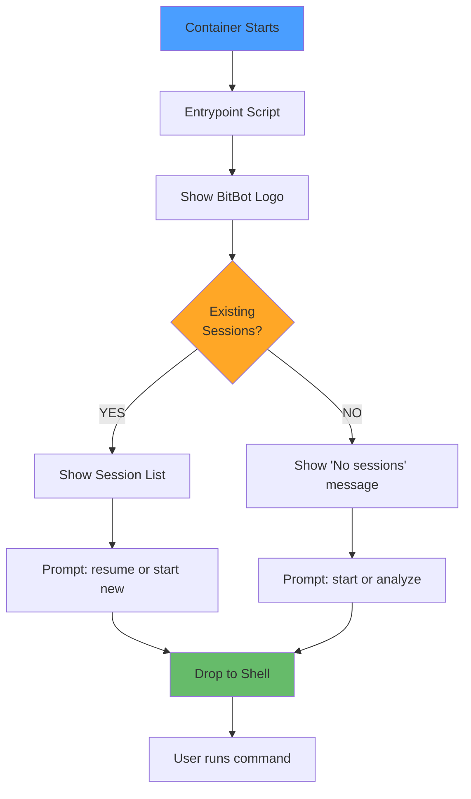
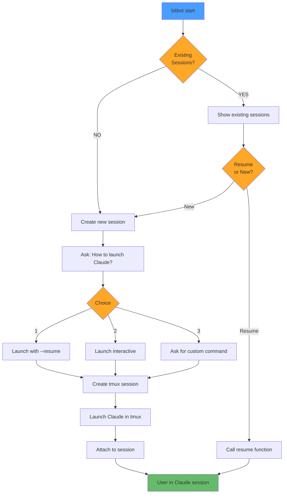
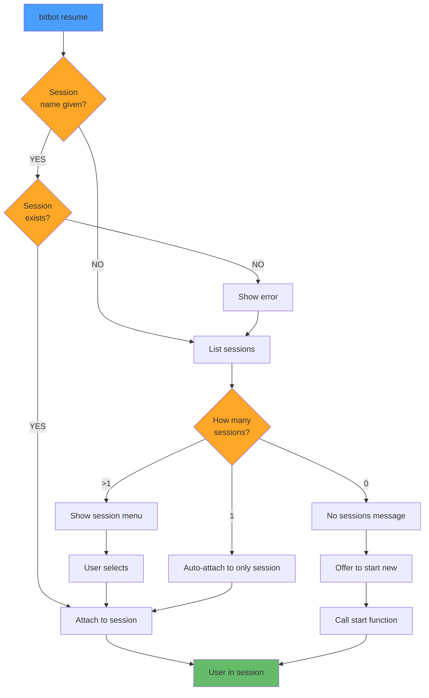
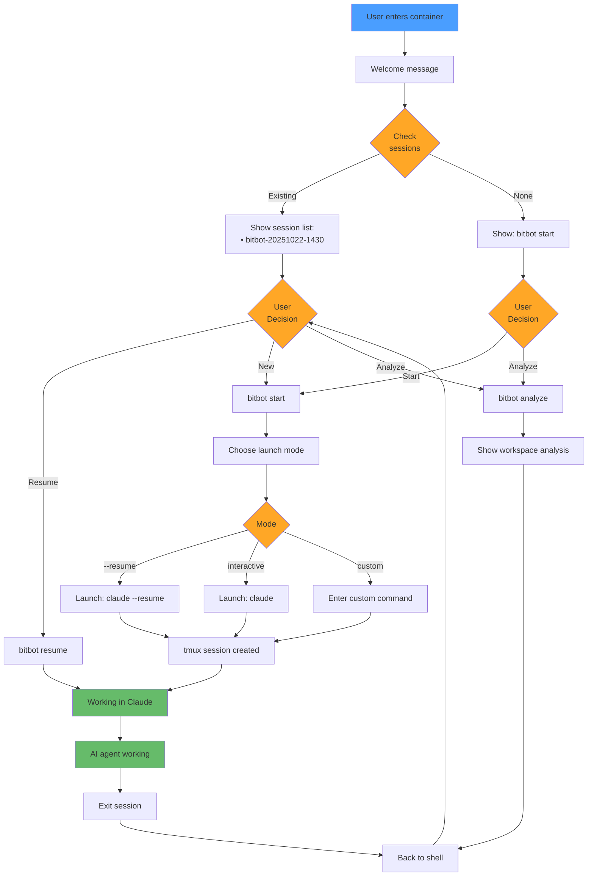
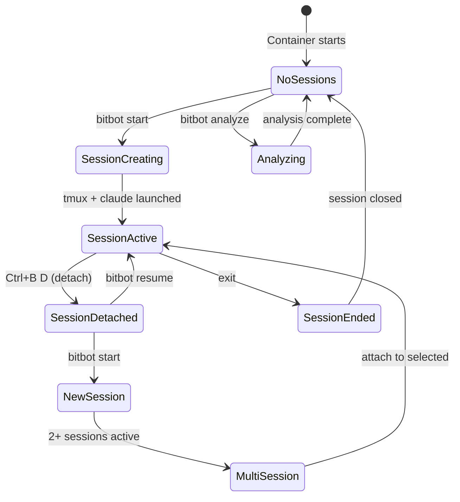

# Container BitBot Flow

**Scenario**: AI agent enters container and needs to start working
**Purpose**: Guide AI through session management and Claude Code launch

---

## Transparent BitBot Behavior

The `bitbot` command works transparently across host and container contexts:

**On Host** (`bitbot` + `core/`):
- `bitbot` → Enters work mode container
- `bitbot work` → Launches work mode container
- `bitbot config` → Launches config mode container
- `bitbot init` → Initializes workspace

**In Container** (`/opt/bitbot/bitbot` + `/opt/bitbot/core/`):
- `bitbot` → Same as `bitbot start` (starts/resumes session)
- `bitbot start` → Creates new Claude session in tmux
- `bitbot resume` → Resumes existing tmux session
- `bitbot analyze` → Analyzes workspace
- `bitbot status` → Shows container status

**Key Insight**: Same command name, context-aware behavior!

---

## Container Entry Flow



---

## Start Claude Session Flow



---

## Resume Session Flow



---

## Complete User Journey



---

## Session Management States



---

## Detailed Steps

### Step 1: Container Entry

**User Experience**:
```
[Container starts]

╔════════════════════════════════════════════════════════╗
║  BitBot Container - Ready                              ║
║  Mode: Work                                            ║
║  Workspace: /workspace                                 ║
╚════════════════════════════════════════════════════════╝

Found existing tmux sessions:
  • bitbot-20251022-1430 (1 window)

To resume: bitbot resume
To start new: bitbot start

Type 'bitbot help' for more commands

user@container:/workspace$
```

---

### Step 2: Resume Existing Session

**Command**: `bitbot resume`

**Flow**:
```
$ bitbot resume

Found 1 tmux session:
  • bitbot-20251022-1430 (created 2 hours ago)

Resuming session...

[Attaches to tmux session with Claude Code running]
```

**With Multiple Sessions**:
```
$ bitbot resume

Select session to resume:

  1) bitbot-20251022-1430 (1 window)
  2) bitbot-20251022-1600 (2 windows)
  0) Cancel

Choice: 1

[Attaches to selected session]
```

---

### Step 3: Start New Session

**Command**: `bitbot start`

**Flow**:
```
$ bitbot start

BitBot - Claude Code Launcher

Found existing tmux sessions:
  • bitbot-20251022-1430 (created 2 hours ago)

Would you like to:
  1) Resume existing session
  2) Create new session

Choice (1-2) [1]: 2

Creating new Claude Code session...

How would you like to launch Claude Code?

  1) Resume previous session    (--resume)
  2) Interactive mode           (default)
  3) Custom command

Choice (1-3) [2]: 1

Launching: claude --resume

Workspace: /workspace
Mode: work
Session: bitbot-20251022-1630

[Creates tmux session with wrapper and launches Claude]
[Attaches to session]
```

---

### Step 4: No Existing Sessions

**Command**: `bitbot start`

**Flow**:
```
$ bitbot start

BitBot - Claude Code Launcher

No existing tmux sessions found.

Creating new Claude Code session...

How would you like to launch Claude Code?

  1) Resume previous session    (--resume)
  2) Interactive mode           (default)
  3) Custom command

Choice (1-3) [2]: ← [User presses Enter for default]

Launching: claude (interactive)

Workspace: /workspace
Mode: work
Session: bitbot-20251022-1630

[Creates session with wrapper and launches Claude]
```

---

### Step 5: Analyze Workspace

**Command**: `bitbot analyze`

**Output**:
```
$ bitbot analyze

Analyzing workspace: /workspace

Project Type:
  ✓ Node.js project (package.json found)

Git Status:
  Branch: main
  ⚠ Uncommitted changes detected
  ✓ Up to date with remote

Dependencies:
  ✓ node_modules installed

Build System:
  ✓ npm scripts available (npm run)

Container Environment:
  User: vscode
  UID: 1000
  GID: 1000
  Shell: /bin/bash
  PWD: /workspace

$ ← [Back to shell]
```

---

### Step 6: Status Check

**Command**: `bitbot status`

**Output**:
```
$ bitbot status

BitBot Container Status

Mode:
  Work Mode
    • Application code: Read-Write
    • .devcontainer: Read-Only
    • Perfect for daily development

Container:
  Hostname: devcontainer-abc123
  User: vscode (UID: 1000, GID: 1000)
  Shell: /bin/bash
  Home: /home/vscode

Workspace:
  Path: /workspace
  Git: main
  .devcontainer: Present
  .bitbot: Initialized

DevContainer Configuration:
  ✓ devcontainer.json found
  ℹ Read-Only access

tmux Sessions:
  • bitbot-20251022-1430 (1 window)

Available Tools:
  ✓ git 2.34.1
  ✓ node v20.10.0
  ✓ npm 10.2.3
  ✓ tmux 3.2a

$
```

---

## Decision Points

### Q1: Resume or Start New?

**Context**: Existing sessions found
**Options**:
- Resume existing → Faster, preserves state
- Start new → Fresh start, parallel sessions

**Default**: Resume (option 1)

### Q2: How to Launch Claude?

**Context**: Creating new session
**Options**:
1. `--resume` → Resume previous Claude session
2. Interactive → Fresh interactive session
3. Custom → User specifies command

**Default**: Interactive (option 2)

### Q3: Which Session to Resume?

**Context**: Multiple sessions exist
**Options**:
- List all sessions with index
- User selects by number
- Cancel (0)

**Default**: First session if only one

---

## Error Handling

### No tmux Installed

**Note**: This fallback is **not implemented** in MVP. tmux is required.

```
$ bitbot start

ERROR: tmux not found
  tmux is required for session management
  Install: apt-get install tmux

Container cannot launch without tmux
```

### No Claude Installed

```
$ bitbot start

ERROR: claude command not found
  Claude Code is not installed in this container

  Install: npm install -g @anthropic/claude-code
```

### Session Attach Failed

```
$ bitbot resume claude-invalid

ERROR: Session 'bitbot-invalid' not found

Available sessions:
  • bitbot-20251022-1430

Try: bitbot resume
```

---

## Wrapper Integration

**All Claude launches** go through the wrapper script for enhanced session management:

**Wrapper Script**: `/usr/local/bitbot/wrapper/claude-wrapper.sh`

**Features**:
- Control pipe: `.bitbot/tmp/pipes/claude-<PID>.pipe`
- Session restart capability (exit, restart, compact, clear)
- Watchdog monitoring for session health
- Status line interception for context tracking

**How it works**:
```bash
# When launching Claude in tmux
tmux new-session -s "bitbot-20251022-1630" \
  "/usr/local/bitbot/wrapper/claude-wrapper.sh claude --resume"
```

**Benefits**:
- Skills can trigger restart/compaction autonomously
- Context % tracked via status line wrapper
- Session recovery on crashes
- Programmatic session control

**Related Components**:
- `claude-wrapper.sh` - Main wrapper (pipe control, restart)
- `statusline-wrapper/wrapper.sh` - Status line interception
- `send-wrapper-command.sh` - Send commands to wrapper via pipe
- `watchdog.sh` - Monitor session health

See: `sparc/0-research/WRAPPER_INTEGRATION.md` for technical details

---

## Implementation Priorities

**MVP (Phase 1)**:
- [x] Basic session management pseudocode
- [x] Implement start command
- [x] Implement resume command
- [x] Container entrypoint integration (smart launcher)
- [x] Wrapper integration for all Claude launches
- [ ] Implement analyze command (planned)
- [ ] Implement status command (planned)

**Post-MVP (Phase 2)**:
- [ ] Session persistence
- [ ] Auto-recovery
- [ ] Advanced tmux features
- [ ] Custom session templates

---

## Integration Points

**Container Build** (`Dockerfile`):
```dockerfile
# Install dependencies
RUN apt-get update && apt-get install -y tmux

# Copy inner bitbot scripts
COPY bitbot /opt/bitbot
RUN chmod +x /opt/bitbot/bitbot.sh /opt/bitbot/commands/*.sh

# Add to PATH
ENV PATH="/opt/bitbot:${PATH}"
```

**Container Entrypoint** (`devcontainer.json`):
```json
{
  "postStartCommand": "/opt/bitbot/entrypoint.sh",
  "customizations": {
    "vscode": {
      "terminal.integrated.shellArgs.linux": ["-l"]
    }
  }
}
```

---

## Success Criteria

**User can**:
- [x] Enter container and see helpful guidance
- [x] Start Claude Code in tmux with one command
- [x] Resume previous session easily
- [x] Choose launch mode (--resume or interactive)
- [x] Manage multiple sessions
- [ ] Get workspace analysis (planned - analyze command)
- [ ] Check container status (planned - status command)

**System provides**:
- [x] Clear prompts and choices
- [x] Sensible defaults
- [x] Error handling with guidance
- [x] Non-blocking workflow
- [x] Wrapper integration for session management
