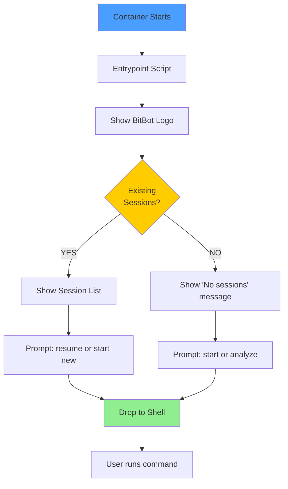
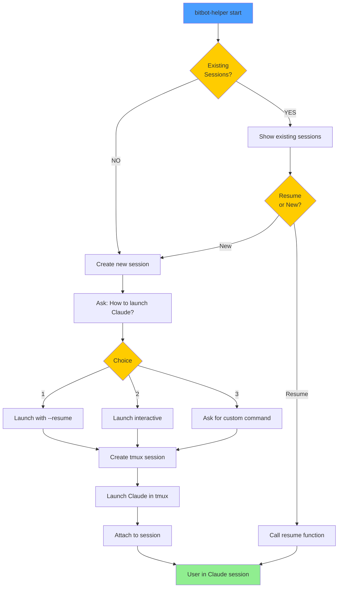
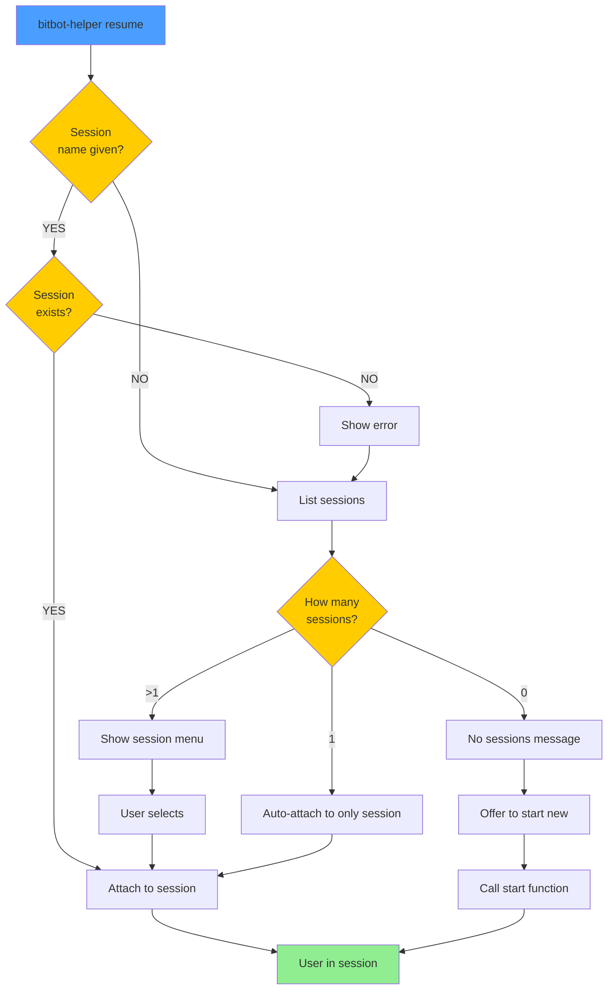
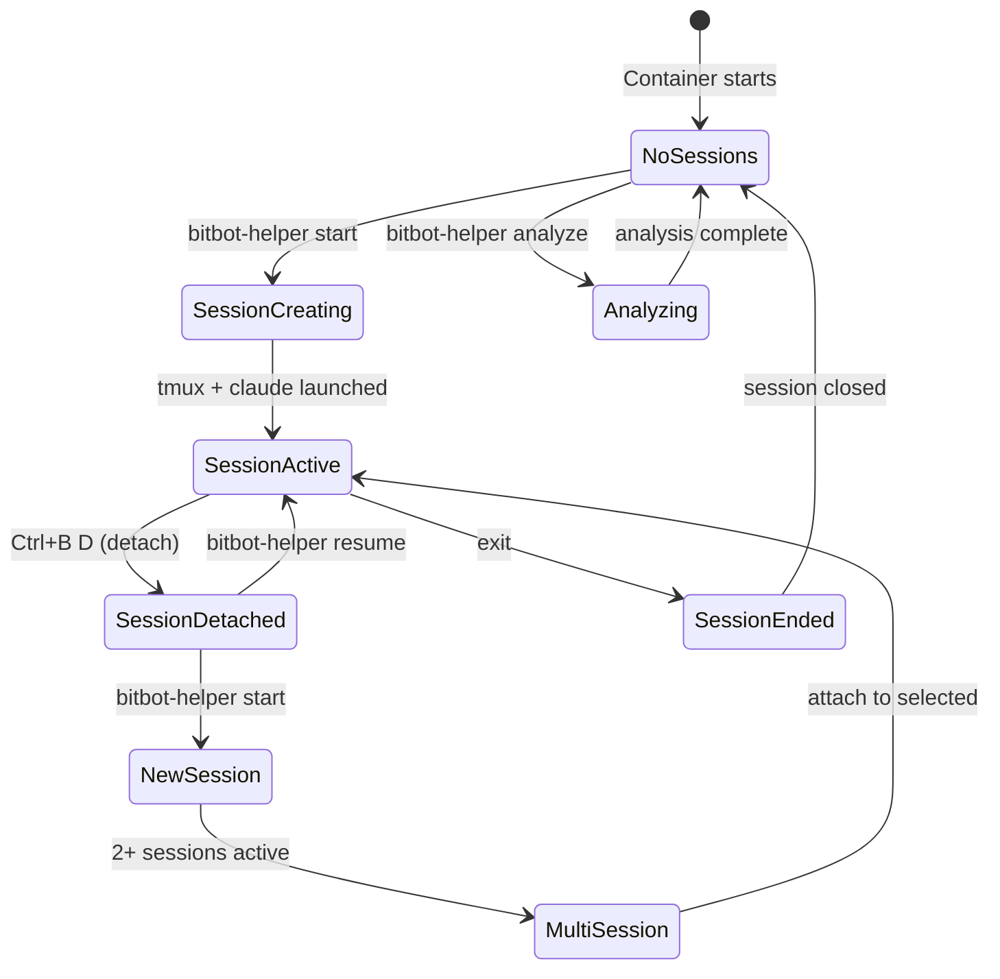

# Inner BitBot Flow

**Scenario**: AI agent enters container and needs to start working
**Purpose**: Guide AI through session management and Claude Code launch

---

## Container Entry Flow



---

## Start Claude Session Flow



---

## Resume Session Flow



---

## Complete User Journey

```mermaid
flowchart TD
    Enter[User enters container] --> Welcome[Welcome message]
    Welcome --> Sess{Check<br/>sessions}

    Sess -->|Existing| ShowList[Show session list:<br/>• claude-20251022-1430]
    Sess -->|None| ShowHelp[Show: bitbot-helper start]

    ShowList --> UserDec1{User<br/>Decision}
    ShowHelp --> UserDec2{User<br/>Decision}

    UserDec1 -->|Resume| Resume[bitbot-helper resume]
    UserDec1 -->|New| Start[bitbot-helper start]
    UserDec1 -->|Analyze| Analyze[bitbot-helper analyze]

    UserDec2 -->|Start| Start
    UserDec2 -->|Analyze| Analyze

    Resume --> InClaude[Working in Claude]
    Start --> LaunchChoice[Choose launch mode]

    LaunchChoice --> Mode{Mode}
    Mode -->|--resume| ResumeFlag[Launch: claude --resume]
    Mode -->|interactive| InterMode[Launch: claude]
    Mode -->|custom| CustomCmd[Enter custom command]

    ResumeFlag --> Tmux[tmux session created]
    InterMode --> Tmux
    CustomCmd --> Tmux

    Tmux --> InClaude

    Analyze --> Results[Show workspace analysis]
    Results --> BackShell[Back to shell]

    InClaude --> Work[AI agent working]
    Work --> Exit[Exit session]
    Exit --> BackShell

    BackShell --> UserDec1

    style Enter fill:#4a9eff
    style Sess fill:#ffcc00
    style UserDec1 fill:#ffcc00
    style UserDec2 fill:#ffcc00
    style Mode fill:#ffcc00
    style InClaude fill:#90ee90
    style Work fill:#90ee90
```



---

## Session Management States



---

## Detailed Steps

### Step 1: Container Entry

**User Experience**:
```
[Container starts]

╔════════════════════════════════════════════════════════╗
║  BitBot Container - Ready                              ║
║  Mode: Work                                            ║
║  Workspace: /workspace                                 ║
╚════════════════════════════════════════════════════════╝

Found existing tmux sessions:
  • claude-20251022-1430 (1 window)

To resume: bitbot-helper resume
To start new: bitbot-helper start

Type 'bitbot-helper help' for more commands

user@container:/workspace$
```

---

### Step 2: Resume Existing Session

**Command**: `bitbot-helper resume`

**Flow**:
```
$ bitbot-helper resume

Found 1 tmux session:
  • claude-20251022-1430 (created 2 hours ago)

Resuming session...

[Attaches to tmux session with Claude Code running]
```

**With Multiple Sessions**:
```
$ bitbot-helper resume

Select session to resume:

  1) claude-20251022-1430 (1 window)
  2) claude-20251022-1600 (2 windows)
  0) Cancel

Choice: 1

[Attaches to selected session]
```

---

### Step 3: Start New Session

**Command**: `bitbot-helper start`

**Flow**:
```
$ bitbot-helper start

BitBot - Claude Code Launcher

Found existing tmux sessions:
  • claude-20251022-1430 (created 2 hours ago)

Would you like to:
  1) Resume existing session
  2) Create new session

Choice (1-2) [1]: 2

Creating new Claude Code session...

How would you like to launch Claude Code?

  1) Resume previous session    (--resume)
  2) Interactive mode           (default)
  3) Custom command

Choice (1-3) [2]: 1

Launching: claude --resume

Workspace: /workspace
Mode: work
Session: claude-20251022-1630

[Creates tmux session and launches Claude]
[Attaches to session]
```

---

### Step 4: No Existing Sessions

**Command**: `bitbot-helper start`

**Flow**:
```
$ bitbot-helper start

BitBot - Claude Code Launcher

No existing tmux sessions found.

Creating new Claude Code session...

How would you like to launch Claude Code?

  1) Resume previous session    (--resume)
  2) Interactive mode           (default)
  3) Custom command

Choice (1-3) [2]: ← [User presses Enter for default]

Launching: claude (interactive)

Workspace: /workspace
Mode: work
Session: claude-20251022-1630

[Creates session and launches Claude]
```

---

### Step 5: Analyze Workspace

**Command**: `bitbot-helper analyze`

**Output**:
```
$ bitbot-helper analyze

Analyzing workspace: /workspace

Project Type:
  ✓ Node.js project (package.json found)

Git Status:
  Branch: main
  ⚠ Uncommitted changes detected
  ✓ Up to date with remote

Dependencies:
  ✓ node_modules installed

Build System:
  ✓ npm scripts available (npm run)

Container Environment:
  User: vscode
  UID: 1000
  GID: 1000
  Shell: /bin/bash
  PWD: /workspace

$ ← [Back to shell]
```

---

### Step 6: Status Check

**Command**: `bitbot-helper status`

**Output**:
```
$ bitbot-helper status

BitBot Container Status

Mode:
  Work Mode
    • Application code: Read-Write
    • .devcontainer: Read-Only
    • Perfect for daily development

Container:
  Hostname: devcontainer-abc123
  User: vscode (UID: 1000, GID: 1000)
  Shell: /bin/bash
  Home: /home/vscode

Workspace:
  Path: /workspace
  Git: main
  .devcontainer: Present
  .bitbot: Initialized

DevContainer Configuration:
  ✓ devcontainer.json found
  ℹ Read-Only access

tmux Sessions:
  • claude-20251022-1430 (1 window)

Available Tools:
  ✓ git 2.34.1
  ✓ node v20.10.0
  ✓ npm 10.2.3
  ✓ tmux 3.2a

$
```

---

## Decision Points

### Q1: Resume or Start New?

**Context**: Existing sessions found
**Options**:
- Resume existing → Faster, preserves state
- Start new → Fresh start, parallel sessions

**Default**: Resume (option 1)

### Q2: How to Launch Claude?

**Context**: Creating new session
**Options**:
1. `--resume` → Resume previous Claude session
2. Interactive → Fresh interactive session
3. Custom → User specifies command

**Default**: Interactive (option 2)

### Q3: Which Session to Resume?

**Context**: Multiple sessions exist
**Options**:
- List all sessions with index
- User selects by number
- Cancel (0)

**Default**: First session if only one

---

## Error Handling

### No tmux Installed

```
$ bitbot-helper start

ERROR: tmux not found
  tmux is required for session management
  Install: apt-get install tmux

  Falling back to direct launch...
  Running: claude
```

### No Claude Installed

```
$ bitbot-helper start

ERROR: claude command not found
  Claude Code is not installed in this container

  Install: npm install -g @anthropic/claude-code
```

### Session Attach Failed

```
$ bitbot-helper resume claude-invalid

ERROR: Session 'claude-invalid' not found

Available sessions:
  • claude-20251022-1430

Try: bitbot-helper resume
```

---

## Implementation Priorities

**MVP (Phase 1)**:
- [x] Basic session management pseudocode
- [ ] Implement start command
- [ ] Implement resume command
- [ ] Container entrypoint integration

**Post-MVP (Phase 2)**:
- [ ] Session persistence
- [ ] Auto-recovery
- [ ] Advanced tmux features
- [ ] Custom session templates

---

## Integration Points

**Container Build** (`Dockerfile`):
```dockerfile
# Install dependencies
RUN apt-get update && apt-get install -y tmux

# Copy inner bitbot scripts
COPY bitbot /opt/bitbot
RUN chmod +x /opt/bitbot/bitbot-helper.sh /opt/bitbot/commands/*.sh

# Add to PATH
ENV PATH="/opt/bitbot:${PATH}"
```

**Container Entrypoint** (`devcontainer.json`):
```json
{
  "postStartCommand": "/opt/bitbot/entrypoint.sh",
  "customizations": {
    "vscode": {
      "terminal.integrated.shellArgs.linux": ["-l"]
    }
  }
}
```

---

## Success Criteria

**User can**:
- [x] Enter container and see helpful guidance
- [ ] Start Claude Code in tmux with one command
- [ ] Resume previous session easily
- [ ] Choose launch mode (--resume or interactive)
- [ ] Manage multiple sessions
- [ ] Get workspace analysis
- [ ] Check container status

**System provides**:
- [ ] Clear prompts and choices
- [ ] Sensible defaults
- [ ] Error handling with guidance
- [ ] Non-blocking workflow
