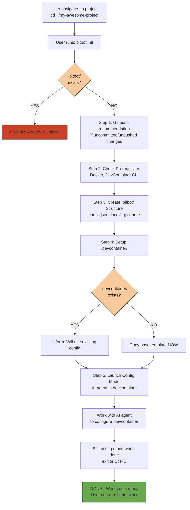

# BitBot Workspace First-Time Initialization Flow

**Scenario**: User has completed global init and wants to set up BitBot in a project folder.

**Purpose**: Initialize BitBot workspace, create .bitbot/ structure, launch config mode to set up .devcontainer.

---

## Prerequisites

- Global BitBot initialization complete (see `FLOW_GLOBAL_INIT.md`)
- User has navigated to a project directory
- Docker is running

---

## Flow Diagram



---

## Step-by-Step Screen Flow

### Step 1: User navigates to project

**Terminal:**
```bash
user@laptop:~$ cd ~/my-awesome-project
user@laptop:~/my-awesome-project$ ls
```

**Output:**
```
README.md  src/  package.json  .git/
```

**User runs init:**
```bash
user@laptop:~/my-awesome-project$ bitbot init
```

---

### Step 2: Git Push Recommendation

**Output (if uncommitted/unpushed changes detected):**
```
[>] Initializing BitBot workspace: /home/user/my-awesome-project

┌─────────────────────────────────────────────────────────┐
│ ⚠️  RECOMMENDATION: Push to remote before init          │
└─────────────────────────────────────────────────────────┘

BitBot will create .bitbot/ and .devcontainer files.
AI agent in config mode will help you configure your .devcontainer.
Push your current state first to easily revert if needed.

On branch main
Your branch is ahead of 'origin/main' by 2 commits.
  (use "git push" to publish your local commits)

Changes not staged for commit:
  (use "git add <file>..." to update what will be committed)
  (use "git restore <file>..." to discard changes in working directory)
        modified:   README.md
        modified:   src/main.py

no changes added to commit (use "git add" and/or "git commit -a")

Recommended steps:
  $ git add .         # Stage changes (if needed)
  $ git commit -m "..." # Commit (if needed)
  $ git push          # Push to remote

What would you like to do?

  1. Exit and push changes (default)
  2. Skip this time
  3. Skip permanently (update config)

Choice [1]: █
```

**User input:** `2` (skip this time)

```

```

---

### Step 3: Prerequisites Check

**Output:**
```
Checking prerequisites...
  ✓ Docker is running
  ✓ DevContainer CLI available

```

**Alternative: Docker not running**
```
Checking prerequisites...
  ✗ Docker is not running

Start Docker now? (Y/n): █
```

**User input:** `Y`

```
[>] Starting Docker...
  Waiting for Docker to start...
  .......... 10s
  ✓ Docker ready (took 12s)

```

---

### Step 4: Create .bitbot/ Structure

**Output:**
```
Creating workspace structure...
  ✓ Created .bitbot/
  ✓ Created .bitbot/local/
  ✓ Created .bitbot/internal/
  ✓ Created .bitbot/internal/local/
  ✓ Created .bitbot/config.json
  ✓ Created config mode devcontainer
  ✓ Added .bitbot/local/ and .bitbot/internal/local/ to .gitignore

Workspace configuration:
  Name: my-awesome-project
  Default mode: work

Config mode devcontainer:
  .bitbot/internal/devcontainer.json (references global Dockerfile)

```

---

### Step 5: Setup .devcontainer

**Scenario A: No existing .devcontainer**

**Output:**
```
[>] Creating base .devcontainer from template...
  ✓ Created .devcontainer/ from template

[+] Workspace initialized
```

**Scenario B: Existing .devcontainer found**

**Output:**
```
[i] Found existing .devcontainer/
    AI agent can help you review and adjust it in config mode

[+] Workspace initialized
```

**Both scenarios then launch config mode:**

**TODO: Add comprehensive config mode warning (Post-MVP)**
Before launching config mode, show warning that:
- Config mode defines the workspace environment for AI agents
- AI will have access to modify critical infrastructure files:
  - `.devcontainer` configuration
  - `.github` workflows
  - `.gitignore` patterns
  - Docker configs
  - Secrets and environment files
- Users should carefully review all changes before committing
- Reference README "The Problem" section for risks
- Show examples of what AI can modify in this mode

```
Launching config mode...

Config mode runs BitBot AI agent in a devcontainer optimized for devcontainer setup.
The AI provides guidance and help to configure your .devcontainer.
Close VS Code or terminal when finished.

You can test your workspace devcontainer in parallel:
  • Open another terminal
  • Run: bitbot work
  • Test your .devcontainer changes while config mode is still running

```

---

### Step 6: Config Mode Launch & Inner BitBot

**Output:**
```
[>] Launching config mode...

Building devcontainer...
[+] Building config devcontainer
 => [internal] load build definition from Dockerfile
 => [1/3] FROM mcr.microsoft.com/devcontainers/base:ubuntu
 => [2/3] RUN apt-get update && apt-get install -y nodejs npm
 => [3/3] COPY bitbot /usr/local/bin/
 => exporting to image
 => => writing image sha256:abc123...

[+] Devcontainer built successfully

Starting devcontainer...
  ✓ Container started: bitbot-config-abc123

Entering devcontainer with tmux session 'config'...

```

**Screen transitions to inside the container, BitBot (inner) launches automatically:**

```
┌─────────────────────────────────────────────────────────────────┐
│ BitBot Config Mode                                              │
│ Container: bitbot-config-abc123                                 │
│ Workspace: /workspace                                           │
└─────────────────────────────────────────────────────────────────┘

[>] Starting BitBot AI Helper...

BitBot AI Helper is ready to assist with devcontainer setup.

You can ask questions like:
  • "Help me configure this devcontainer for a Node.js project"
  • "What features should I add for Python development?"
  • "How do I set up VS Code extensions?"
  • "Review my devcontainer.json"

Your workspace files are at: /workspace
Your .devcontainer is at: /workspace/.devcontainer

Type your questions or close VS Code or terminal when finished.

> █
```

**User asks for help:**
```
> Help me set up a Node.js devcontainer with ESLint
```

**AI Agent responds:**
```
I'll help you configure a Node.js devcontainer with ESLint. Let me update
your .devcontainer/devcontainer.json with the recommended settings:

Recommended configuration:
  • Base image: Node.js 20
  • Features: common-utils (for UID sync)
  • Extensions: ESLint extension
  • PostCreate: npm install

Would you like me to update the devcontainer.json file? (Y/n): █
```

**User can test in parallel while config mode is running:**
- Open another terminal
- Run `bitbot work` to test the workspace devcontainer
- Make adjustments in config mode based on test results

**User continues working with AI agent until satisfied, then closes VS Code or terminal**

---

### Step 7: Exit Config Mode

**User closes VS Code or terminal when finished configuring devcontainer**

**User is back on host:**
```bash
user@laptop:~/my-awesome-project$ █
```

**Workspace is ready:**
```
Your BitBot workspace is initialized and configured.

Next steps:

1. Launch work mode:
   $ bitbot work

2. Or launch in VS Code:
   $ bitbot vscode
```

---

### Step 8: User Launches Work Mode

**Terminal:**
```bash
user@laptop:~/my-awesome-project$ bitbot work
```

**Output:**
```
[>] Launching work mode...

Checking prerequisites...
  ✓ Docker is running
  ✓ DevContainer CLI available

Validating workspace...
  ✓ Workspace initialized
  ✓ .devcontainer found

Git status check...
  [i] No uncommitted changes

[>] Building and starting devcontainer...

Building devcontainer from .devcontainer/devcontainer.json...
[+] Building work devcontainer
 => [internal] load build definition
 => [1/3] FROM mcr.microsoft.com/devcontainers/javascript-node:20
 => [2/3] RUN apt-get update && apt-get install -y git
 => [3/3] USER vscode
 => exporting to image

[+] Devcontainer built successfully

Starting devcontainer...
  ✓ Container started: bitbot-work-abc123def
  ✓ UID/GID synchronized (1000:1000)

Entering devcontainer with tmux session 'work'...

```

**Screen transitions to work mode container:**

```
┌─────────────────────────────────────────────────────────────────┐
│ BitBot Work Mode                                                │
│ Container: bitbot-work-abc123def                                │
│ Workspace: /workspace                                           │
│ .devcontainer: Read-Only ✓                                      │
└─────────────────────────────────────────────────────────────────┘

vscode@bitbot-work:/workspace$ █
```

**User verifies .devcontainer is read-only:**
```bash
vscode@bitbot-work:/workspace$ touch .devcontainer/test
```

**Output:**
```
touch: cannot touch '.devcontainer/test': Read-only file system
```

**Success! User can now work safely:**
```bash
vscode@bitbot-work:/workspace$ npm run dev
```

---

## Alternative Flows

### Already Initialized

**User runs init in an already-initialized workspace:**

```bash
user@laptop:~/my-project$ bitbot init
```

**Output:**
```
[X] Error: Workspace already initialized

Found existing .bitbot/ directory in:
  /home/user/my-project

To reinitialize, first remove .bitbot/:
  $ rm -rf .bitbot/
  $ bitbot init

Or just launch work mode:
  $ bitbot work

```

---

### Git Safety Warnings (Public Repo)

**User has a public GitHub repo:**

**Output:**
```
[>] Initializing BitBot workspace: /home/user/my-project

┌─────────────────────────────────────────────────────────┐
│ ⚠️  PUBLIC REPOSITORY DETECTED                          │
└─────────────────────────────────────────────────────────┘

  This appears to be a public repository.

  WARNING: AI agents may accidentally commit secrets:
    • API keys, tokens, passwords
    • Environment variables (.env files)
    • SSH keys, certificates
    • Database credentials

  Recommendations:
    1. Review ALL changes before committing
    2. Use .gitignore for sensitive files
    3. Consider using git-secrets or similar tools
    4. Never commit credentials - use environment variables

Press Enter to continue with initialization...█
```

**This is non-blocking - user can continue after reading the warnings**

---

## Files Created

After workspace init, the following structure exists:

```
my-awesome-project/
├── .devcontainer/
│   └── devcontainer.json         # Work mode config (created or existing)
├── .bitbot/
│   ├── config.json               # Workspace config (committed)
│   ├── local/                    # Work mode local data (gitignored)
│   │   └── .bash_history         # Work mode bash history mountpoint
│   └── internal/                 # Config mode internals (excluded from mounts)
│       ├── devcontainer.json     # Config mode devcontainer (committed, references global Dockerfile)
│       └── local/                # Config mode local data (gitignored)
│           └── .bash_history     # Config mode bash history mountpoint
├── .git/                         # Existing git repo
├── .gitignore                    # Updated to ignore .bitbot/local/ and .bitbot/internal/local/
├── src/                          # Existing project files
└── README.md
```

**Contents of .bitbot/config.json:**
```json
{
  "default_mode": "work",
  "workspace_name": "my-awesome-project",
  "skip_push_recommendation": false,
  "skip_safety_checks": false
}
```

---

## User Experience Notes

### Timing
- Prerequisites check: **2-3 seconds**
- Create .bitbot/: **< 1 second**
- Config mode launch: **10-30 seconds** (first time, cached after)
- User .devcontainer creation: **2-5 minutes** (manual)
- Exit config mode: **2-3 seconds**
- **Total**: 15 seconds to 6 minutes (depending on user edits)

### User Interactions
- **Init command**: 1 command (`bitbot init`)
- **Inside config mode**: Work with AI agent to set up .devcontainer
- **Exit**: Simple `exit` command when finished
- **Testing**: Can test workspace devcontainer in parallel (separate terminal)

### Error Handling
- **Already initialized**: Clear error with instructions
- **Docker not running**: Auto-start with confirmation
- **No DevContainer CLI**: Helpful install guidance
- **Permission errors**: Suggest checking folder permissions

---

## Decision Points

### Question 1: Create new .devcontainer or use existing?
**If no .devcontainer:** Create from template in config mode
**If .devcontainer exists:** Use existing, allow edits in config mode

### Question 2: What base image to use?
**Options**: Node.js, Python, Ubuntu, Custom
**Default**: Based on project detection (package.json → Node.js, requirements.txt → Python)

### Question 3: Continue with uncommitted changes?
**Recommendation**: Commit first
**User choice**: Can continue anyway (warning only, non-blocking)

---

## Success State

**User knows init succeeded when:**
1. See "✓ Workspace initialized" message
2. Config mode launches (BitBot AI agent running in devcontainer)
3. .bitbot/ directory exists with proper structure
4. Can work with AI agent to configure .devcontainer

**What user can do next:**
1. Run `bitbot work` to start development
2. Run `bitbot vscode` to open in VS Code
3. Run `bitbot config` to edit .devcontainer again (anytime)

---

## Common Issues

### Issue: "Workspace already initialized"
**Cause**: .bitbot/ directory already exists
**Solution**:
1. If intentional, just run `bitbot work`
2. To reinitialize, remove .bitbot/ first: `rm -rf .bitbot/`

### Issue: Config mode exits immediately
**Cause**: tmux session not created properly
**Solution**:
1. Check Docker is running
2. Check devcontainer CLI is available
3. Try again: `bitbot config`

### Issue: .devcontainer not writable in config mode
**Cause**: Incorrect mount configuration
**Solution**:
1. Config mode should NOT have RO mount for .devcontainer
2. Check ~/.bitbot/config-devcontainer/devcontainer.json
3. Ensure no RO mount is specified

### Issue: Changes to .devcontainer not persisting
**Cause**: Editing wrong location or container issue
**Solution**:
1. Ensure editing /workspace/.devcontainer (not /workspace/.devcontainer inside container)
2. Changes should persist on host immediately
3. Verify with `ls -la .devcontainer/` on host after exiting

---

## Best Practices

### Before Init
1. ✅ Navigate to project root (where .git/ is)
2. ✅ Commit any uncommitted work
3. ✅ Ensure Docker is running
4. ✅ Have project requirements ready (Node.js version, Python version, etc.)

### During Config Mode
1. ✅ Use helper script for basic setup
2. ✅ Customize for your project needs
3. ✅ Add project-specific features (git, docker-in-docker, etc.)
4. ✅ Test the config: `devcontainer build --workspace-folder /workspace`
5. ✅ Review mounts (RO for .devcontainer, RW for .bitbot/state)

### After Init
1. ✅ Test work mode: `bitbot work`
2. ✅ Verify .devcontainer is read-only in work mode
3. ✅ Verify bash history persistence across sessions
4. ✅ Commit .devcontainer/ to git (if desired)
5. ✅ Add .bitbot/ to .gitignore (state is local)

---

## Comparison: Work Mode vs Config Mode

| Aspect | Work Mode | Config Mode |
|--------|-----------|-------------|
| **Purpose** | Daily development | Edit infrastructure |
| **DevContainer** | Workspace's .devcontainer/ | Global ~/.bitbot/config-devcontainer/ |
| **Launch** | `bitbot work` | `bitbot config` (or auto-launch from init) |
| **.devcontainer** | Read-only ✓ | Read-write ✓ |
| **Workspace** | /workspace (RW) | /workspace (RW) |
| **When to use** | Write code, run tests | Create/edit .devcontainer, add features |
| **Safety** | Can't break container config | Can edit config (be careful) |

---

## Summary

**Workspace init accomplishes:**
- ✅ Creates .bitbot/ directory structure
- ✅ Creates workspace config.json
- ✅ Ensures .devcontainer/ exists (create or use existing)
- ✅ Automatically launches config mode for setup
- ✅ Readies workspace for work mode

**User learns:**
- ✅ How to initialize a BitBot workspace
- ✅ Config mode is for .devcontainer edits
- ✅ Work mode is for daily development
- ✅ .devcontainer is protected in work mode
- ✅ Bash history persists across sessions

**Next steps after init:**
1. Launch work mode: `bitbot work`
2. Start coding with AI assistance
3. Edit .devcontainer anytime: `bitbot config`
4. Launch in VS Code: `bitbot vscode`

---

**Related Flows:**
- Global first-run: See `FLOW_GLOBAL_INIT.md`
- Work mode session: See `FLOW_WORK_SESSION.md` (future)
- Config mode editing: See `FLOW_CONFIG_MODE.md` (future)
