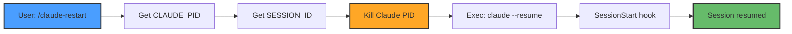

# Claude Code Hooks Pseudocode

**Purpose**: Session tracking and management via Claude Code hooks
**Location**: `.bitbot/hooks/`
**Status**: Implemented

---

## Overview

Hook scripts that integrate with Claude Code's event system to track sessions, manage PIDs, and enable session-aware skills.

---

## session-start.sh

**Trigger**: Claude Code SessionStart event
**Purpose**: Capture session ID and PID, export to environment

```bash
#!/usr/bin/env bash
# Receives JSON via stdin with session_id field

# Validate environment
IF CLAUDE_ENV_FILE not set:
    ERROR: "Must be run by Claude Code, not standalone"
    EXIT 1

# Source shared utilities
SOURCE session-utils.sh

# Read JSON from stdin
INPUT = read_stdin()

# Extract session_id from JSON
IF jq available:
    SESSION_ID = jq('.session_id', INPUT)
ELSE:
    SESSION_ID = grep_extract('"session_id":"([^"]*)"', INPUT)

IF SESSION_ID not empty:
    # Find Claude PID
    CLAUDE_PID = find_claude_pid()  # From session-utils.sh

    # Check if resume or start
    IS_RESUME = grep('"is_resume":true', INPUT) ? "resume" : "start"

    # Export to Claude environment
    PROJECT_ROOT = find_project_root()
    APPEND to CLAUDE_ENV_FILE:
        export CLAUDE_SESSION_ID='$SESSION_ID'
        export CLAUDE_PROJECT_DIR='$PROJECT_ROOT'
        export CLAUDE_PID='$CLAUDE_PID'

    # Echo session info (shown to user)
    IF CLAUDE_PID not empty:
        ECHO "SessionStart:$IS_RESUME - Session: $SESSION_ID, PID: $CLAUDE_PID"
    ELSE:
        ECHO "SessionStart:$IS_RESUME - Session: $SESSION_ID"

    # Write wrapper state file for inter-process communication
    IF CLAUDE_PID not empty:
        WRAPPER_STATE = "$PROJECT_ROOT/.bitbot/wrapper/.wrapper-session-${CLAUDE_PID}.state"
        CREATE directory .bitbot/wrapper
        WRITE to WRAPPER_STATE:
            SESSION_ID=$SESSION_ID
            IS_RESUME=$IS_RESUME
            START_TIME=$(current_timestamp)

EXIT 0
```

---

## session-end.sh

**Trigger**: Claude Code SessionEnd event
**Purpose**: Clean up session state files

```bash
#!/usr/bin/env bash
# Clean up wrapper state files when Claude exits

# Source shared utilities
SOURCE session-utils.sh

# Find Claude PID
CLAUDE_PID = find_claude_pid()

IF CLAUDE_PID not empty:
    PROJECT_ROOT = find_project_root()
    WRAPPER_STATE = "$PROJECT_ROOT/.bitbot/wrapper/.wrapper-session-${CLAUDE_PID}.state"

    # Remove state file for this session
    IF file_exists(WRAPPER_STATE):
        DELETE WRAPPER_STATE

    # Clean up old state files for non-running PIDs
    FOR each file IN .bitbot/wrapper/.wrapper-session-*.state:
        PID = extract_pid_from_filename(file)
        IF NOT process_running(PID):
            DELETE file

EXIT 0
```

---

## user-prompt-submit.sh

**Trigger**: Claude Code UserPromptSubmit event
**Purpose**: Track user interaction (currently minimal)

```bash
#!/usr/bin/env bash
# Called when user submits a prompt

# Currently just passes through
# Future: Could log prompts, track session activity, etc.

EXIT 0
```

---

## do-not-stop.sh

**Trigger**: Claude Code Stop event
**Purpose**: Enable continuous workflow automation

```bash
#!/usr/bin/env bash
# Control whether Claude continues after finishing response

# Source shared utilities
SOURCE session-utils.sh

PROJECT_ROOT = find_project_root()
CONTROL_FILE = "$PROJECT_ROOT/.bitbot/DO-NOT-STOP.txt"

# Check if automation enabled
IF NOT file_exists(CONTROL_FILE):
    # File doesn't exist - allow normal stop
    EXIT 0

# Read continuation reason from file
REASON = read_file(CONTROL_FILE)

IF REASON is empty:
    # File exists but empty - allow normal stop
    EXIT 0

# Check for infinite loop protection
IF environment variable stop_hook_active is set:
    # Already in stop hook - prevent recursion
    EXIT 0

# Continue with specified reason
ECHO "$REASON"
EXIT 1  # Non-zero exit = continue
```

**Control Flow**:
```
User finishes task
    → Claude finishes response
    → Stop hook triggered
    → Check DO-NOT-STOP.txt
        → File missing/empty? → Normal stop
        → File has content? → Continue with reason from file
    → Claude continues working
```

---

## session-utils.sh

**Purpose**: Shared utility functions for hooks and skills
**Usage**: Sourced by other scripts

```bash
#!/usr/bin/env bash
# Shared session management utilities

# Find Claude Code process PID
FUNCTION find_claude_pid():
    # Get current shell's parent process tree
    CURRENT_PID = $$

    # Walk up process tree looking for 'claude' process
    WHILE CURRENT_PID not 1:
        PROCESS_NAME = get_process_name(CURRENT_PID)

        IF PROCESS_NAME contains "claude":
            RETURN CURRENT_PID

        # Move to parent process
        CURRENT_PID = get_parent_pid(CURRENT_PID)

    # Claude PID not found
    RETURN empty

# Find BitBot project root
FUNCTION find_project_root():
    CURRENT_DIR = pwd

    # Walk up directory tree looking for .bitbot/ or .claude/
    WHILE CURRENT_DIR not "/":
        IF directory_exists("$CURRENT_DIR/.bitbot"):
            RETURN CURRENT_DIR

        IF directory_exists("$CURRENT_DIR/.claude"):
            RETURN CURRENT_DIR

        # Move up one directory
        CURRENT_DIR = parent_directory(CURRENT_DIR)

    # Not found, return current working directory
    RETURN pwd

# Get session ID from wrapper state
FUNCTION get_session_id():
    CLAUDE_PID = find_claude_pid()

    IF CLAUDE_PID empty:
        RETURN empty

    PROJECT_ROOT = find_project_root()
    WRAPPER_STATE = "$PROJECT_ROOT/.bitbot/wrapper/.wrapper-session-${CLAUDE_PID}.state"

    IF NOT file_exists(WRAPPER_STATE):
        RETURN empty

    # Extract SESSION_ID from state file
    SESSION_ID = grep('^SESSION_ID=', WRAPPER_STATE) | extract_value

    RETURN SESSION_ID
```

---

## Integration with Skills

### claude-restart Skill

**Usage**: `/claude-restart` or skill invocation

```bash
#!/usr/bin/env bash
# Restart Claude Code session

# Source utilities
SOURCE session-utils.sh

# Get current session info
CLAUDE_PID = find_claude_pid()
SESSION_ID = get_session_id()

IF CLAUDE_PID empty OR SESSION_ID empty:
    ERROR: "Cannot find Claude session info"
    EXIT 1

# Kill current Claude process
kill CLAUDE_PID

# Exec restart (replaces current process)
exec claude --resume $SESSION_ID
```

**Flow**:


### claude-do-not-stop Skill

**Usage**: `/claude-do-not-stop [reason]`

```bash
#!/usr/bin/env bash
# Enable continuous workflow automation

PROJECT_ROOT = find_project_root()
CONTROL_FILE = "$PROJECT_ROOT/.bitbot/DO-NOT-STOP.txt"

# Get reason from argument or use default
IF argument provided:
    REASON = "$1"
ELSE:
    REASON = "Continue working. Check TODO list and implement the next pending task."

# Write reason to control file
ECHO "$REASON" > $CONTROL_FILE

ECHO "Automation enabled: $REASON"
EXIT 0
```

### claude-allow-stop Skill

**Usage**: `/claude-allow-stop`

```bash
#!/usr/bin/env bash
# Disable continuous workflow automation

PROJECT_ROOT = find_project_root()
CONTROL_FILE = "$PROJECT_ROOT/.bitbot/DO-NOT-STOP.txt"

# Remove or empty control file
IF file_exists(CONTROL_FILE):
    DELETE CONTROL_FILE

ECHO "Automation disabled. Claude will stop normally."
EXIT 0
```

---

## State Management

### Wrapper State File Format

**File**: `.bitbot/wrapper/.wrapper-session-{PID}.state`

```bash
SESSION_ID=4c02986e-41d4-4b5f-829a-b097ee844a8e
IS_RESUME=start
START_TIME=1735410000
```

**Purpose**:
- Inter-process communication (hooks → skills)
- Session info persistence across script invocations
- PID-based uniqueness (no conflicts between sessions)

### Control File Format

**File**: `.bitbot/DO-NOT-STOP.txt`

```
Continue working. Check TODO list and implement the next pending task.
```

**Purpose**:
- User-controlled automation toggle
- Custom continuation reasons
- Per-project preference

---

## Error Handling

### Hook Validation
```bash
# All hooks validate they're run by Claude Code
IF CLAUDE_ENV_FILE not set:
    ERROR: "This hook must be run by Claude Code"
    EXIT 1
```

### Missing Dependencies
```bash
# Graceful fallback if jq not available
IF command jq not found:
    USE grep/sed for JSON parsing
```

### PID Not Found
```bash
# Skills handle missing PID gracefully
IF find_claude_pid() returns empty:
    ERROR: "Cannot find Claude process"
    SUGGEST: "Run this from within Claude Code session"
    EXIT 1
```

---

## Success Criteria

**Hooks**:
- [x] SessionStart captures session ID and PID
- [x] SessionEnd cleans up state files
- [x] Stop hook enables automation control
- [x] Hooks fail gracefully if prerequisites missing

**Skills**:
- [x] claude-restart works reliably
- [x] claude-do-not-stop enables automation
- [x] claude-allow-stop disables automation
- [x] Skills can access session info via utilities

**State Management**:
- [x] Wrapper state files use unique PIDs
- [x] Old state files cleaned up automatically
- [x] Git ignores generated state files

---

## Future Enhancements

**Context Management**:
```bash
# claude-compact-resume skill (planned)
claude --compact --resume $SESSION_ID
```

**Session Metadata**:
```bash
# Enhanced wrapper state
SESSION_ID=...
IS_RESUME=start
START_TIME=1735410000
DURATION=3600
FILES_MODIFIED=src/foo.ts,src/bar.ts
COMMANDS_RUN=15
```

**Multi-Session Support**:
```bash
# List all active sessions
claude-list-sessions

# Switch between sessions
claude-switch-session <session-id>
```
