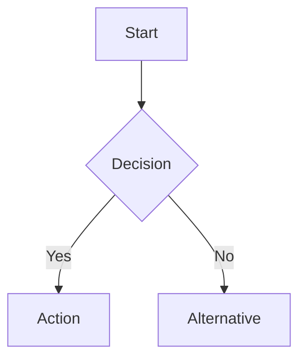
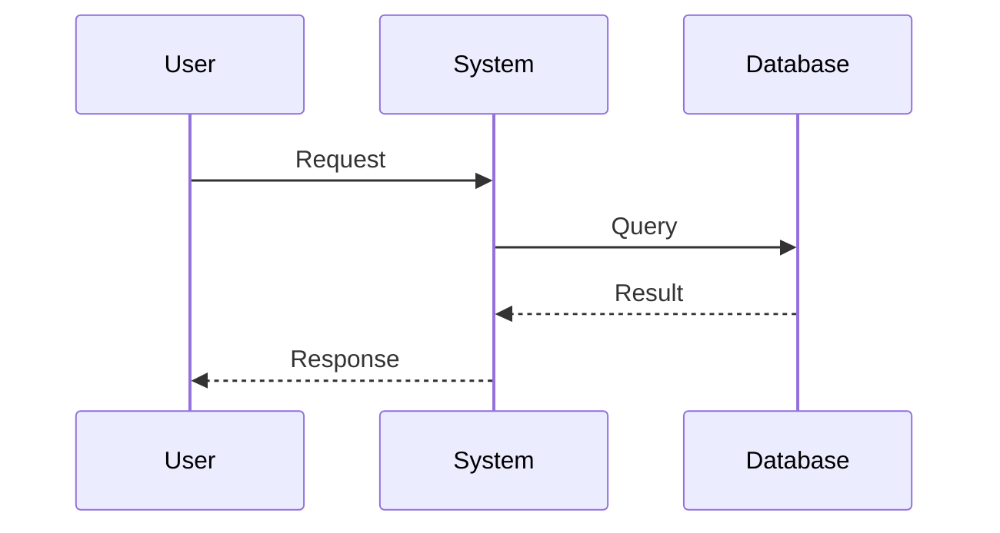
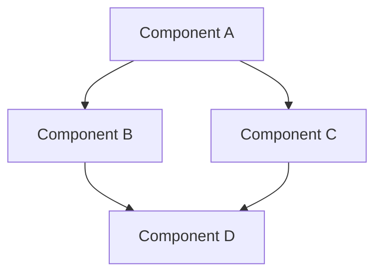

# Phase 3: Architecture

This directory contains visual architecture documentation including system diagrams, sequence flows, and component interactions.

## Purpose

Architecture documentation serves to:
- **Visualize** system structure and component relationships
- **Communicate** design to developers and stakeholders
- **Document** key architectural decisions visually
- **Guide** implementation and maintenance
- **Onboard** new contributors with clear diagrams

## Status

**Phase**: Complete
**Format**: Mermaid diagrams (rendered in GitHub/Markdown viewers)
**Coverage**: System architecture, container orchestration, workspace detection, VS Code integration, cross-platform flows, and component interactions

## Directory Structure

```
3-architecture/
├── README.md                     This file
└── diagrams/                     Mermaid architecture diagrams
    ├── 01-system-overview.md
    ├── 02-container-orchestration.md
    ├── 03-workspace-detection.md
    ├── 04-vscode-integration.md
    ├── 05-cross-platform-flow.md
    └── 06-component-interaction.md
```

---

## Architecture Diagrams

### 01: System Overview
**File**: `diagrams/01-system-overview.md`

**Purpose**: High-level view of BitBot's major components and their interactions

**Contents**:
- User interface (CLI, VS Code)
- Platform layer (Windows/WSL, macOS, Linux)
- Core components (router, commands, utilities)
- Container orchestration (work mode, config mode)
- External services (Docker, Git, DevContainer)
- Templates (basic, config)

**Key Insights**:
- Clear separation between user interface and core logic
- Platform abstraction layer
- Dual-mode container system
- Template-based initialization

**View**: [01-system-overview.md](diagrams/01-system-overview.md)

---

### 02: Container Orchestration
**File**: `diagrams/02-container-orchestration.md`

**Purpose**: Detailed view of the two-mode security system

**Contents**:
- Work mode container (read-only `.devcontainer`)
- Config mode container (read-write `.devcontainer`)
- Security boundaries and isolation layers
- Permission matrix
- Container lifecycle
- Simultaneous operation capability
- Git safety integration

**Key Insights**:
- Filesystem-level security enforcement
- Both containers can run simultaneously
- Clear separation of development vs infrastructure work
- Non-blocking git safety warnings

**View**: [02-container-orchestration.md](diagrams/02-container-orchestration.md)

---

### 03: Workspace Detection
**File**: `diagrams/03-workspace-detection.md`

**Purpose**: Workspace discovery and initialization algorithm

**Contents**:
- Detection flow (CWD → parent → init)
- Validation process
- Error handling
- User experience scenarios
- Cross-platform path handling
- Future enhancements

**Key Insights**:
- Progressive detection (CWD first, then parent)
- User-prompted initialization
- Comprehensive validation
- Helpful error messages

**View**: [03-workspace-detection.md](diagrams/03-workspace-detection.md)

---

### 04: VS Code Integration
**File**: `diagrams/04-vscode-integration.md`

**Purpose**: Direct DevContainer Opening innovation

**Contents**:
- Hex encoding path conversion
- URI construction
- Platform-specific execution
- Container reuse mechanism
- Comparison with DevContainer CLI approach
- Error handling

**Key Insights**:
- No manual "Reopen in Container" popup
- No DevContainer CLI dependency (~200MB saved)
- Hex encoding prevents WSL path corruption
- One-step direct container opening

**View**: [04-vscode-integration.md](diagrams/04-vscode-integration.md)

---

### 05: Cross-Platform Flow
**File**: `diagrams/05-cross-platform-flow.md`

**Purpose**: How BitBot handles Windows/WSL, macOS, and Linux

**Contents**:
- Platform detection
- Windows architecture (WSL + Alpine)
- macOS architecture (native bash)
- Linux architecture (native bash)
- Path handling (WSL ↔ Windows conversion)
- VS Code execution
- Docker integration
- Unified codebase strategy

**Key Insights**:
- Single bash codebase (90% shared)
- Alpine WSL for Windows (~8MB)
- Platform-specific adaptations minimal
- Consistent behavior across platforms

**View**: [05-cross-platform-flow.md](diagrams/05-cross-platform-flow.md)

---

### 06: Component Interaction
**File**: `diagrams/06-component-interaction.md`

**Purpose**: How core components interact to deliver functionality

**Contents**:
- Component responsibilities
- Data flow sequences
- Dependency graph
- Shared state (or lack thereof)
- Environment variables
- Error propagation
- Design principles

**Key Insights**:
- Clear component boundaries
- Minimal dependencies
- No global state
- Predictable data flow

**View**: [06-component-interaction.md](diagrams/06-component-interaction.md)

---

## Diagram Format: Mermaid

All diagrams use [Mermaid](https://mermaid.js.org/) syntax for several reasons:

### Advantages
- ✅ **Text-based**: Can be versioned in Git
- ✅ **Rendered**: GitHub/GitLab/VS Code render automatically
- ✅ **Editable**: Easy to update without special tools
- ✅ **Consistent**: Uniform styling across diagrams
- ✅ **Portable**: Works anywhere Markdown is supported

### Viewing Mermaid Diagrams

**GitHub/GitLab**:
- Rendered automatically in `.md` files
- No special plugins needed

**VS Code**:
- Install "Markdown Preview Mermaid Support" extension
- Preview `.md` files with diagrams

**Standalone**:
- [Mermaid Live Editor](https://mermaid.live/)
- Copy/paste diagram code

---

## Diagram Types Used

### Flowcharts


**Used for**:
- Process flows (workspace detection)
- Decision trees (error handling)
- Algorithm steps

---

### Sequence Diagrams


**Used for**:
- Command execution flows
- Component interactions over time
- API/service communication

---

### Graphs


**Used for**:
- System architecture
- Component relationships
- Dependency diagrams

---

## Architectural Principles

### Separation of Concerns
- **Entry Point**: Command routing
- **Commands**: Business logic
- **Utilities**: Shared functionality
- **External Services**: Docker, Git, VS Code

### Security First
- **Work Mode**: Read-only infrastructure
- **Config Mode**: Explicit infrastructure editing
- **Git Safety**: Warn before potential data loss
- **Isolation**: Containers separate concerns

### Cross-Platform
- **Single Codebase**: 90% shared across platforms
- **Platform Detection**: Runtime adaptation
- **Consistent Behavior**: Same functionality everywhere

### Simplicity
- **No Global State**: All config in workspace
- **Minimal Dependencies**: Core bash only
- **Clear Interfaces**: Predictable function signatures
- **Direct Execution**: No complex build steps

---

## Design Patterns

### Command Pattern
```
bitbot [command] [options]
  ↓
Router determines handler
  ↓
Handler executes with utilities
  ↓
Result returned to user
```

### Facade Pattern
```
Complex Docker/DevContainer interactions
  ↓
Wrapped in devcontainer.sh
  ↓
Simple functions for commands
```

### Strategy Pattern
```
Platform detection
  ↓
Platform-specific strategies selected
  ↓
Common interface executed
```

---

## Relationship to Specifications

Each diagram implements design from specifications:

| Diagram                   | Implements Specification           |
|---------------------------|-------------------------------------|
| System Overview           | All specs (holistic view)          |
| Container Orchestration   | SPEC-02, SPEC-02A                  |
| Workspace Detection       | SPEC-08                            |
| VS Code Integration       | SPEC-06                            |
| Cross-Platform Flow       | SPEC-05                            |
| Component Interaction     | SPEC-01, SPEC-04, SPEC-08          |

**Traceability**:
- Specifications (Phase 1) → what to build
- Pseudocode (Phase 2) → how to implement
- Architecture (Phase 3) → how components fit together
- Implementation → actual code

---

## Using These Diagrams

### For Development
- Reference when implementing new features
- Understand component relationships
- Ensure consistency with design
- Guide refactoring decisions

### For Onboarding
- New contributors start with system overview
- Drill down into specific components
- Understand design rationale
- See the big picture

### For Documentation
- User docs reference architecture
- Technical docs link to diagrams
- Presentations use visual aids
- Design discussions reference diagrams

### For Troubleshooting
- Trace data flow through components
- Identify integration points
- Understand security boundaries
- Debug cross-platform issues

---

## Maintenance

### Updating Diagrams

When architecture changes:
1. **Update specification** first (Phase 1)
2. **Update pseudocode** if needed (Phase 2)
3. **Update diagram** to reflect changes (Phase 3)
4. **Update implementation** (code)
5. **Update tests** (Phase 4)

### Diagram Consistency

Ensure diagrams stay consistent:
- Use same component names across diagrams
- Maintain consistent styling
- Update related diagrams together
- Cross-reference between diagrams

---

## Future Diagrams

### Planned (Post-MVP)

**Deployment Architecture**:
- Installation process
- Directory structure
- File permissions
- System integration

**Security Architecture**:
- Threat model
- Attack surface
- Mitigation strategies
- Trust boundaries

**Data Flow**:
- Configuration data
- User data
- Container data
- Shared volumes

**Extension Points**:
- Plugin architecture
- Custom templates
- Hook system
- API design

---

## Not Included in Release

Architecture diagrams are development artifacts and excluded from release distributions. However, simplified diagrams may appear in user documentation.

---

## References

- **Specifications**: `../1-specification/` (what to build)
- **Pseudocode**: `../2-pseudocode/` (how to implement)
- **Implementation**: `/core/` (actual code)
- **Mermaid Docs**: https://mermaid.js.org/
- **Live Editor**: https://mermaid.live/
