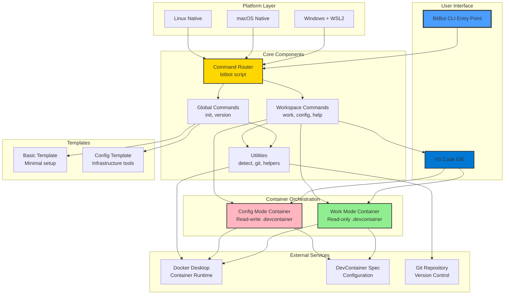

# System Overview

High-level architecture of BitBot showing major components and their interactions.

## Key Components

### User Interface
- **BitBot CLI**: Command-line entry point for all BitBot operations
- **VS Code IDE**: Direct container opening via hex-encoded URIs

### Platform Layer
- **Windows + WSL2**: BitBot runs in Alpine WSL distro, launches Windows VS Code
- **macOS Native**: Direct bash execution
- **Linux Native**: Direct bash execution

### Core Components
- **Command Router**: Routes commands to appropriate handlers (global vs workspace)
- **Global Commands**: System-wide operations (first-run init, version)
- **Workspace Commands**: Workspace-specific operations (work, config, help, init)
- **Utilities**: Shared functionality (workspace detection, git safety, helpers)

### Container Orchestration
- **Work Mode**: Development container with read-only .devcontainer (secure)
- **Config Mode**: Configuration container with read-write .devcontainer (infrastructure)

### External Services
- **Docker Desktop**: Provides container runtime
- **DevContainer Spec**: Configuration standard for development containers
- **Git Repository**: Version control and safety checks

### Templates
- **Basic Template**: Minimal Ubuntu + Node.js + Claude Code
- **Config Template**: Basic + Docker CLI + DevContainer CLI

## Information Flow

1. **User invokes BitBot CLI** → Platform-specific execution (WSL/native bash)
2. **Router analyzes command** → Global or workspace context
3. **Command handler executes** → Uses utilities for common operations
4. **Container operations** → Work or config mode based on command
5. **VS Code integration** → Direct container opening (no manual popup)

## Design Principles

- **Separation of Concerns**: Global vs workspace, work vs config modes
- **Security First**: Read-only .devcontainer in work mode
- **Cross-Platform**: Same codebase works on Windows/macOS/Linux
- **Simple Entry Point**: Single `bitbot` command for all operations
- **No Globals**: All state in workspace, no global configuration
