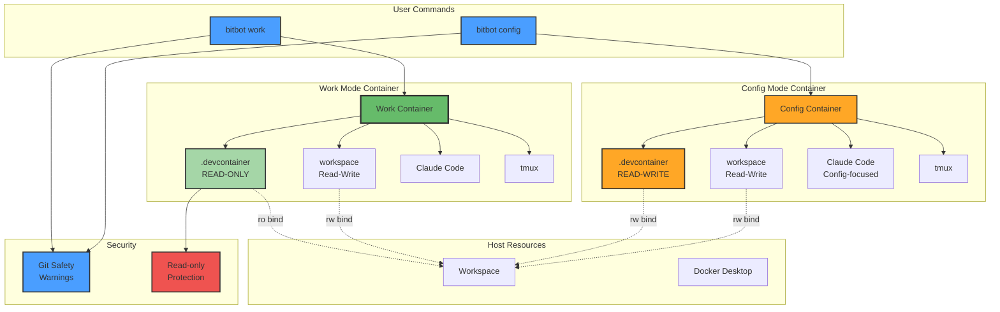
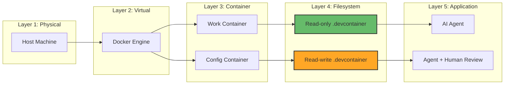
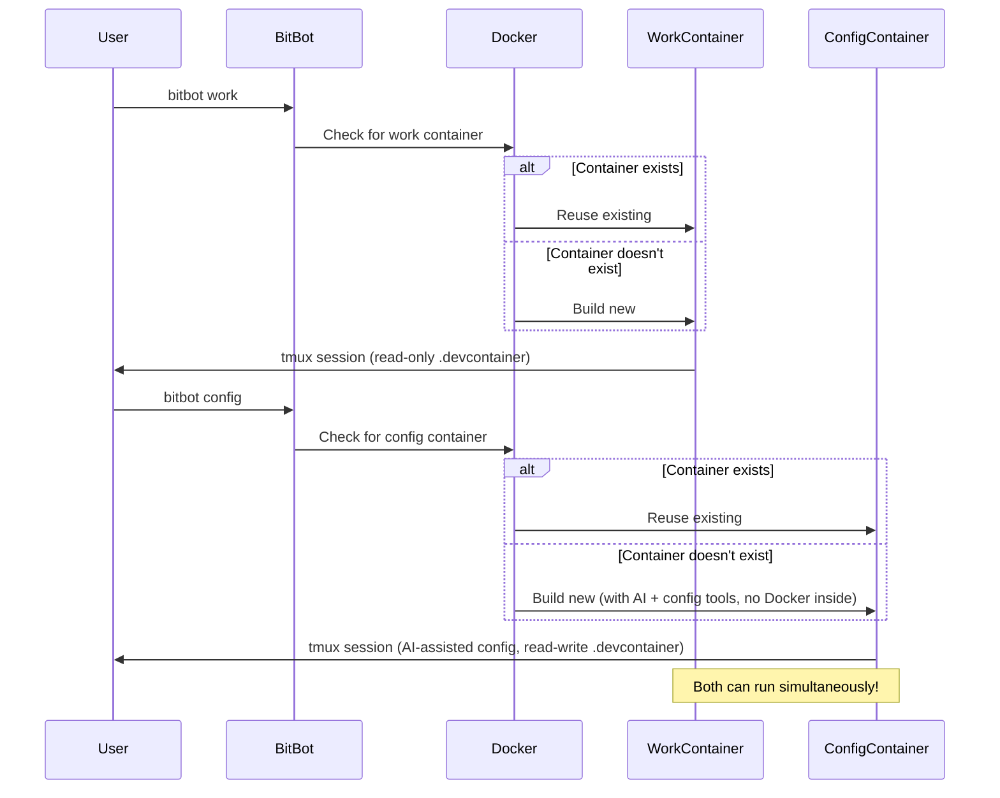
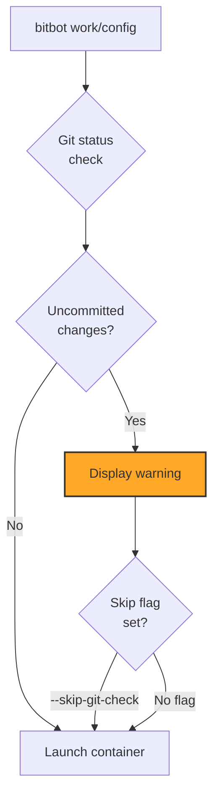

# Container Orchestration - Two-Mode Security System

BitBot's dual-mode container system providing security boundaries between development work and infrastructure configuration.



## Work Mode (Secure Development)

### Purpose

Isolated development environment with AI assistant, protected infrastructure.

### Characteristics

- **Container**: `devcontainer.json` from workspace
- **.devcontainer**: Read-only bind mount (cannot modify infrastructure)
- **Workspace**: Read-write bind mount (can edit code)
- **Tools**: Claude Code AI, tmux session, git
- **Security**: Git safety warnings, no Docker access (by default)
- **Docker-in-Docker**: Optional (⚠️ security trade-off - see SPEC-02 section 2.3)

### Use Cases

- Writing code
- Running tests
- AI-assisted development
- Git operations
- Regular development workflow
- **(Optional)** Docker image building, Docker Compose testing (⚠️ requires trust)

### Mount Configuration

```yaml
Mounts:
  - source: ${localWorkspaceFolder}/.devcontainer
    target: /workspace/.devcontainer
    type: bind
    consistency: cached
    readonly: true              # ← READ-ONLY

  - source: ${localWorkspaceFolder}
    target: /workspace
    type: bind
    consistency: cached
    readonly: false             # ← READ-WRITE
```

---

## Config Mode (Infrastructure Management)

### Purpose

AI-assisted infrastructure configuration environment with write access to `.devcontainer`.

### Prerequisites

- Requires Docker on host (to run the config container)
- Requires DevContainer CLI (to build/launch the config container)

### Characteristics

- **Container**: Config template with config-specific tooling
- **.devcontainer**: Read-write bind mount (can modify infrastructure)
- **Workspace**: Read-write bind mount (can edit everything)
- **AI Agent**: Claude Code AI for assisted configuration changes
- **Tools**: Config-specific tools (devcontainer features, YAML/JSON editors, git, etc.)
- **Access**: No Docker socket mount - config container doesn't run other containers

### Use Cases

- AI-assisted editing of `.devcontainer/devcontainer.json`
- Modifying `Dockerfile` with AI help
- Adding/configuring devcontainer features
- Updating workspace configuration files
- Infrastructure documentation changes

### Mount Configuration

```yaml
Mounts:
  - source: ${localWorkspaceFolder}
    target: /workspace
    type: bind
    consistency: cached
    readonly: false             # ← READ-WRITE (includes .devcontainer)

# No Docker socket mount - config container doesn't run other containers
```

---

## Security Model

### Threat Model

**Problem**: AI agents could accidentally modify infrastructure (devcontainer config), breaking the development environment or introducing vulnerabilities.

**Solution**: Separate work and configuration into different containers with different permission models.

### Isolation Layers



### Permission Matrix

| Resource                | Work Mode                | Config Mode                  |
| ----------------------- | ------------------------ | ---------------------------- |
| Source code (workspace) | Read-Write               | Read-Write                   |
| .devcontainer files     | Read-Only                | Read-Write                   |
| Docker socket           | Optional (⚠️)           | No Access                    |
| DevContainer CLI        | No Access                | No Access                    |
| Workload/Config tools   | Workload-specific        | Config-specific (YAML, JSON) |
| Claude Code AI          | Available (code-focused) | Available (config-focused)   |
| Git operations          | Available                | Available                    |

**Note**: Docker socket access in work mode is optional and template-dependent. When enabled, uses rootless Docker-in-Docker with limited isolation (⚠️ security trade-off). See SPEC-02 section 2.3 for details.

---

## Container Lifecycle



---

## Simultaneous Operation

### Both Modes Active

Work and config mode containers **can run at the same time**:

- Separate container instances
- Shared workspace on host
- No conflicts (different tmux sessions)

### Use Case

1. **Terminal 1**: `bitbot work` - Coding with AI
2. **Terminal 2**: `bitbot config` - Editing Dockerfile
3. **Result**: Safe infrastructure changes without disrupting development

---

## Git Safety Integration

Both modes integrate git safety checks:



**Protection**: Non-blocking warnings prevent accidental loss of uncommitted work

---

## Design Decisions

### Why Two Separate Containers?

- **Security**: AI cannot accidentally modify infrastructure
- **Simplicity**: Clear separation of concerns
- **Flexibility**: Can run both simultaneously
- **Safety**: Infrastructure changes are intentional, not accidental

### Why Read-Only Mount?

- **Protection**: Filesystem-level enforcement (not just convention)
- **Reliability**: Cannot be bypassed by AI or user error
- **Visibility**: Clear error messages if write attempted

### Why Not Runtime Mode Switching?

- **Complexity**: Runtime switching adds state management
- **Security**: Mode boundaries less clear
- **Simplicity**: Separate containers = separate contexts

---

## References

- **SPEC-02**: Security Mode System specification
- **SPEC-02A**: Git Safety Integration
- **D-11**: Decision to use containers instead of sketch mode