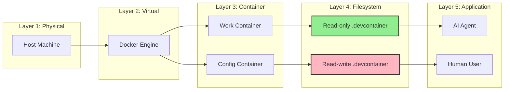
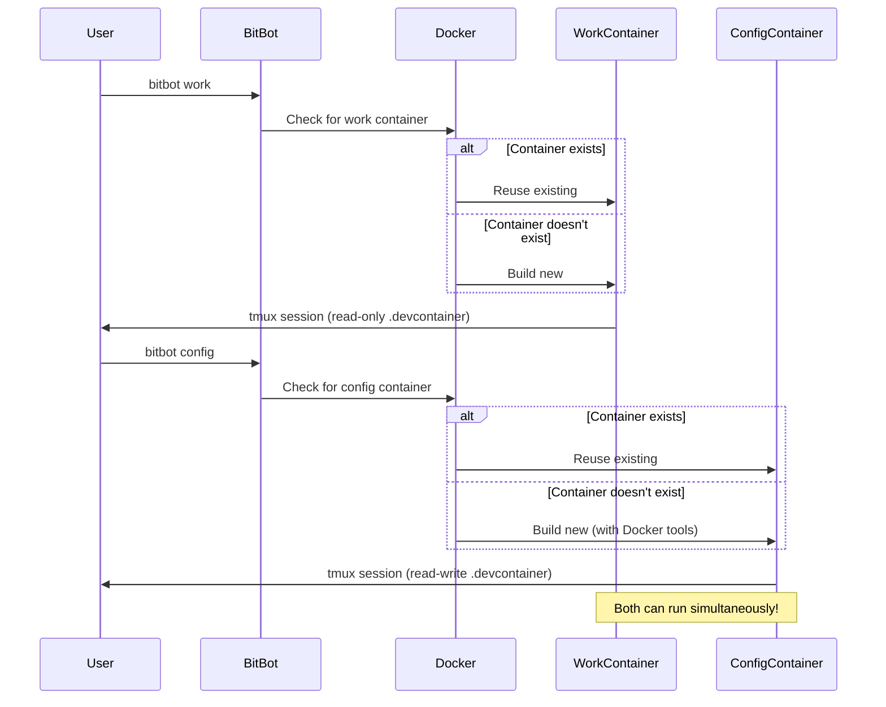
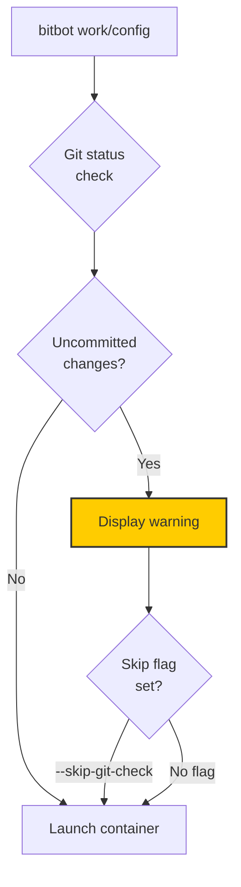

# Container Orchestration - Two-Mode Security System

BitBot's dual-mode container system providing security boundaries between development work and infrastructure configuration.

```mermaid
graph TB
    subgraph "User Commands"
        WORK[bitbot work]
        CONFIG[bitbot config]
    end

    subgraph "Work Mode Container"
        direction TB
        WORKCONT[Work Container]
        WORKDC[.devcontainer/<br/>READ-ONLY]
        WORKSPACE1[/workspace<br/>Read-Write]
        CLAUDECODE1[Claude Code AI]
        TMUX1[tmux Session]

        WORKCONT --> WORKDC
        WORKCONT --> WORKSPACE1
        WORKCONT --> CLAUDECODE1
        WORKCONT --> TMUX1
    end

    subgraph "Config Mode Container"
        direction TB
        CONFIGCONT[Config Container]
        CONFIGDC[.devcontainer/<br/>READ-WRITE]
        WORKSPACE2[/workspace<br/>Read-Write]
        DOCKER[Docker CLI]
        DCCLI[DevContainer CLI]
        TMUX2[tmux Session]

        CONFIGCONT --> CONFIGDC
        CONFIGCONT --> WORKSPACE2
        CONFIGCONT --> DOCKER
        CONFIGCONT --> DCCLI
        CONFIGCONT --> TMUX2
    end

    subgraph "Shared Host Resources"
        HOSTWS[Host Workspace<br/>/path/to/project]
        HOSTDOCKER[Docker Desktop]
    end

    subgraph "Security Boundaries"
        GITSAFETY[Git Safety Checks<br/>Warn on uncommitted]
        READONLY[Read-only Mount<br/>Protection]
    end

    WORK --> WORKCONT
    CONFIG --> CONFIGCONT

    WORKDC -.->|Read-only bind| HOSTWS
    WORKSPACE1 -.->|Read-write bind| HOSTWS

    CONFIGDC -.->|Read-write bind| HOSTWS
    WORKSPACE2 -.->|Read-write bind| HOSTWS

    DOCKER -.->|Docker socket| HOSTDOCKER

    WORK --> GITSAFETY
    CONFIG --> GITSAFETY

    WORKDC --> READONLY

    style WORKCONT fill:#90ee90,stroke:#333,stroke-width:3px
    style CONFIGCONT fill:#ffb6c1,stroke:#333,stroke-width:3px
    style WORKDC fill:#d0f0c0,stroke:#333,stroke-width:2px
    style CONFIGDC fill:#ffc0cb,stroke:#333,stroke-width:2px
    style READONLY fill:#ff6b6b,stroke:#333,stroke-width:2px
    style GITSAFETY fill:#4a9eff,stroke:#333,stroke-width:2px
```

## Work Mode (Secure Development)

### Purpose
Isolated development environment with AI assistant, protected infrastructure.

### Characteristics
- **Container**: `devcontainer.json` from workspace
- **.devcontainer**: Read-only bind mount (cannot modify infrastructure)
- **Workspace**: Read-write bind mount (can edit code)
- **Tools**: Claude Code AI, tmux session, git
- **Security**: Git safety warnings, no Docker access

### Use Cases
- Writing code
- Running tests
- AI-assisted development
- Git operations
- Regular development workflow

### Mount Configuration
```yaml
Mounts:
  - source: ${localWorkspaceFolder}/.devcontainer
    target: /workspace/.devcontainer
    type: bind
    consistency: cached
    readonly: true              # ← READ-ONLY

  - source: ${localWorkspaceFolder}
    target: /workspace
    type: bind
    consistency: cached
    readonly: false             # ← READ-WRITE
```

---

## Config Mode (Infrastructure Management)

### Purpose
Infrastructure configuration environment with full container access.

### Characteristics
- **Container**: Config template with infrastructure tools
- **.devcontainer**: Read-write bind mount (can modify infrastructure)
- **Workspace**: Read-write bind mount (can edit everything)
- **Tools**: Docker CLI, DevContainer CLI, Claude Code
- **Access**: Full Docker socket access for rebuilding

### Use Cases
- Editing `.devcontainer/devcontainer.json`
- Modifying `Dockerfile`
- Installing system packages
- Testing devcontainer changes
- Setting up Docker Compose services

### Mount Configuration
```yaml
Mounts:
  - source: ${localWorkspaceFolder}
    target: /workspace
    type: bind
    consistency: cached
    readonly: false             # ← READ-WRITE (includes .devcontainer)

  - source: /var/run/docker.sock
    target: /var/run/docker.sock
    type: bind                  # ← DOCKER ACCESS
```

---

## Security Model

### Threat Model
**Problem**: AI agents could accidentally modify infrastructure (devcontainer config), breaking the development environment or introducing vulnerabilities.

**Solution**: Separate work and configuration into different containers with different permission models.

### Isolation Layers



### Permission Matrix

| Resource                 | Work Mode  | Config Mode |
|--------------------------|------------|-------------|
| Source code (workspace)  | Read-Write | Read-Write  |
| .devcontainer files      | Read-Only  | Read-Write  |
| Docker socket            | No Access  | Full Access |
| DevContainer CLI         | No Access  | Available   |
| Claude Code AI           | Available  | Available   |
| Git operations           | Available  | Available   |

---

## Container Lifecycle



---

## Simultaneous Operation

### Both Modes Active
Work and config mode containers **can run at the same time**:
- Separate container instances
- Shared workspace on host
- No conflicts (different tmux sessions)

### Use Case
1. **Terminal 1**: `bitbot work` - Coding with AI
2. **Terminal 2**: `bitbot config` - Editing Dockerfile
3. **Result**: Safe infrastructure changes without disrupting development

---

## Git Safety Integration

Both modes integrate git safety checks:



**Protection**: Non-blocking warnings prevent accidental loss of uncommitted work

---

## Design Decisions

### Why Two Separate Containers?
- **Security**: AI cannot accidentally modify infrastructure
- **Simplicity**: Clear separation of concerns
- **Flexibility**: Can run both simultaneously
- **Safety**: Infrastructure changes are intentional, not accidental

### Why Read-Only Mount?
- **Protection**: Filesystem-level enforcement (not just convention)
- **Reliability**: Cannot be bypassed by AI or user error
- **Visibility**: Clear error messages if write attempted

### Why Not Runtime Mode Switching?
- **Complexity**: Runtime switching adds state management
- **Security**: Mode boundaries less clear
- **Simplicity**: Separate containers = separate contexts

---

## References

- **SPEC-02**: Security Mode System specification
- **SPEC-02A**: Git Safety Integration
- **D-11**: Decision to use containers instead of sketch mode
