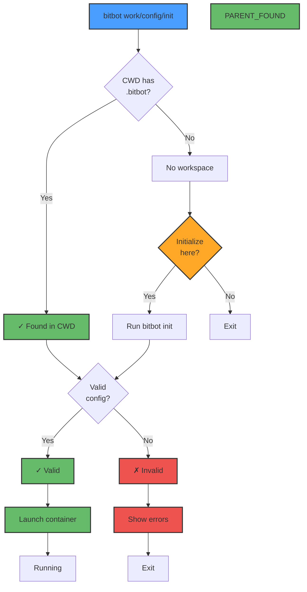
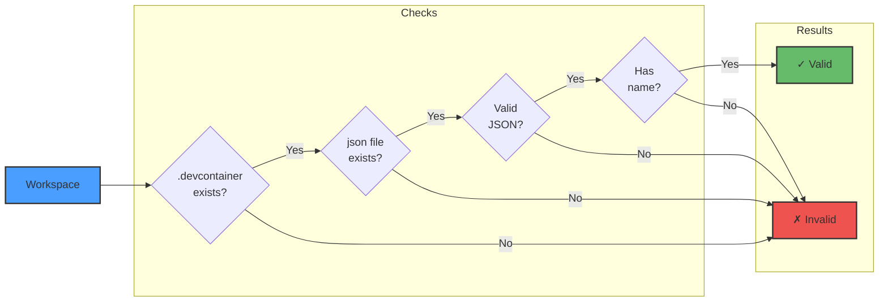

# Workspace Detection Flow

BitBot's intelligent workspace detection algorithm for finding or initializing BitBot workspaces.



## Detection Algorithm

### Step 1: Check Current Working Directory (CWD)

```bash
# Check if CWD has .bitbot directory
if [ -d "$PWD/.bitbot" ]; then
    WORKSPACE_PATH="$PWD"
    return 0
fi
```

**Rationale**: Most common case - user is already in workspace directory. The `.bitbot` directory is created during workspace initialization and marks a BitBot workspace.

---

### Step 2: Check Parent Directory

```bash
# Check if parent has .bitbot directory
PARENT_DIR="$(dirname "$PWD")"
if [ -d "$PARENT_DIR/.bitbot" ]; then
    # Prompt user for confirmation
    echo "Found workspace in parent directory: $PARENT_DIR"
    read -p "Use this workspace? (y/n) " CONFIRM
    if [ "$CONFIRM" = "y" ]; then
        WORKSPACE_PATH="$PARENT_DIR"
        return 0
    fi
fi
```

**Rationale**: User might be in subdirectory (e.g., `src/`, `tests/`). The `.bitbot` directory contains BitBot-specific data like session history and internal configuration.

---

### Step 3: No Workspace Found - Offer Initialization

```bash
# No workspace found
echo "No BitBot workspace found in current or parent directory."
echo "Current directory: $PWD"
echo ""
read -p "Initialize BitBot workspace here? (y/n) " INIT_CONFIRM

if [ "$INIT_CONFIRM" = "y" ]; then
    # Run bitbot init
    bitbot init
else
    echo "Workspace initialization cancelled."
    exit 1
fi
```

**Rationale**: Smooth onboarding - easy to get started

---

## Validation Process

Once workspace is detected, validate the devcontainer configuration:



### Validation Checks

1. **Directory exists**: `.devcontainer/` directory present
2. **File exists**: `devcontainer.json` file present
3. **Valid JSON**: File is parseable JSON
4. **Required fields**: Has required fields (e.g., `name`)

### Error Handling

```bash
# Example validation error
if ! jq empty "$DEVCONTAINER_JSON" 2>/dev/null; then
    echo "ERROR: Invalid JSON in $DEVCONTAINER_JSON"
    echo ""
    echo "Common issues:"
    echo "  - Missing comma between properties"
    echo "  - Trailing comma before closing brace"
    echo "  - Unquoted property names"
    echo ""
    echo "Validate at: https://jsonlint.com"
    exit 1
fi
```

---

## User Experience Examples

### Scenario 1: Already in Workspace

```bash
$ cd /home/user/myproject
$ ls -la
.bitbot/  .devcontainer/  src/  README.md

$ bitbot work
✓ Workspace detected: /home/user/myproject
✓ Launching work mode container...
```

---

### Scenario 2: In Subdirectory

```bash
$ cd /home/user/myproject/src
$ bitbot work
? Found workspace in parent directory: /home/user/myproject
  Use this workspace? (y/n) y
✓ Workspace: /home/user/myproject
✓ Launching work mode container...
```

---

### Scenario 3: No Workspace - Initialize

```bash
$ cd /home/user/newproject
$ bitbot work
✗ No BitBot workspace found in current or parent directory.
  Current directory: /home/user/newproject

? Initialize BitBot workspace here? (y/n) y
✓ Initializing workspace...
? Select template:
  1) basic - Ubuntu + Node.js + Claude Code
  2) python - Python + common data science tools
  3) web - Node.js + web development tools

  Choice: 1
✓ Workspace initialized!
✓ Launching work mode container...
```

---

### Scenario 4: Invalid Configuration

```bash
$ cd /home/user/brokenproject
$ bitbot work
✓ Workspace detected: /home/user/brokenproject
✗ ERROR: Invalid JSON in .devcontainer/devcontainer.json

  Syntax error at line 10, column 5:
      "workspaceFolder": "/workspace",  # ← Unexpected comment
                                        ^
  Common issues:
    - JSON doesn't support comments (use JSONC editor)
    - Missing comma between properties
    - Trailing comma before closing brace

  Fix or validate at: https://jsonlint.com
```

---

## Design Decisions

### Why Check CWD First?

**Most common case** - users typically navigate to project root

### Why Check Parent?

**Developer workflow** - common to be in `src/`, `tests/`, etc.

### Why Not Check All Parents?

**Simplicity** - one level up covers 95% of use cases without complexity

### Why Prompt for Initialization?

**User intent** - don't automatically create files without permission

### Why Not Global Workspace Registry?

**Simplicity** - no global state, all configuration in workspace

---

## Cross-Platform Considerations

### Windows (WSL)

```bash
# WSL path: /mnt/c/Users/username/Projects/myproject
# Windows path: C:\Users\username\Projects\myproject

# BitBot handles conversion automatically
detect_workspace() {
    local CURRENT="$PWD"

    # Handle WSL paths
    if [[ "$CURRENT" == /mnt/* ]]; then
        # Convert for display
        DISPLAY_PATH=$(wslpath -w "$CURRENT")
    else
        DISPLAY_PATH="$CURRENT"
    fi
}
```

### macOS

```bash
# Standard Unix paths
# /Users/username/Projects/myproject
```

### Linux

```bash
# Standard Unix paths
# /home/username/Projects/myproject
```

---

## Future Enhancements

### Multi-Level Parent Search (Post-MVP)

```bash
# Search up to N levels
MAX_LEVELS=3
CURRENT="$PWD"

for i in $(seq 1 $MAX_LEVELS); do
    if [ -f "$CURRENT/.devcontainer/devcontainer.json" ]; then
        WORKSPACE_PATH="$CURRENT"
        break
    fi
    CURRENT="$(dirname "$CURRENT")"
done
```

### Workspace Flag (Post-MVP)

```bash
# Override detection
bitbot work --workspace /path/to/workspace
```

### .bitbot Directory (Implemented)

```bash
# .bitbot directory marks a BitBot workspace
if [ -d .bitbot ]; then
    # This is definitely a workspace
    # Contains session data and internal configuration
fi
```

**Note:** The `.bitbot` directory is now the primary workspace marker, replacing the previous `.devcontainer` check.

---

## References

- **SPEC-08**: Workspace Management specification
- **Pseudocode**: `2-pseudocode/core/util/detect.md`
- **Implementation**: `/core/util/detect.sh`