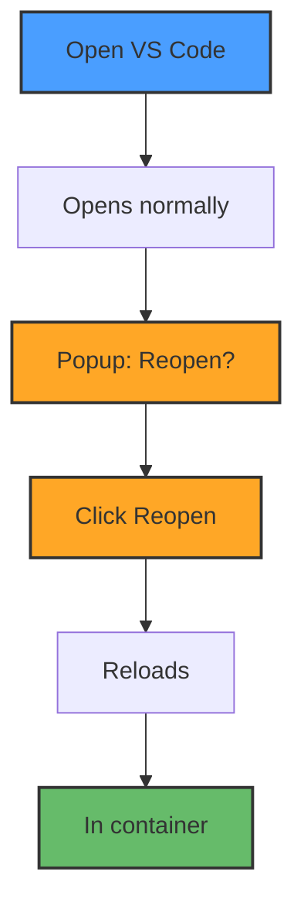
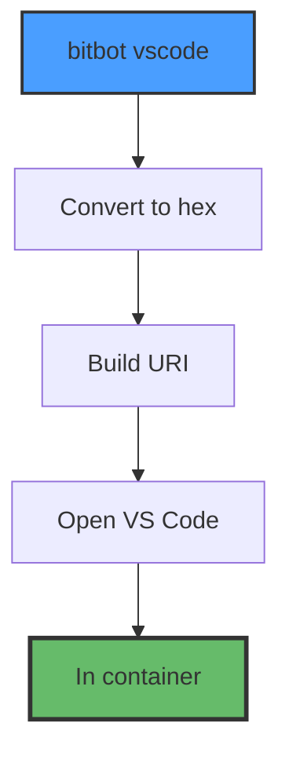
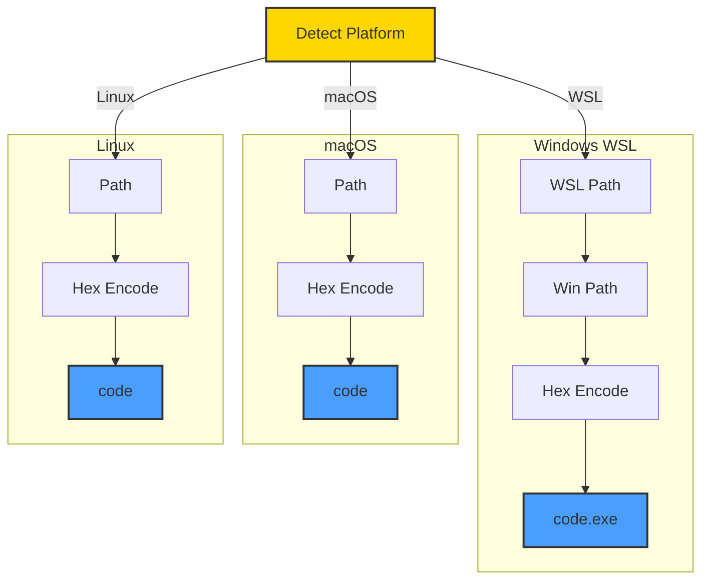
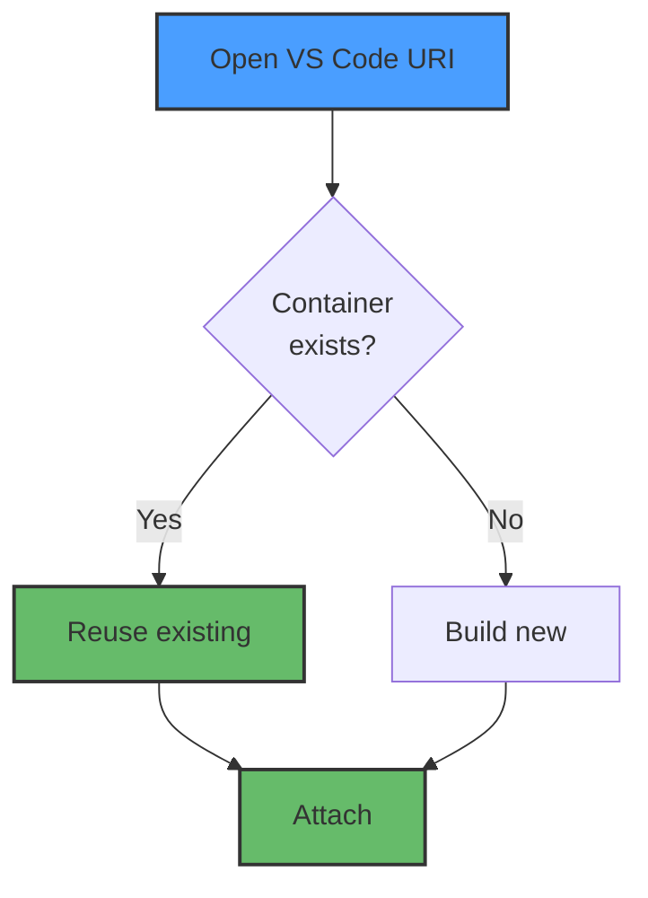
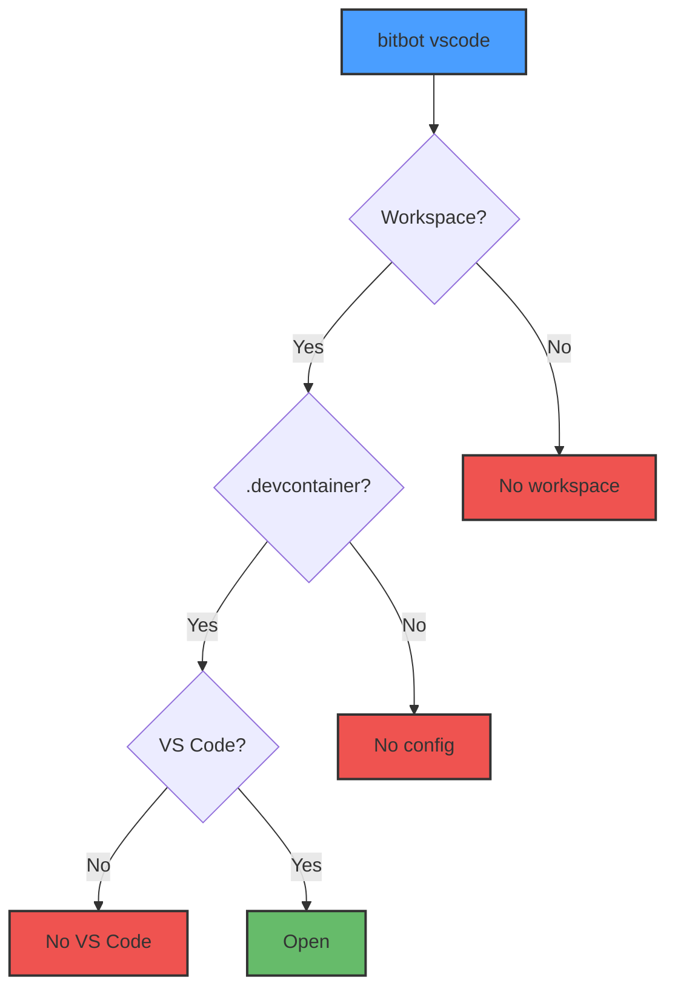

# VS Code Integration - Direct DevContainer Opening

BitBot's innovative approach to opening VS Code directly in dev containers using hex-encoded URIs, eliminating manual "Reopen in Container" popups.

```mermaid
sequenceDiagram
    participant User
    participant BitBot
    participant VSCode as VS Code
    participant Docker
    participant Container

    User->>BitBot: bitbot vscode
    BitBot->>BitBot: Detect platform
    BitBot->>BitBot: Convert to hex

    Note over BitBot: C:\Projects\MyApp<br/>→ 433a5c...

    BitBot->>BitBot: Build URI

    BitBot->>VSCode: code --folder-uri
    VSCode->>Docker: Check container

    alt Container exists
        Docker-->>VSCode: Reuse
    else No container
        VSCode->>Docker: Build new
        Docker->>Container: Create
        Docker-->>VSCode: Ready
    end

    VSCode->>Container: Attach
    Container-->>User: Opens ✓

    style BitBot fill:#ffd700,stroke:#333,stroke-width:2px,color:#333
    style VSCode fill:#4a9eff,stroke:#333,stroke-width:2px
    style Container fill:#66bb6a,stroke:#333,stroke-width:2px,color:#333
```

## The Innovation

### Traditional Approach (Problems)



**Problems**:
- ❌ Manual popup requires user interaction
- ❌ VS Code restarts (disrupts workflow)
- ❌ Extra steps every time

---

### Direct DevContainer Opening (Solution)



**Benefits**:
- ✅ **No popup** - Opens directly in container
- ✅ **No restart** - One-step process
- ✅ **Automatic** - Works every time
- ✅ **Fast** - Skips manual steps

---

## How It Works

### 1. Hex Encoding

Convert workspace path to hexadecimal for URI encoding:

```bash
# Input: C:\Projects\MyApp
# Output: 433a5c50726f6a656374735c4d794170

path_to_hex() {
    local path="$1"

    # Preferred method (if xxd available)
    if command -v xxd &>/dev/null; then
        printf "%s" "$path" | xxd -p -c 256 | tr -d '\n'
    else
        # Fallback for Alpine (no xxd)
        printf "%s" "$path" | od -A n -t x1 | tr -d ' \n'
    fi
}
```

**Why hex?**
- Handles special characters (spaces, backslashes, etc.)
- URL-safe encoding
- VS Code's internal format

---

### 2. URI Construction

Build the special `vscode-remote` URI:

```
vscode-remote://dev-container+{HEX_ENCODED_PATH}{CONTAINER_PATH}
```

**Example**:
```
vscode-remote://dev-container+433a5c50726f6a656374735c4d794170/workspace
                              └────────────────┬────────────────┘ └───┬───┘
                                  C:\Projects\MyApp (hex)        container path
```

**Components**:
- `vscode-remote://` - VS Code's remote protocol
- `dev-container+` - DevContainer plugin identifier
- `{HEX}` - Workspace path in hexadecimal
- `/workspace` - Path inside container

---

### 3. Platform-Specific Execution



**Windows (WSL) Example**:
```bash
# WSL: Get Windows path
WIN_USER=$(cmd.exe /c "echo %USERNAME%" 2>/dev/null | tr -d '\r')
WIN_PATH="/mnt/c/Users/$WIN_USER/Projects/MyApp"

# Convert to Windows format
WINDOWS_PATH=$(wslpath -w "$WIN_PATH")
# Result: C:\Users\username\Projects\MyApp

# Hex encode
HEX=$(path_to_hex "$WINDOWS_PATH")

# Open with code.exe (Windows VS Code from WSL)
code.exe --folder-uri="vscode-remote://dev-container+${HEX}/workspace"
```

**macOS/Linux Example**:
```bash
# Use path directly
PATH_TO_OPEN="/Users/me/Projects/MyApp"

# Hex encode
HEX=$(path_to_hex "$PATH_TO_OPEN")

# Open with code command
code --folder-uri="vscode-remote://dev-container+${HEX}/workspace"
```

---

## Container Reuse

VS Code automatically reuses existing containers:



**Benefits**:
- Fast reopening (no rebuild)
- Preserves container state
- Same container for CLI and VS Code

**Container Matching**:
VS Code matches containers by:
1. Workspace path (hex encoded in URI)
2. DevContainer configuration hash
3. Image name and tags

---

## Comparison: DevContainer CLI vs Direct Opening

### Old Approach: DevContainer CLI

```bash
# Requires @devcontainers/cli package (~200MB)
npm install -g @devcontainers/cli

# Complex command
devcontainer up --workspace-folder /path/to/workspace

# Then manually open VS Code
code /path/to/workspace

# User still sees popup!
```

**Problems**:
- ❌ Large dependency (Node.js + npm + package)
- ❌ WSL path corruption issues
- ❌ Still shows manual popup
- ❌ Complex Windows/WSL interop

---

### New Approach: Direct Opening

```bash
# No external dependencies needed
# Just VS Code with Dev Containers extension

# One command, direct opening
bitbot vscode /path/to/workspace
```

**Benefits**:
- ✅ No DevContainer CLI needed
- ✅ No WSL path corruption (hex encoding immune)
- ✅ No popup (direct container opening)
- ✅ Simple cross-platform code

---

## Implementation

### Complete Function

```bash
open_vscode_devcontainer() {
    local workspace_path="$1"

    # Detect platform
    local platform
    if grep -qi microsoft /proc/version 2>/dev/null; then
        platform="wsl"
    elif [[ "$OSTYPE" == "darwin"* ]]; then
        platform="macos"
    else
        platform="linux"
    fi

    # Platform-specific path handling
    local path_to_encode
    if [ "$platform" = "wsl" ]; then
        # Convert WSL path to Windows path
        path_to_encode=$(wslpath -w "$workspace_path")
    else
        path_to_encode="$workspace_path"
    fi

    # Hex encode path
    local hex_path
    if command -v xxd &>/dev/null; then
        hex_path=$(printf "%s" "$path_to_encode" | xxd -p -c 256 | tr -d '\n')
    else
        hex_path=$(printf "%s" "$path_to_encode" | od -A n -t x1 | tr -d ' \n')
    fi

    # Build URI
    local uri="vscode-remote://dev-container+${hex_path}/workspace"

    # Open VS Code
    if [ "$platform" = "wsl" ]; then
        code.exe --folder-uri="$uri"
    else
        code --folder-uri="$uri"
    fi
}
```

---

## User Experience

### Command Integration

```bash
# Standalone command
bitbot vscode

# From work mode
bitbot work
# Inside container:
exit          # Returns to shell
bitbot vscode # Opens VS Code in same container

# From config mode
bitbot config
# Inside container:
bitbot vscode # Opens VS Code in config container
```

### Workflow Examples

**Scenario 1: Start with CLI, switch to VS Code**
```bash
$ bitbot work
[Container] $ # Do some CLI work
[Container] $ exit
$ bitbot vscode  # Open VS Code in same container
```

**Scenario 2: Direct VS Code opening**
```bash
$ cd /path/to/project
$ bitbot vscode  # One command, direct container opening
```

---

## Error Handling



---

## Design Decisions

### Why Hex Encoding?
- **URL-safe**: No special character escaping needed
- **Reliable**: Works with spaces, backslashes, Unicode
- **Standard**: VS Code's internal format

### Why Not DevContainer CLI?
- **Size**: Saves ~200MB (Alpine stays ~8MB)
- **Simplicity**: No Node.js/npm dependency
- **Reliability**: No WSL path corruption issues
- **Speed**: Direct opening is faster

### Why Container Path Hardcoded?
- **Convention**: `/workspace` is DevContainer standard
- **Simplicity**: No need for path mapping
- **Compatibility**: Works with all devcontainers

---

## References

- **SPEC-06**: VS Code DevContainer Integration
- **Research**: `../poc-tests/docs/DIRECT-DEVCONTAINER-FINDINGS.md`
- **Implementation**: `/core/workspace/bitbot-vscode.sh`
