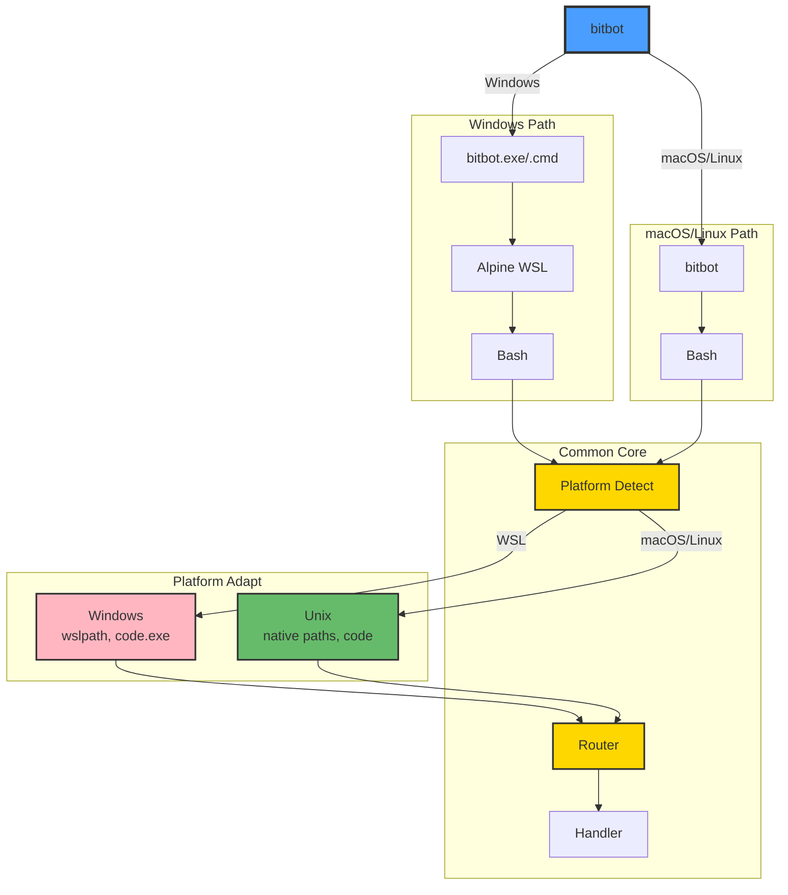
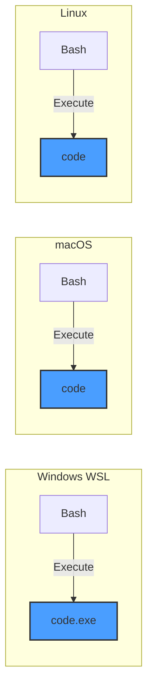
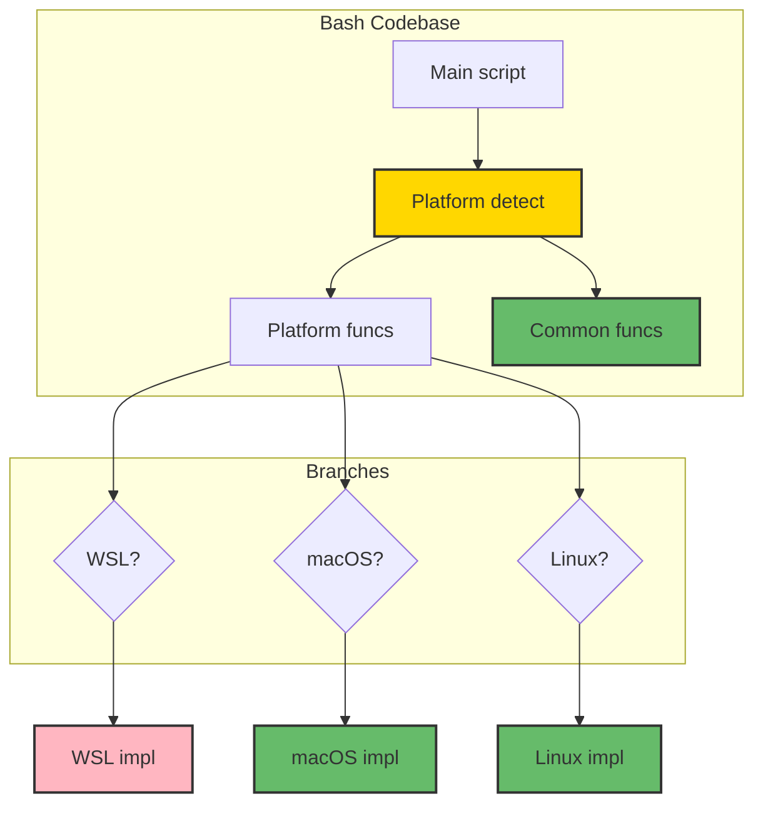

# Cross-Platform Flow

How BitBot handles Windows/WSL, macOS, and Linux with a single codebase.



## Platform Detection

```bash
detect_platform() {
    # Check for WSL
    if grep -qi microsoft /proc/version 2>/dev/null; then
        echo "wsl"
        return 0
    fi

    # Check for macOS
    if [[ "$OSTYPE" == "darwin"* ]]; then
        echo "macos"
        return 0
    fi

    # Default to Linux
    echo "linux"
    return 0
}
```

**Detection Markers**:
- **WSL**: `/proc/version` contains "microsoft"
- **macOS**: `$OSTYPE` starts with "darwin"
- **Linux**: Default (everything else)

---

## Windows Architecture

```mermaid
graph TB
    subgraph HOST["Windows Host"]
        USER[User]
        BITBOT_EXE[bitbot.exe]
        BITBOT_CMD[bitbot.cmd]
        CMD[cmd.exe]
        WSLEXE[wsl.exe]
        CODE_EXE[code.exe]
        DOCKER[Docker Desktop]
    end

    subgraph WSL["WSL2 Alpine"]
        ALPINE[BitBot-Alpine]
        BASH_SCRIPT[bitbot script]
        CORE_LIB[core libs]
    end

    subgraph CONT["Container"]
        CONTAINER[Work/Config]
        WORKSPACE[/workspace]
    end

    USER --> BITBOT_EXE
    USER --> BITBOT_CMD

    BITBOT_EXE --> WSLEXE
    BITBOT_CMD --> CMD
    CMD --> WSLEXE

    WSLEXE --> ALPINE
    ALPINE --> BASH_SCRIPT
    BASH_SCRIPT --> CORE_LIB

    CORE_LIB --> DOCKER
    DOCKER --> CONTAINER
    CONTAINER --> WORKSPACE

    BASH_SCRIPT -.->|Launch| CODE_EXE
    CODE_EXE --> DOCKER

    style USER fill:#4a9eff,stroke:#333,stroke-width:2px
    style ALPINE fill:#ffb6c1,stroke:#333,stroke-width:2px,color:#333
    style CONTAINER fill:#66bb6a,stroke:#333,stroke-width:2px,color:#333
```

### Windows Entry Points

**1. bitbot.exe (Recommended)**
- C program compiled with MinGW
- Checks for WSL, launches Alpine
- Passes arguments to bash script
- 38KB executable

**2. bitbot.cmd**
- CMD batch wrapper
- Alternative to .exe
- Same functionality
- Text-based

### Why Alpine WSL?

**Benefits**:
- ✅ **Tiny**: ~8MB (vs. Ubuntu ~500MB)
- ✅ **Fast**: Quick startup
- ✅ **Isolated**: Separate from user's WSL distros
- ✅ **Consistent**: Same environment on all Windows machines

**Trade-offs**:
- ⚠ Limited packages (but BitBot doesn't need many)
- ⚠ musl libc instead of glibc (rarely matters)

---

## macOS Architecture

```mermaid
graph TB
    subgraph MAC["macOS System"]
        USER[User]
        BITBOT[bitbot]
        CORE_LIB[core libs]
        CODE[code]
        DOCKER[Docker Desktop]
    end

    subgraph CONT["Container"]
        CONTAINER[Work/Config]
        WORKSPACE[/workspace]
    end

    USER --> BITBOT
    BITBOT --> CORE_LIB

    CORE_LIB --> DOCKER
    DOCKER --> CONTAINER
    CONTAINER --> WORKSPACE

    BITBOT -.->|Launch| CODE
    CODE --> DOCKER

    style USER fill:#4a9eff,stroke:#333,stroke-width:2px
    style BITBOT fill:#ffd700,stroke:#333,stroke-width:2px,color:#333
    style CONTAINER fill:#66bb6a,stroke:#333,stroke-width:2px,color:#333
```

### macOS Entry Point

**Single Bash Script**:
- Direct execution (no wrapper needed)
- Standard Unix paths
- Native Docker Desktop integration

**Installation**:
```bash
# Global installation
sudo ln -s /opt/bitbot/bin/bitbot /usr/local/bin/bitbot

# User installation
ln -s /opt/bitbot/bin/bitbot ~/bin/bitbot
```

---

## Linux Architecture

```mermaid
graph TB
    subgraph LIN["Linux System"]
        USER[User]
        BITBOT[bitbot]
        CORE_LIB[core libs]
        CODE[code]
        DOCKER[Docker Engine]
    end

    subgraph CONT["Container"]
        CONTAINER[Work/Config]
        WORKSPACE[/workspace]
    end

    USER --> BITBOT
    BITBOT --> CORE_LIB

    CORE_LIB --> DOCKER
    DOCKER --> CONTAINER
    CONTAINER --> WORKSPACE

    BITBOT -.->|Launch| CODE
    CODE --> DOCKER

    style USER fill:#4a9eff,stroke:#333,stroke-width:2px
    style BITBOT fill:#ffd700,stroke:#333,stroke-width:2px,color:#333
    style CONTAINER fill:#66bb6a,stroke:#333,stroke-width:2px,color:#333
```

### Linux Entry Point

**Single Bash Script**:
- Same as macOS
- Standard Unix paths
- Native Docker Engine integration

**Installation**:
```bash
# Global installation
sudo ln -s /opt/bitbot/bin/bitbot /usr/local/bin/bitbot

# User installation
ln -s /opt/bitbot/bin/bitbot ~/bin/bitbot
```

---

## Path Handling

### Windows (WSL) Path Conversion

```bash
# Windows path: C:\Users\username\Projects\MyApp
# WSL path: /mnt/c/Users/username/Projects/MyApp

# Convert WSL → Windows
wslpath -w /mnt/c/Users/username/Projects/MyApp
# Output: C:\Users\username\Projects\MyApp

# Convert Windows → WSL
wslpath -u 'C:\Users\username\Projects\MyApp'
# Output: /mnt/c/Users/username/Projects/MyApp
```

**Usage in BitBot**:
```bash
if [ "$PLATFORM" = "wsl" ]; then
    # Need Windows path for VS Code
    WINDOWS_PATH=$(wslpath -w "$WSL_PATH")
    HEX=$(path_to_hex "$WINDOWS_PATH")
    code.exe --folder-uri="vscode-remote://dev-container+${HEX}/workspace"
fi
```

---

### macOS/Linux Path Handling

```bash
# Paths used directly, no conversion needed
WORKSPACE="/Users/me/Projects/MyApp"      # macOS
WORKSPACE="/home/me/Projects/MyApp"       # Linux

# Use directly
HEX=$(path_to_hex "$WORKSPACE")
code --folder-uri="vscode-remote://dev-container+${HEX}/workspace"
```

---

## VS Code Execution



**Platform-Specific Commands**:
- **Windows (WSL)**: `code.exe` (Windows executable from WSL)
- **macOS**: `code` (macOS binary)
- **Linux**: `code` (Linux binary)

---

## Docker Integration

### Windows (Docker Desktop)

```bash
# Docker Desktop runs in WSL2 backend
# BitBot in Alpine connects via Docker socket

# Docker Desktop must integrate with BitBot-Alpine distro
# Settings → Resources → WSL Integration → Enable BitBot-Alpine
```

**Auto-Configuration**:
BitBot can automatically enable WSL integration:
```bash
# Check if enabled
if ! docker ps &>/dev/null; then
    # Prompt to enable
    echo "Docker Desktop WSL integration not enabled for BitBot-Alpine"
    echo "Run: bitbot enable-docker"
fi
```

---

### macOS (Docker Desktop)

```bash
# Docker Desktop for Mac
# BitBot connects via /var/run/docker.sock

# Standard Docker Desktop installation
# No special configuration needed
```

---

### Linux (Docker Engine)

```bash
# Native Docker Engine
# BitBot connects via /var/run/docker.sock

# User must be in docker group
sudo usermod -aG docker $USER
```

---

## Unified Codebase Strategy



**Design Pattern**:
```bash
# Detect platform once
PLATFORM=$(detect_platform)

# Use platform-specific code
case "$PLATFORM" in
    wsl)
        # Windows/WSL specific code
        launch_vscode_wsl "$WORKSPACE"
        ;;
    macos)
        # macOS specific code
        launch_vscode_unix "$WORKSPACE"
        ;;
    linux)
        # Linux specific code
        launch_vscode_unix "$WORKSPACE"
        ;;
esac
```

**Shared Code Ratio**:
- 90% shared across platforms
- 10% platform-specific adaptations

---

## Testing Matrix

| Platform        | Entry Point  | WSL Distro    | Docker            | VS Code      | Status      |
|-----------------|--------------|---------------|-------------------|--------------|-------------|
| Windows 11      | bitbot.exe   | BitBot-Alpine | Docker Desktop    | code.exe     | ✅ Tested    |
| Windows 11      | bitbot.cmd   | BitBot-Alpine | Docker Desktop    | code.exe     | ✅ Tested    |
| macOS (Intel)   | bitbot       | N/A           | Docker Desktop    | code         | ⏳ Pending  |
| macOS (ARM)     | bitbot       | N/A           | Docker Desktop    | code         | ⏳ Pending  |
| Ubuntu 22.04    | bitbot       | N/A           | Docker Engine     | code         | ⏳ Pending  |
| Debian          | bitbot       | N/A           | Docker Engine     | code         | ⏳ Pending  |
| Arch Linux      | bitbot       | N/A           | Docker Engine     | code         | ⏳ Pending  |

---

## Design Decisions

### Why Single Bash Codebase?
- **Maintainability**: One codebase to maintain
- **Consistency**: Same behavior across platforms
- **Simplicity**: No platform-specific branches

### Why Alpine for Windows?
- **Size**: Minimal footprint (~8MB)
- **Isolation**: Doesn't conflict with user's WSL
- **Consistency**: Same environment on all Windows machines

### Why Not PowerShell for Windows?
- **Portability**: Bash works everywhere
- **Complexity**: PowerShell → bash bridge is complex
- **Consistency**: Same language across platforms

---

## Future Enhancements

### Native Windows (No WSL)
```
bitbot.exe → PowerShell → Docker Desktop → Container
```

**Challenges**:
- Different scripting language (PowerShell vs Bash)
- Path handling differences
- Additional testing required

### WSL1 Support
Currently requires WSL2 for Docker Desktop backend.

**Potential**:
- Native Docker Engine in WSL1
- Limited by WSL1 capabilities

---

## References

- **SPEC-05**: Cross-Platform CLI specification
- **Implementation**: `/core/util/detect.sh`
- **Windows Launcher**: `poc-tests/` (proof-of-concept)
