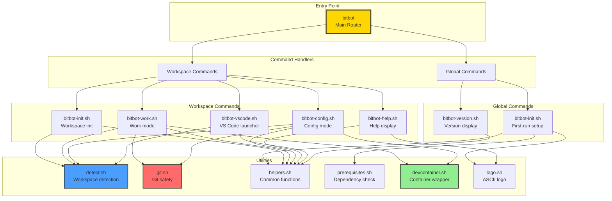
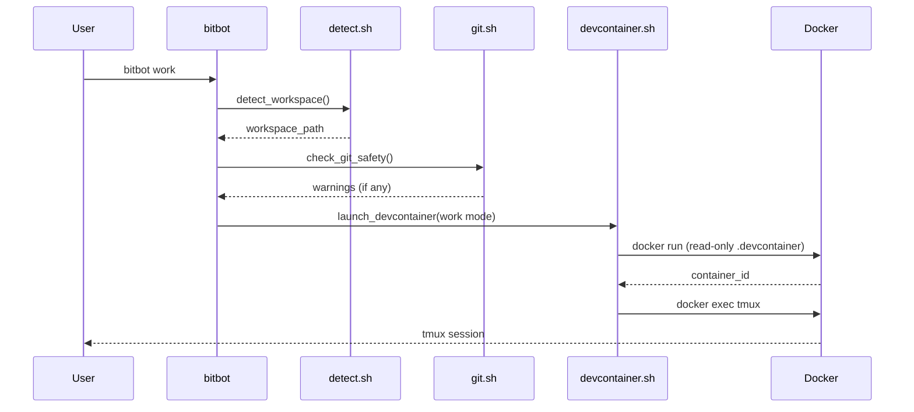
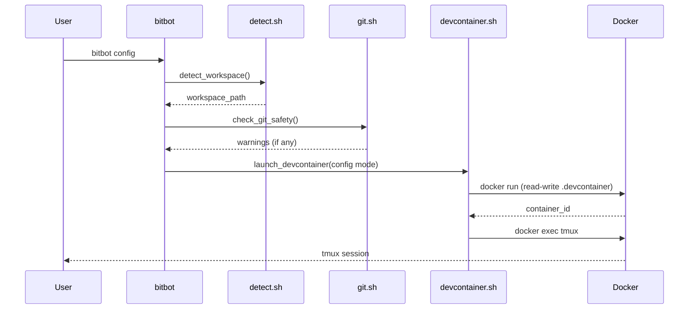
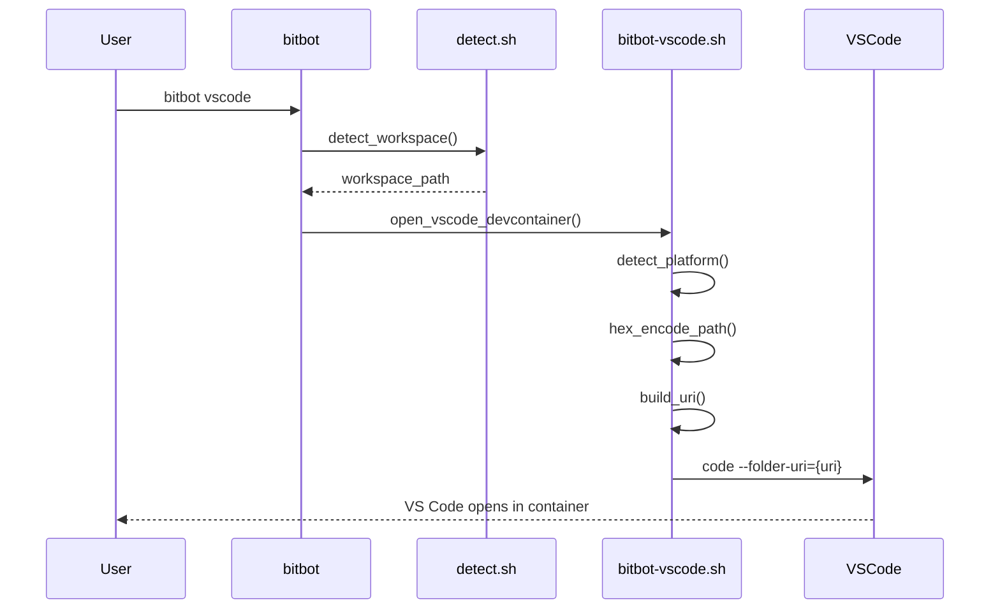
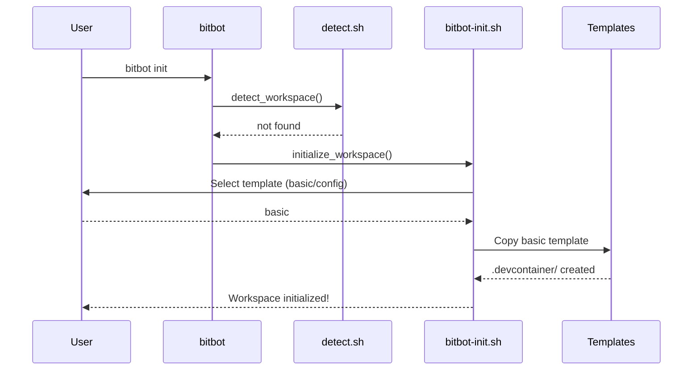
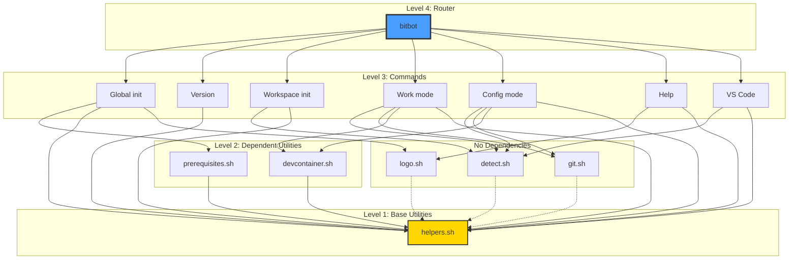

# Component Interaction

How BitBot's core components interact to deliver functionality.



## Component Responsibilities

### Main Router (bitbot)

**File**: `/bitbot`
**Purpose**: Route commands to appropriate handlers
**Dependencies**: None (sources handlers as needed)

```bash
# Routes commands
case "$COMMAND" in
    init)      # Global or workspace?
    work)      # Workspace command
    config)    # Workspace command
    vscode)    # Workspace command
    help)      # Workspace command
    version)   # Global command
esac
```

---

### Global Commands

#### bitbot-init.sh (Global)
**File**: `/core/global/bitbot-init.sh`
**Purpose**: First-run system-wide setup
**Dependencies**: `prerequisites.sh`, `helpers.sh`, `logo.sh`

**Responsibilities**:
- Check prerequisites (Docker, VS Code, WSL)
- Display welcome message
- Guide user through setup
- No actual installation (just validation)

---

#### bitbot-version.sh
**File**: `/core/bitbot-version.sh`
**Purpose**: Display version information
**Dependencies**: `helpers.sh`

**Responsibilities**:
- Read VERSION file
- Display formatted version
- Show system information

---

### Workspace Commands

#### bitbot-init.sh (Workspace)
**File**: `/core/workspace/bitbot-init.sh`
**Purpose**: Initialize new workspace
**Dependencies**: `detect.sh`, `helpers.sh`

**Responsibilities**:
- Detect if workspace already exists
- Prompt for template selection
- Copy template files
- Create `.devcontainer/` structure

---

#### bitbot-work.sh
**File**: `/core/workspace/bitbot-work.sh`
**Purpose**: Launch work mode container
**Dependencies**: `detect.sh`, `git.sh`, `devcontainer.sh`, `helpers.sh`

**Responsibilities**:
- Detect workspace
- Run git safety checks
- Launch work mode container (read-only `.devcontainer`)
- Attach to tmux session

---

#### bitbot-config.sh
**File**: `/core/workspace/bitbot-config.sh`
**Purpose**: Launch config mode container
**Dependencies**: `detect.sh`, `git.sh`, `devcontainer.sh`, `helpers.sh`

**Responsibilities**:
- Detect workspace
- Run git safety checks
- Launch config mode container (read-write `.devcontainer`)
- Attach to tmux session

---

#### bitbot-help.sh
**File**: `/core/workspace/bitbot-help.sh`
**Purpose**: Display help information
**Dependencies**: `logo.sh`, `helpers.sh`

**Responsibilities**:
- Display BitBot logo
- Show command reference
- Display examples
- Show version info

---

#### bitbot-vscode.sh
**File**: `/core/workspace/bitbot-vscode.sh`
**Purpose**: Open VS Code in container
**Dependencies**: `detect.sh`, `helpers.sh`

**Responsibilities**:
- Detect workspace
- Detect platform (Windows/macOS/Linux)
- Hex-encode workspace path
- Launch VS Code with container URI

---

### Utilities

#### detect.sh
**File**: `/core/util/detect.sh`
**Purpose**: Workspace detection
**Dependencies**: None

**Functions**:
```bash
detect_workspace()         # Find .devcontainer in CWD or parent
validate_workspace()       # Validate .devcontainer structure
get_workspace_path()       # Return workspace absolute path
```

**Used by**:
- `bitbot-init.sh` (workspace)
- `bitbot-work.sh`
- `bitbot-config.sh`
- `bitbot-vscode.sh`

---

#### git.sh
**File**: `/core/util/git.sh`
**Purpose**: Git safety checks
**Dependencies**: None

**Functions**:
```bash
check_git_safety()         # Check for uncommitted changes
warn_uncommitted()         # Display warning message
should_skip_git_check()    # Check for skip flags
```

**Used by**:
- `bitbot-work.sh`
- `bitbot-config.sh`

---

#### helpers.sh
**File**: `/core/util/helpers.sh`
**Purpose**: Common utility functions
**Dependencies**: None

**Functions**:
```bash
log_info()                 # Info message
log_warn()                 # Warning message
log_error()                # Error message
check_command()            # Check if command exists
get_platform()             # Detect OS platform
```

**Used by**: All components

---

#### prerequisites.sh
**File**: `/core/util/prerequisites.sh`
**Purpose**: Dependency validation
**Dependencies**: `helpers.sh`

**Functions**:
```bash
check_docker()             # Verify Docker available
check_vscode()             # Verify VS Code installed
check_wsl()                # Verify WSL2 (Windows only)
check_devcontainer_ext()   # Verify Dev Containers extension
check_all_prerequisites()  # Run all checks
```

**Used by**:
- `bitbot-init.sh` (global)

---

#### devcontainer.sh
**File**: `/core/util/devcontainer.sh`
**Purpose**: DevContainer CLI wrapper
**Dependencies**: `helpers.sh`

**Functions**:
```bash
launch_devcontainer()      # Build and start container
attach_devcontainer()      # Attach to running container
stop_devcontainer()        # Stop container
get_container_id()         # Get container ID for workspace
```

**Used by**:
- `bitbot-work.sh`
- `bitbot-config.sh`

---

#### logo.sh
**File**: `/core/util/logo.sh`
**Purpose**: ASCII logo display
**Dependencies**: None

**Functions**:
```bash
print_bitbot_logo()        # Display ASCII logo
```

**Used by**:
- `bitbot-init.sh` (global)
- `bitbot-help.sh`

---

## Data Flow

### work Command Flow



---

### config Command Flow



---

### vscode Command Flow



---

### init Command Flow (Workspace)



---

## Dependency Graph



---

## Shared State

### No Global State
BitBot avoids global configuration files:
- No `~/.bitbot` config
- No global workspace registry
- All state in workspace directory

### Workspace State
All configuration stored in workspace:
```
workspace/
├── .devcontainer/
│   ├── devcontainer.json    # Container config
│   └── Dockerfile           # Build instructions
└── .bitbot/                 # (future) workspace metadata
    └── config.json
```

---

## Environment Variables

### Used by BitBot

| Variable         | Purpose                    | Set by           |
|------------------|----------------------------|------------------|
| `BITBOT_HOME`    | BitBot installation path   | Entry script     |
| `WORKSPACE_PATH` | Current workspace          | detect.sh        |
| `PLATFORM`       | OS platform (wsl/macos/linux) | helpers.sh    |
| `SKIP_GIT_CHECK` | Skip git safety            | User (flag)      |

### Not Modified
BitBot does not modify:
- `PATH`
- `HOME`
- `USER`
- Any global environment variables

---

## Error Propagation

```bash
# Commands return non-zero on error
detect_workspace || exit 1

# Errors bubble up through call stack
bitbot work
  → detect_workspace  # Error: no workspace
    → exit 1
  → (bitbot exits)
```

**Error Handling Strategy**:
- Functions return non-zero on error
- Calling code checks return values
- User-friendly error messages displayed
- No silent failures

---

## Design Principles

### Modularity
- Each script has single responsibility
- Clear interfaces between components
- Minimal dependencies

### Reusability
- Utilities shared across commands
- Common patterns in helpers.sh
- No code duplication

### Testability
- Functions can be tested independently
- Clear inputs and outputs
- Minimal side effects

### Maintainability
- Clear component boundaries
- Well-documented interfaces
- Predictable behavior

---

## References

- **Specifications**: `../1-specification/`
- **Pseudocode**: `../2-pseudocode/`
- **Implementation**: `/core/`
