# Complete Workflow

End-to-end BitBot workflow showing all technical components from first run through daily development operations.

```mermaid
graph TB
    Start([User runs bitbot]) --> PlatformLayer

    subgraph PlatformLayer[" "]
        direction TB
        PlatformExec{Platform?} -->|Windows| WinExe[bitbot.exe]
        PlatformExec -->|WSL| WSLBash[bash bitbot]
        PlatformExec -->|macOS/Linux| NativeBash[bash bitbot]

        WinExe --> WSLAlpine[Alpine WSL Distro]
        WSLAlpine --> Router[Main Router<br/>core/bitbot]
        WSLBash --> Router
        NativeBash --> Router

        Router --> DetectContext{Running from<br/>BITBOT_HOME?}
    end

    DetectContext -->|Yes| GlobalContext
    DetectContext -->|No| WorkspaceContext

    subgraph GlobalCtx[" "]
        direction TB
        GlobalContext[Global Context Handler] --> CheckGlobal{is_global_init_needed?}
        CheckGlobal -->|Yes| GlobalInit[core/global/bitbot-init.sh]
        CheckGlobal -->|No| ValidateEnv[validate_global_environment]
        GlobalInit --> SetupWizard[First-time setup wizard]
        SetupWizard --> AddPath[Add to PATH]
        AddPath --> Done1([Setup Complete])
        ValidateEnv --> Done1
    end

    subgraph WorkspaceCtx[" "]
        direction TB
        WorkspaceContext[Workspace Context Handler] --> CheckWS{is_workspace_initialized?}

        CheckWS -->|No| HandleUninit{Command?}
        HandleUninit -->|init| InitCmd[core/workspace/bitbot-init.sh]
        HandleUninit -->|work/none| PromptUser{Prompt:<br/>Initialize?}
        PromptUser -->|Yes| InitCmd
        PromptUser -->|No| ExitNoInit([Exit: Run bitbot init])

        InitCmd --> GitPush[recommend_git_push_before_init]
        GitPush --> GitSafety[check_git_safety<br/>util/git.sh]
        GitSafety --> CreateStruct[create_workspace_structure<br/>.bitbot/]
        CreateStruct --> SetupDC{.devcontainer<br/>exists?}
        SetupDC -->|Yes| UseExisting[Use existing]
        SetupDC -->|No| CopyTemplate[Copy from template]
        UseExisting --> LaunchConfigInit[launch_config_devcontainer]
        CopyTemplate --> LaunchConfigInit

        LaunchConfigInit --> ConfigDC[Config DevContainer]

        CheckWS -->|Yes| ValidatePrereq[validate_prerequisites<br/>util/prerequisites.sh]
        ValidatePrereq --> CheckDocker{Docker<br/>running?}
        CheckDocker -->|No| ErrDocker([Error: Start Docker])
        CheckDocker -->|Yes| CheckVSCode{VS Code<br/>installed?}
        CheckVSCode -->|No, if needed| ErrVSCode([Error: Install VS Code])
        CheckVSCode -->|Yes| RouteCmd{Route command}

        RouteCmd -->|config| ConfigCmd[core/workspace/bitbot-config.sh]
        RouteCmd -->|help| HelpCmd([core/workspace/bitbot-help.sh])
        RouteCmd -->|version| VersionCmd([core/bitbot-version.sh])
        RouteCmd -->|work/none| WorkCmd[core/workspace/bitbot-work.sh]

        WorkCmd --> GitWarn1[check_git_uncommitted<br/>non-blocking warning]
        GitWarn1 --> LaunchWork[launch_work_devcontainer<br/>util/devcontainer.sh]

        ConfigCmd --> GitWarn2[check_git_uncommitted<br/>non-blocking warning]
        GitWarn2 --> LaunchConfig[launch_config_devcontainer<br/>util/devcontainer.sh]

        LaunchWork --> WorkInterface{use_vscode<br/>flag?}
        WorkInterface -->|Yes| LaunchVSCode[Launch VS Code]
        WorkInterface -->|No| LaunchTerminal[Launch Terminal]

        LaunchConfig --> ConfigInterface{use_vscode<br/>flag?}
        ConfigInterface -->|Yes| LaunchVSCodeConfig[Launch VS Code]
        ConfigInterface -->|No| LaunchTerminalConfig[Launch Terminal]

        LaunchVSCode --> WorkDC[Work DevContainer]
        LaunchTerminal --> WorkDC
        LaunchVSCodeConfig --> ConfigDC
        LaunchTerminalConfig --> ConfigDC

        WorkDC --> WorkMount[Mount workspace RW<br/>.devcontainer RO]
        ConfigDC --> ConfigMount[Mount workspace RW<br/>full access]
    end

    WorkMount --> ContainerBitbot
    ConfigMount --> ContainerBitbot

    subgraph InnerBitbot[" "]
        direction TB
        ContainerBitbot[Container BitBot<br/>/usr/local/bitbot/bitbot] --> InnerCmd{Command?}

        InnerCmd -->|start| StartCmd
        InnerCmd -->|default| DetectSessions[Detect sessions<br/>tmux list-sessions]
        DetectSessions --> LaunchMode{Choose<br/>launch mode}
        LaunchMode -->|Fresh| StartCmd[bitbot start]
        LaunchMode -->|Resume| ResumeCmd[bitbot resume]
        InnerCmd -->|resume| ResumeCmd

        StartCmd --> CreateTmux[Create tmux session<br/>tmux new-session]
        CreateTmux --> WrapperLaunch[Launch via wrapper<br/>claude-wrapper.sh claude]

        ResumeCmd --> SelectSession[Select existing session]
        SelectSession --> AttachTmux[Attach to tmux session<br/>tmux attach-session]

        WrapperLaunch --> AgentMode{Container<br/>mode?}
        AgentMode -->|Work| WorkAI([Claude with work tools<br/>AI codes freely])
        AgentMode -->|Config| ConfigAI([Claude with config tools<br/>AI edits infra])

        AttachTmux --> ResumedSession([Resume existing Claude session])
    end

    style Start fill:#4a9eff,stroke:#333,stroke-width:2px
    style Router fill:#4a9eff,stroke:#333,stroke-width:2px
    style GlobalInit fill:#ffa726,stroke:#333,stroke-width:2px,color:#333
    style InitCmd fill:#ffa726,stroke:#333,stroke-width:2px,color:#333
    style GitPush fill:#ffa726,stroke:#333,stroke-width:2px,color:#333
    style GitSafety fill:#ffa726,stroke:#333,stroke-width:2px,color:#333
    style GitWarn1 fill:#ffa726,stroke:#333,stroke-width:2px,color:#333
    style GitWarn2 fill:#ffa726,stroke:#333,stroke-width:2px,color:#333
    style WorkAI fill:#66bb6a,stroke:#333,stroke-width:2px,color:#333
    style ConfigAI fill:#66bb6a,stroke:#333,stroke-width:2px,color:#333
    style Done1 fill:#66bb6a,stroke:#333,stroke-width:2px,color:#333
    style ExitNoInit fill:#ef5350,stroke:#333,stroke-width:2px,color:#333
    style ErrDocker fill:#ef5350,stroke:#333,stroke-width:2px,color:#333
    style ErrVSCode fill:#ef5350,stroke:#333,stroke-width:2px,color:#333
    style InnerBitbot fill:#795548,stroke:#1b0000,stroke-width:3px
    style ContainerBitbot fill:#4e342e,stroke:#333,stroke-width:2px,color:#fff
```



## Technical Flow Details

### Platform Entry Points

**Windows**:
- `bitbot.exe` (38KB C launcher) → WSL Alpine distro → bash execution
- Hex-encoded path conversion prevents WSL corruption
- Launches Windows VS Code from Alpine WSL

**macOS/Linux**:
- Direct bash execution via `bitbot` script
- Native path handling
- Direct VS Code execution

### Context Detection

**Global Context** (`cwd == $BITBOT_HOME`):
- First run: Setup wizard → Add to PATH
- Subsequent: Validate environment

**Workspace Context** (`cwd != $BITBOT_HOME`):
- Check `.bitbot/` directory existence
- Route to workspace commands

### Initialization Flow

**Workspace Structure**:
```
.bitbot/
├── config.json              # Workspace config (launch mode, skip flags)
├── local/                   # Work mode session data (gitignored)
├── internal/                # Infrastructure files
│   ├── .devcontainer/       # Config mode devcontainer
│   │   └── devcontainer.json
│   ├── container/           # Container infrastructure (committed)
│   │   └── home/
│   │       └── .tmux.conf
│   ├── global/              # Global config overlay structure (gitignored)
│   │   ├── .bitbot/
│   │   └── .claude/
│   └── local/               # Config mode session data (gitignored)
└── tmp/                     # Runtime files (gitignored)
    ├── pipes/               # Wrapper IPC pipes
    └── sessions/            # Session state
```

**DevContainer Setup**:
- Existing `.devcontainer/` → Use as-is
- No `.devcontainer/` → Copy from template
- Template path: `$BITBOT_HOME/container/templates/bitbot-work/`

**Global Config Location**:
- Global config: `$BITBOT_HOME/global/.bitbot/config.json`
- Contains default launch mode (terminal/vscode)
- Contains default skip flags (git push recommendation, safety checks)
- Migration from old `config.json` at root handled automatically

### Work Mode Container

**Security Model**:
- `.devcontainer/` mounted read-only
- Workspace code mounted read-write
- AI can modify code freely
- Infrastructure files protected

**Mount Configuration**:
```json
{
  "mounts": [
    "source=${localWorkspaceFolder},target=/workspace,type=bind",
    "source=${localWorkspaceFolder}/.devcontainer,target=/workspace/.devcontainer,type=bind,readonly"
  ]
}
```

### Config Mode Container

**Access Model**:
- Read-write workspace access (allows editing `.devcontainer/`)
- Read-only overlay for `.bitbot/internal/` (protects infrastructure)
- Separate container from work mode
- Uses workspace-specific devcontainer at `.bitbot/internal/.devcontainer/`
- References global Dockerfile: `$BITBOT_HOME/container/templates/bitbot-config/Dockerfile`

**Use Cases**:
- Edit `.devcontainer/devcontainer.json`
- Add VS Code extensions
- Configure container features
- Update Dockerfile

**Note**: Config mode is optional after `bitbot init` (default: no). Use `bitbot init --config` to force launch, or `bitbot config` anytime.

### Git Safety Integration

**Non-Blocking Warnings**:
- Check uncommitted files before launch
- Recommend `git push` before init
- Display file count and status
- Never blocks execution

**Safety Functions** (`util/git.sh`):
- `recommend_git_push_before_init()` - Two-stage prompting:
  1. Push recommendation (uncommitted/unpushed changes)
  2. Safety checks (secrets warning, API keys)
- `check_git_uncommitted()` - Detect dirty working tree
- `count_uncommitted_files()` - Count modified files
- **Three-choice system**: Exit to fix, Skip this time, Skip permanently (saves to workspace config)

### Prerequisites Validation

**Docker**:
- Check Docker daemon running
- Verify Docker CLI accessible
- Error if not available

**VS Code** (if `use_vscode=true`):
- Detect `code` command
- Check DevContainer extension
- Error if VS Code mode requested but not available

### DevContainer Launching

**Utility Functions** (`util/devcontainer.sh`):

**`launch_work_devcontainer(workspace_path, use_vscode)`**:
- Reads `.devcontainer/devcontainer.json`
- Builds hex-encoded VS Code URI
- Launches VS Code or terminal session

**`launch_config_devcontainer(workspace_path, use_vscode)`**:
- Reads `.bitbot/internal/devcontainer.json`
- References global config template
- Launches separate config container

**Direct Container Opening**:
- No manual "Reopen in Container" popup
- Container reused if already running
- Hex encoding prevents path corruption

### Wrapper Integration (Container)

**All Claude launches** go through wrapper for session management:

**Wrapper Script**: `/usr/local/bitbot/wrapper/claude-wrapper.sh`

**Architecture**:
- Creates control pipe: `.bitbot/tmp/pipes/claude-<PID>.pipe`
- Intercepts status line for context tracking
- Provides restart capability (exit, restart, compact, clear)
- Watchdog monitoring for session health

**Session Flow**:
```bash
# When launching Claude in tmux
tmux new-session -s "bitbot-YYYYMMDD-HHMMSS" \
  "/usr/local/bitbot/wrapper/claude-wrapper.sh claude --resume"
```

**Benefits**:
- Skills can trigger restart/compaction autonomously
- Context % tracked via status line wrapper
- Session recovery on crashes
- Programmatic session control

**Components**:
- `claude-wrapper.sh` - Main wrapper (pipe control, restart)
- `statusline-wrapper/wrapper.sh` - Status line interception
- `send-wrapper-command.sh` - Send commands to wrapper
- `watchdog.sh` - Monitor session health

### WSL Path Handling

**DevContainer Command Wrapping** (`util/devcontainer.sh`):

**Method 3 (cmd.exe)** - For Windows mount paths (`/mnt/c/...`):
```bash
cmd.exe /c "cd /d \"C:\path\" && devcontainer.cmd --workspace-folder ."
```

**Method 4 (PowerShell)** - For WSL native paths:
```bash
pwsh.exe -Command "devcontainer.cmd --workspace-folder '\\wsl.localhost\Ubuntu\home\user\project'"
```

**Why needed**: Direct devcontainer.cmd execution from WSL with UNC paths causes corruption. Wrappers prevent this.

**Additional WSL Features**:
- Project location warning (performance impact on `/mnt/*` paths)
- Windows environment sync (PATH, BITBOT_HOME)
- Portable installation detection and auto-fix
- Path conversion utilities (`wslpath`)

## Component Interactions

### File Dependencies

| Component                  | Sources                    | Dependencies              |
|----------------------------|----------------------------|---------------------------|
| Main Router                | `core/bitbot`              | All utilities             |
| Global Init                | `core/global/bitbot-init.sh` | helpers.sh              |
| Workspace Init             | `core/workspace/bitbot-init.sh` | helpers, git, detect, devcontainer |
| Work Mode                  | `core/workspace/bitbot-work.sh` | helpers, detect, devcontainer, prerequisites |
| Config Mode                | `core/workspace/bitbot-config.sh` | helpers, detect, devcontainer, prerequisites |
| Git Utilities              | `core/util/git.sh`         | helpers                   |
| DevContainer Utilities     | `core/util/devcontainer.sh` | detect, helpers          |
| Prerequisites              | `core/util/prerequisites.sh` | detect, helpers         |

### Data Flow

**Environment Variables**:
- `BITBOT_HOME` - Installation directory
- `HISTFILE` - Container bash history location
- Platform-specific vars for detection

**Configuration Hierarchy**:
- Global config: `$BITBOT_HOME/global/.bitbot/config.json` (default launch mode, default skip flags)
- Workspace config: `.bitbot/config.json` (workspace launch mode, workspace skip flags)
- Workspace values override global values (JSON merge)
- Skip flags: Can be set globally or per-workspace (git push recommendation, safety checks)
- Each workspace independent

### Error Propagation

**Exit Codes**:
- `0` - Success
- `1` - General error
- `4` - Workspace not initialized
- Other - Specific error conditions

**Error Handling**:
- `set -euo pipefail` in all scripts
- Validation before operations
- User-friendly error messages
- Non-blocking warnings vs blocking errors

## Design Patterns

### Command Pattern
```
CLI Input → Router → Command Handler → Utilities → External Services
```

### Facade Pattern
```
Complex Docker operations → devcontainer.sh → Simple functions
```

### Strategy Pattern
```
Platform detection → Platform-specific strategy → Common interface
```

### Template Method Pattern
```
validate_workspace → Common validation → Platform-specific checks
```

## Performance Considerations

### Fast Path Operations
- Context detection (milliseconds)
- Git status check (seconds)
- Prerequisites validation (seconds)

### Slow Path Operations
- Container build (minutes first time)
- Container start (seconds)
- VS Code launch (seconds)

### Optimization
- Container reuse (don't rebuild)
- Prerequisite caching (skip if validated)
- Parallel operations where possible

## Security Boundaries

### Trust Zones

**Zone 1: Host System**
- BitBot CLI (trusted)
- Docker daemon (trusted)
- VS Code (trusted)

**Zone 2: Work Container**
- AI can modify code (isolated)
- Cannot modify infrastructure (RO mount)
- No Docker access (by default)

**Zone 3: Config Container**
- AI can modify infrastructure (explicit)
- Full workspace access (authorized)
- No Docker inside (by default)

### Attack Surface

**Minimal**:
- No network services
- No privileged operations
- Filesystem-level isolation
- Docker provides containerization

## Future Enhancements

### Phase 2
- Rootless Docker template for Docker-in-Docker
- Agent steering templates (code, docs, testing)
- Session management (tmux integration)

### Phase 3
- Full VM sandboxing (maximum isolation)
- Multi-container orchestration (Docker Compose)
- MCP service architecture
- Self-improving capabilities

## References

- **Specifications**: `../1-specification/` (requirements)
- **Implementation**: `/core/` (actual code)
- **Templates**: `/container/templates/` (devcontainer configs)
- **Related Diagrams**: All other architecture diagrams
